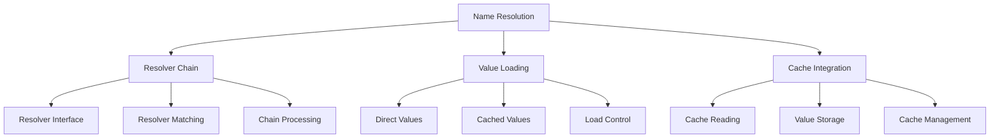
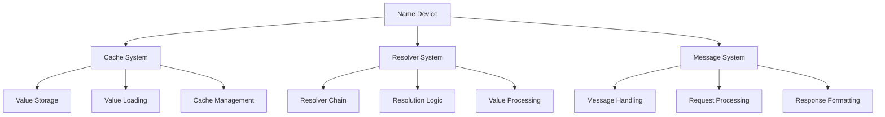

# Module: dev_name

## Basic Information
- **Source File:** dev_name.erl
- **Module Type:** Name Resolution Device
- **Purpose:** Provides a flexible name resolution system using resolver interfaces to map keys to values, with support for chained resolution and value loading.

## Core Functionality

### 1. Resolution Architecture


### 2. Resolver System
```erlang
% Core resolver implementation
resolve(Key, _, Req, Opts) ->
    Resolvers = hb_opts:get(name_resolvers, [], Opts),
    case match_resolver(Key, Resolvers, Opts) of
        {ok, Resolved} ->
            case hb_util:atom(hb_ao:get(<<"load">>, Req, true, Opts)) of
                false ->
                    {ok, Resolved};
                true ->
                    hb_cache:read(Resolved, Opts)
            end;
        not_found ->
            not_found
    end.
```

### 3. Resolver Chain Processing
```erlang
% Resolver chain matching
match_resolver(_Key, [], _Opts) -> 
    not_found;
match_resolver(Key, [Resolver | Resolvers], Opts) ->
    case execute_resolver(Key, Resolver, Opts) of
        {ok, Value} ->
            {ok, Value};
        _ ->
            match_resolver(Key, Resolvers, Opts)
    end.
```

## Key Features

### 1. Resolver Interface
```erlang
% Example resolver implementation
message_lookup_device_resolver(Msg) ->
    #{
        <<"device">> => #{
            <<"lookup">> => fun(_, Req, Opts) ->
                Key = hb_ao:get(<<"key">>, Req, Opts),
                case maps:get(Key, Msg, not_found) of
                    not_found ->
                        {error, not_found};
                    Value ->
                        {ok, Value}
                end
            end
        }
    }.
```

### 2. Value Loading
- Direct value return
- Cache-based loading
- Load control flags
- Value resolution
- Cache integration

### 3. Chain Processing
- Sequential resolution
- First match return
- Error handling
- Chain traversal
- Result management

## Usage Examples

### 1. Basic Resolution
```erlang
% Simple name resolution
resolve_example() ->
    resolve(
        <<"hello">>,
        #{},
        #{ <<"load">> => false },
        #{
            name_resolvers => [
                message_lookup_device_resolver(
                    #{<<"hello">> => <<"world">>}
                )
            ]
        }
    ).
```

### 2. Multiple Resolvers
```erlang
% Chained resolver example
chain_example() ->
    resolve(
        <<"key">>,
        #{},
        #{ <<"load">> => false },
        #{
            name_resolvers => [
                message_lookup_device_resolver(#{}),
                message_lookup_device_resolver(
                    #{<<"key">> => <<"value">>}
                )
            ]
        }
    ).
```

### 3. Cache Integration
```erlang
% Cache-based resolution
cache_example() ->
    {ok, ID} = hb_cache:write(
        #{<<"data">> => <<"value">>},
        #{}
    ),
    resolve(
        <<"key">>,
        #{},
        #{ <<"load">> => true },
        #{
            name_resolvers => [
                message_lookup_device_resolver(
                    #{<<"key">> => ID}
                )
            ]
        }
    ).
```

## Integration Points

### 1. System Integration


### 2. Dependencies
- hb_cache: Cache operations
- hb_ao: Message handling
- hb_util: Utility functions
- hb_opts: Configuration
- eunit: Testing framework

### 3. Event System
- Resolution events
- Cache operations
- Chain processing
- Error handling
- Value loading

## Error Handling

### 1. Resolution Errors
- Missing resolvers
- Invalid keys
- Resolution failures
- Chain errors
- Value errors

### 2. Cache Errors
- Load failures
- Storage errors
- Read failures
- Cache misses
- System errors

### 3. System Errors
- Configuration errors
- Message errors
- Processing failures
- Chain errors
- Integration issues

## Performance Considerations

### 1. Resolution Efficiency
- Chain optimization
- Early returns
- Cache utilization
- Value loading
- Error handling

### 2. Cache Management
- Load control
- Value caching
- Resolution caching
- Chain optimization
- Resource usage

### 3. System Impact
- Chain length
- Resolution depth
- Cache usage
- Memory management
- Processing overhead

## Future Enhancements

### 1. Resolution Features
- Parallel resolution
- Pattern matching
- Wildcard support
- Chain optimization
- Cache strategies

### 2. Integration
- External resolvers
- System integration
- Cache enhancement
- Protocol support
- API extensions

### 3. Development
- Testing tools
- Debug support
- Documentation
- Examples
- Utilities

## Security Considerations

### 1. Access Control
- Resolver access
- Value protection
- Chain security
- Cache security
- System protection

### 2. Data Protection
- Value security
- Cache protection
- Resolution safety
- Chain integrity
- System security

### 3. System Security
- Configuration protection
- Message security
- Processing safety
- Integration security
- Error handling
