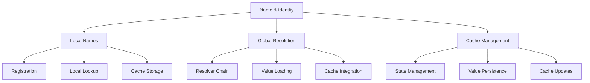
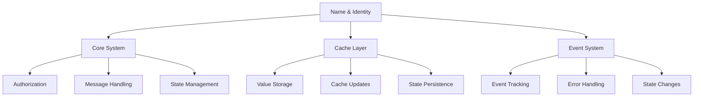

# Name & Identity Subsystem Observations

## Architectural Patterns

### 1. Name Management Architecture

### 2. Common Design Elements
- Persistent storage
- Cache integration
- Authorization control
- Event tracking
- Error handling

### 3. Integration Strategy
- Modular design
- Clear interfaces
- Minimal coupling
- Efficient caching
- Flexible resolution

## Key Insights

### 1. Local Name Management (dev_local_name)
- **Registration System**
  - Operator-only access
  - Secure storage
  - Cache management
  - Link tracking
  - State persistence

- **Lookup System**
  - Efficient retrieval
  - Cache utilization
  - Value resolution
  - Error handling
  - State tracking

### 2. Name Resolution (dev_name)
- **Resolver Chain**
  - Sequential processing
  - First match return
  - Chain traversal
  - Error recovery
  - Result management

- **Value Loading**
  - Cache integration
  - Load control
  - Value resolution
  - State management
  - Error handling

## Implementation Patterns

### 1. State Management
- Cache-based storage
- Event-driven updates
- Atomic operations
- State validation
- Error recovery

### 2. Error Handling
- Consistent patterns
- Detailed logging
- Error categorization
- Recovery strategies
- User feedback

### 3. Resource Management
- Efficient processing
- Memory optimization
- Resource pooling
- Load balancing
- Cache utilization

## Common Challenges

### 1. Registration
- Authorization control
- Value validation
- Cache consistency
- State management
- Error handling

### 2. Resolution
- Chain efficiency
- Cache management
- Value loading
- Error recovery
- State tracking

### 3. Integration
- System coupling
- Cache coordination
- Event handling
- Error propagation
- State synchronization

## Best Practices

### 1. Code Organization
- Clear module boundaries
- Consistent interfaces
- Minimal coupling
- Comprehensive testing
- Detailed documentation

### 2. Error Management
- Detailed error messages
- Consistent formatting
- Recovery procedures
- User guidance
- Debug support

### 3. Resource Handling
- Efficient algorithms
- Memory management
- Resource cleanup
- Load monitoring
- Performance optimization

## Integration Patterns

### 1. System Integration

### 2. Message Flow
- Standardized formats
- Clear routing
- Error handling
- State tracking
- Event logging

### 3. Event Handling
- Event correlation
- Signal processing
- State updates
- Resource tracking
- Performance monitoring

## Future Directions

### 1. Enhancement Areas
- Advanced resolution
- Parallel processing
- Pattern matching
- Cache optimization
- Performance profiling

### 2. Integration Opportunities
- External resolvers
- Cloud services
- Analytics platforms
- Monitoring systems
- Development tools

### 3. Development Focus
- User experience
- Performance optimization
- Tool integration
- Documentation
- Testing support

## Critical Considerations

### 1. Performance Impact
- Resolution overhead
- Cache efficiency
- System load
- Memory usage
- Processing time

### 2. Security Implications
- Access control
- Data protection
- State isolation
- Error handling
- Resource limits

### 3. Maintenance Aspects
- Code organization
- Documentation
- Testing coverage
- Error handling
- Resource management

## Recommendations

### 1. Development
- Standardize interfaces
- Improve documentation
- Enhance testing
- Optimize performance
- Extend tooling

### 2. Integration
- Strengthen integration
- Add external resolvers
- Improve monitoring
- Enhance debugging
- Expand testing

### 3. Operations
- Monitor performance
- Track resources
- Handle errors
- Manage state
- Optimize usage
