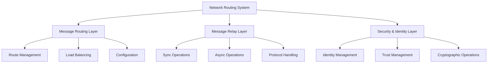
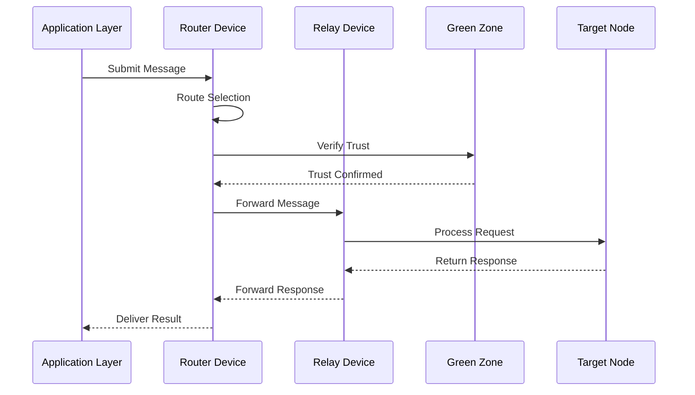

# Network Routing System: Comprehensive Technical Analysis

## Architectural Foundation & Core Design Principles

### 1. System Architecture Overview


The Network Routing System represents a sophisticated and meticulously engineered architecture that orchestrates message routing, relaying, and secure communication within the HyperBEAM ecosystem. This system is built upon three fundamental pillars:

1. **Message Routing Layer (dev_router)**
   - **Intelligent Route Selection**: Implements advanced algorithms for determining optimal message paths based on multiple criteria including load, distance, and network conditions
   - **Dynamic Load Balancing**: Utilizes sophisticated strategies to distribute network load effectively across available nodes
   - **Adaptive Configuration**: Maintains flexible routing tables that can be updated at runtime to reflect network changes
   - **Performance Optimization**: Employs various techniques to minimize latency and maximize throughput

2. **Message Relay Layer (dev_relay)**
   - **Dual Operation Modes**: Supports both synchronous and asynchronous message processing to accommodate different use cases
   - **Protocol Adaptation**: Handles seamless conversion between different message formats and protocols
   - **State Management**: Maintains consistent message state throughout the relay process
   - **Error Recovery**: Implements robust error handling and recovery mechanisms

3. **Security & Identity Layer (dev_green_zone)**
   - **Cryptographic Foundation**: Provides strong encryption and digital signature capabilities
   - **Trust Management**: Establishes and maintains trust relationships between nodes
   - **Access Control**: Enforces fine-grained permissions and security policies
   - **Identity Verification**: Ensures authentic communication between trusted nodes

### 2. Component Integration & Interaction Flow


## Core System Components & Their Functions

### 1. Router Device Implementation

#### Route Management System
```erlang
% Route configuration structure
Route = #{
    template => Template,      % Message matching pattern
    strategy => Strategy,      % Load balancing strategy
    nodes => Nodes,           % Available target nodes
    priority => Priority,     % Route precedence
    options => Options       % Additional parameters
}
```

The router device implements sophisticated route management:

1. **Template Matching**
   - Pattern-based message routing
   - Regular expression support
   - Priority-based selection
   - Fallback handling

2. **Load Distribution**
   - Multiple balancing strategies
   - Weight-based routing
   - Hash-based distribution
   - Nearest node selection

### 2. Relay Device Architecture

#### Message Processing Pipeline
```erlang
process_message(Message, Mode, Options) ->
    % 1. Initial processing
    Validated = validate_message(Message),
    
    % 2. Protocol adaptation
    Adapted = adapt_protocol(Validated, Options),
    
    % 3. Message handling
    case Mode of
        sync -> 
            handle_sync(Adapted, Options);
        async ->
            handle_async(Adapted, Options)
    end
```

The relay device provides sophisticated message handling:

1. **Operation Modes**
   - Synchronous processing for immediate responses
   - Asynchronous handling for background operations
   - Batch processing capabilities
   - Priority-based queuing

2. **Protocol Support**
   - Multiple protocol adaptations
   - Format conversion
   - Header management
   - Content transformation

### 3. Green Zone Security Implementation

#### Security Operations
```erlang
secure_communication(Message, Node, Options) ->
    % 1. Identity verification
    {ok, Identity} = verify_identity(Node),
    
    % 2. Trust establishment
    {ok, Trust} = establish_trust(Identity),
    
    % 3. Secure message handling
    encrypt_and_sign(Message, Trust, Options)
```

The green zone provides comprehensive security:

1. **Identity Management**
   - RSA key pair generation
   - Identity verification
   - Trust establishment
   - Access control

2. **Cryptographic Operations**
   - AES-256-GCM encryption
   - RSA signature generation
   - Key exchange protocols
   - Secure storage

## Advanced Features & Capabilities

### 1. Intelligent Route Selection
The system employs sophisticated algorithms for route selection:

1. **Strategy Implementation**
   ```erlang
   select_route(Message, Routes, Options) ->
       % 1. Filter applicable routes
       Candidates = filter_routes(Message, Routes),
       
       % 2. Apply routing strategy
       Selected = apply_strategy(
           Candidates,
           Options#strategy,
           Message
       ),
       
       % 3. Validate selection
       validate_route(Selected, Options)
   ```

2. **Load Balancing**
   ```erlang
   balance_load(Nodes, Strategy, Message) ->
       case Strategy of
           random -> 
               random_selection(Nodes);
           weighted ->
               weighted_selection(Nodes);
           nearest ->
               nearest_node(Nodes, Message);
           custom ->
               custom_strategy(Nodes, Message)
       end
   ```

### 2. Security & Trust Management
The system implements robust security measures:

1. **Trust Establishment**
   ```erlang
   establish_trust(Node, Options) ->
       % 1. Verify identity
       {ok, Identity} = verify_node_identity(Node),
       
       % 2. Check trust chain
       {ok, Chain} = verify_trust_chain(Identity),
       
       % 3. Establish secure channel
       create_secure_channel(Chain, Options)
   ```

2. **Message Protection**
   ```erlang
   protect_message(Message, Trust, Options) ->
       % 1. Encrypt content
       Encrypted = encrypt_content(Message),
       
       % 2. Generate signature
       Signed = sign_message(Encrypted),
       
       % 3. Prepare final message
       prepare_protected_message(Signed, Options)
   ```

## Performance Optimization & Resource Management

### 1. Connection Management
The system optimizes connection handling:

1. **Connection Pooling**
   ```erlang
   manage_connections(Pool, Options) ->
       % 1. Monitor pool status
       Status = monitor_pool(Pool),
       
       % 2. Optimize connections
       Optimized = optimize_pool(Status),
       
       % 3. Clean unused
       cleanup_inactive(Optimized, Options)
   ```

2. **Resource Control**
   ```erlang
   control_resources(Resources, Limits) ->
       % 1. Monitor usage
       Usage = monitor_usage(Resources),
       
       % 2. Apply limits
       Controlled = apply_limits(Usage, Limits),
       
       % 3. Optimize allocation
       optimize_allocation(Controlled)
   ```

## Future Development & Evolution

### 1. Planned Enhancements
The system is designed for future expansion:

1. **Protocol Extensions**
   - New routing strategies
   - Enhanced security features
   - Improved monitoring
   - Better integration

2. **Performance Improvements**
   - Faster routing
   - Better resource usage
   - Enhanced security
   - Improved reliability

### 2. Architectural Evolution
The system supports continuous improvement:

1. **Component Updates**
   - Enhanced modules
   - Better integration
   - Improved security
   - Optimized performance

2. **Feature Additions**
   - New capabilities
   - Better monitoring
   - Enhanced security
   - Improved reliability
