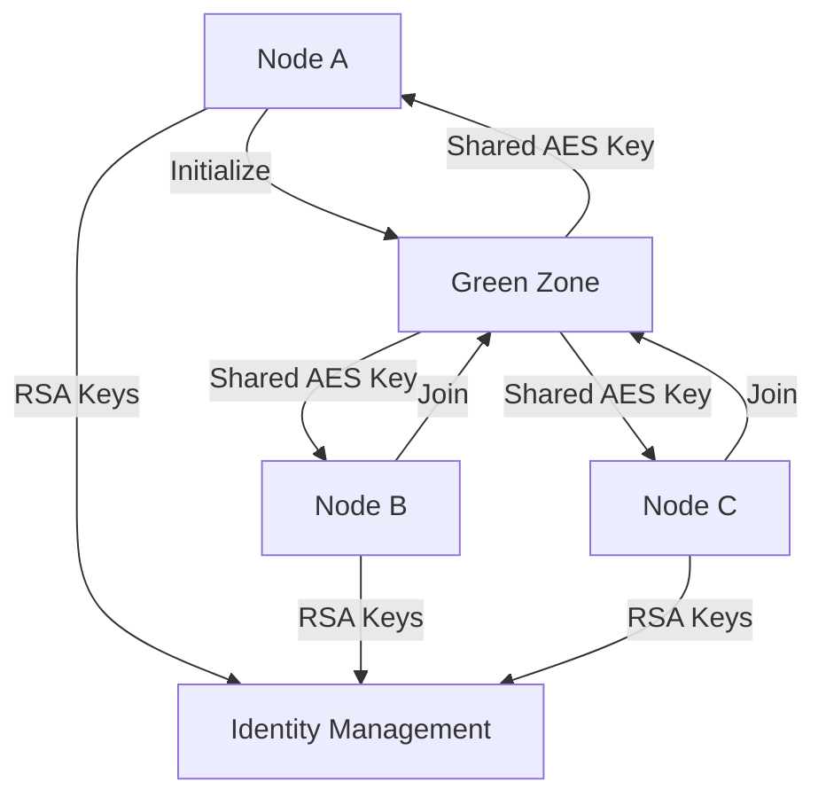
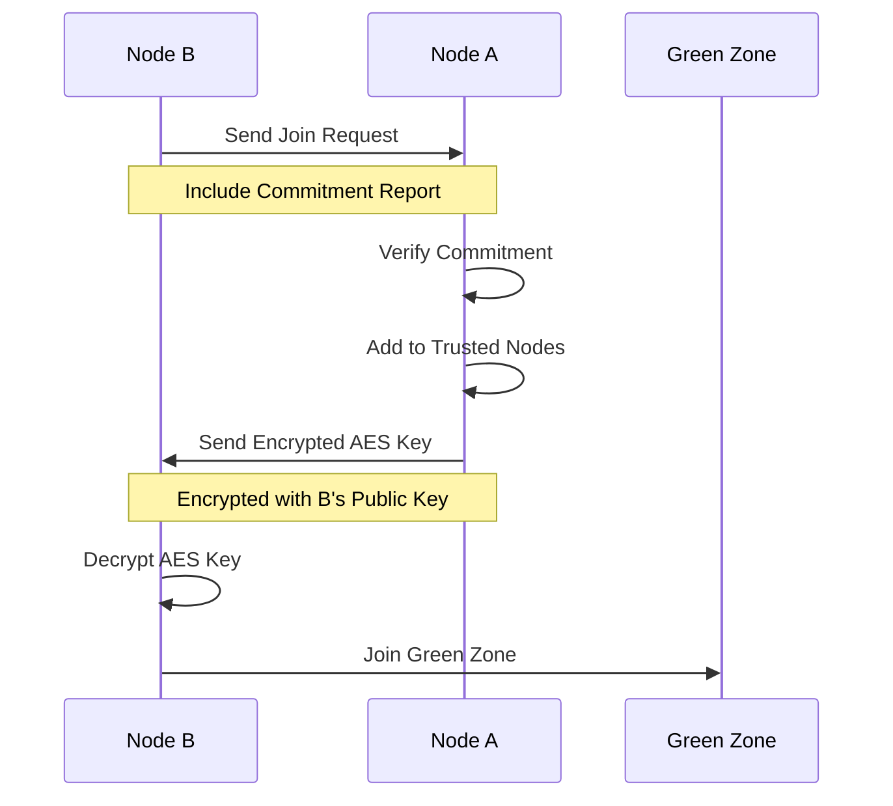

# Module: dev_green_zone

## Basic Information
- **Source File:** dev_green_zone.erl
- **Module Type:** Security & Identity Device
- **Purpose:** Provides secure communication and identity management between trusted nodes through hardware commitment and encryption, handling node initialization, joining existing green zones, key exchange, and node identity cloning.

## Core Functionality

### 1. Green Zone Architecture


### 2. Node Join Process


## Implementation Details

### 1. Zone Initialization
```erlang
init(_M1, M2, Opts) ->
    % Generate or use existing wallet
    NodeWallet = get_or_create_wallet(Opts),
    
    % Generate or use existing AES key
    GreenZoneAES = get_or_create_aes_key(Opts),
    
    % Set required configuration
    RequiredConfig = get_required_config(M2, Opts),
    
    % Store configuration
    ok = store_zone_config(NodeWallet, GreenZoneAES, RequiredConfig, Opts)
```

### 2. Join Process Implementation
```erlang
join(M1, M2, Opts) ->
    % Extract peer information
    PeerLocation = get_peer_location(M1),
    PeerID = get_peer_id(M1),
    
    case validate_join_request(PeerLocation, PeerID) of
        true -> 
            % Generate commitment report
            Report = generate_commitment_report(),
            % Send join request to peer
            send_join_request(PeerLocation, Report);
        false ->
            {error, "Invalid join request"}
    end
```

### 3. Identity Management
```erlang
become(M1, M2, Opts) ->
    % Get target node information
    NodeLocation = get_node_location(M2),
    NodeID = get_node_id(M2),
    
    % Retrieve encrypted key from target
    {ok, KeyResp} = get_encrypted_key(NodeLocation),
    
    % Verify response authenticity
    case verify_response(KeyResp, NodeID) of
        true ->
            % Decrypt and adopt identity
            adopt_node_identity(KeyResp, Opts);
        false ->
            {error, "Invalid response"}
    end
```

## Key Features

### 1. Security Management
- RSA key pairs
- AES-256-GCM encryption
- Hardware commitment
- Identity verification
- Secure key exchange

### 2. Node Configuration
- Required options
- Configuration validation
- Option inheritance
- State management
- Identity tracking

### 3. Trust Management
- Node verification
- Trust establishment
- Identity validation
- Commitment tracking
- Access control

### 4. Identity Operations
- Key generation
- Identity cloning
- Key exchange
- Identity verification
- Access management

## Usage Examples

### 1. Initialize Green Zone
```erlang
% Initialize a new green zone
{ok, <<"Green zone initialized successfully.">>} = 
    dev_green_zone:init(
        undefined,
        #{
            <<"required-config">> => #{
                <<"trusted_device_signers">> => [],
                <<"load_remote_devices">> => false
            }
        },
        #{}
    )
```

### 2. Join Existing Zone
```erlang
% Join an existing green zone
{ok, Response} = 
    dev_green_zone:join(
        #{
            <<"peer-location">> => <<"https://peer.example.com">>,
            <<"peer-id">> => PeerID
        },
        #{},
        #{}
    )
```

### 3. Clone Node Identity
```erlang
% Clone another node's identity
{ok, Result} = 
    dev_green_zone:become(
        undefined,
        #{
            <<"peer-location">> => <<"https://target.example.com">>,
            <<"peer-id">> => TargetID
        },
        #{}
    )
```

## Security Considerations

### 1. Key Management
- Secure key generation
- Safe key storage
- Key rotation
- Access control
- Key backup

### 2. Identity Protection
- Identity verification
- Clone prevention
- Access control
- Trust validation
- Audit logging

### 3. Communication Security
- Channel encryption
- Message signing
- Replay prevention
- Man-in-middle protection
- Protocol security

## Error Handling

### 1. Join Errors
- Invalid requests
- Failed verification
- Network issues
- Configuration mismatch
- Trust failures

### 2. Identity Errors
- Invalid keys
- Failed cloning
- Trust issues
- Access denied
- Protocol errors

### 3. Configuration Errors
- Invalid options
- Missing requirements
- State conflicts
- Version mismatch
- Protocol issues

## Performance Considerations

### 1. Cryptographic Operations
- Key generation cost
- Encryption overhead
- Signature verification
- Memory usage
- CPU utilization

### 2. Network Operations
- Join latency
- Key exchange time
- Identity sync
- Trust verification
- Protocol overhead

### 3. State Management
- Configuration size
- Trust list scaling
- Identity tracking
- Memory usage
- Storage impact

## Future Improvements

### 1. Security Enhancements
- Better key management
- Enhanced verification
- Improved trust model
- Protocol hardening
- Audit capabilities

### 2. Performance Optimization
- Faster crypto
- Better networking
- Reduced overhead
- Improved scaling
- Resource efficiency

### 3. Feature Extensions
- More identity options
- Better trust management
- Enhanced security
- Improved monitoring
- Better integration
