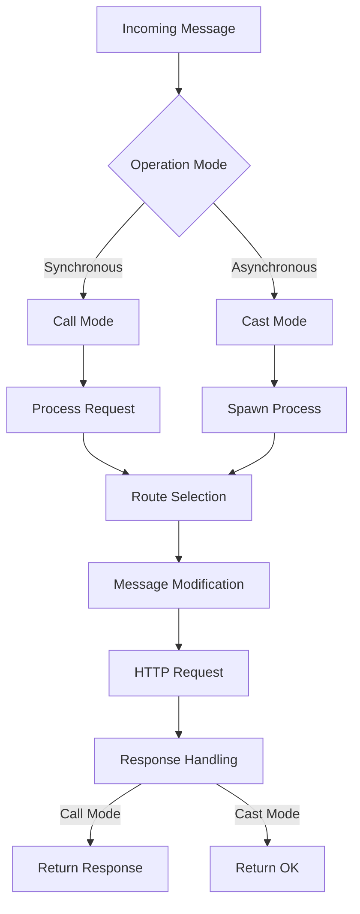
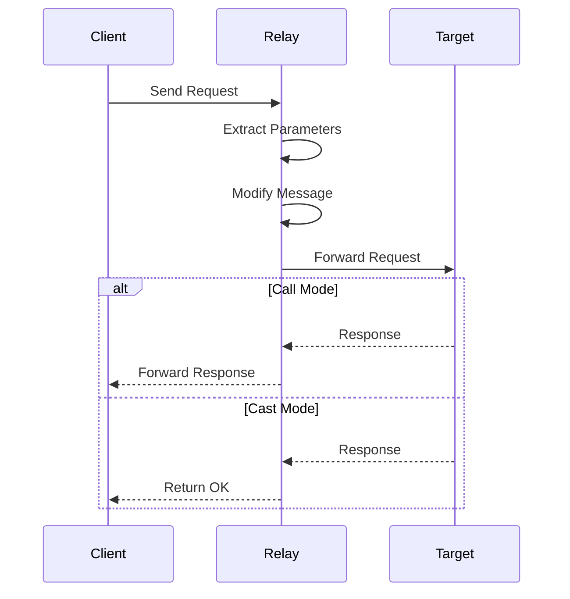

# Module: dev_relay

## Basic Information
- **Source File:** dev_relay.erl
- **Module Type:** Network Relay Device
- **Purpose:** Handles message relaying between nodes and HTTP(S) endpoints, supporting both synchronous (call) and asynchronous (cast) operations.

## Core Functionality

### 1. Message Flow Architecture


### 2. Request Processing Flow


## Implementation Details

### 1. Call Mode Implementation
```erlang
call(M1, RawM2, Opts) ->
    % Extract target and parameters
    {ok, BaseTarget} = hb_message:find_target(M1, RawM2, Opts),
    RelayPath = extract_relay_path(BaseTarget, RawM2, M1, Opts),
    RelayMethod = extract_relay_method(BaseTarget, RawM2, M1, Opts),
    RelayBody = extract_relay_body(BaseTarget, RawM2, M1, Opts),
    
    % Construct modified message
    TargetMsg = construct_target_message(BaseTarget, RelayPath, 
                                       RelayMethod, RelayBody),
    
    % Handle signing if required
    SignedMsg = handle_signing(TargetMsg, BaseTarget, Opts),
    
    % Execute request
    hb_http:request(SignedMsg, Opts)
```

### 2. Cast Mode Implementation
```erlang
cast(M1, M2, Opts) ->
    spawn(fun() -> call(M1, M2, Opts) end),
    {ok, <<"OK">>}
```

### 3. Message Preprocessing
```erlang
preprocess(_M1, M2, Opts) ->
    {ok,
        [
            #{ <<"device">> => <<"relay@1.0">> },
            #{
                <<"path">> => <<"call">>,
                <<"target">> => <<"body">>,
                <<"body">> => extract_request(M2, Opts)
            }
        ]
    }
```

## Key Features

### 1. Operation Modes
- **Synchronous (Call)**
  - Waits for response
  - Returns result
  - Error handling
  - Response forwarding

- **Asynchronous (Cast)**
  - Immediate return
  - Background processing
  - Fire and forget
  - No response handling

### 2. Message Handling
- Path extraction
- Method selection
- Body processing
- Parameter handling

### 3. Request Processing
- Target resolution
- Message modification
- Signature handling
- HTTP dispatching

### 4. Integration Features
- Route preprocessing
- Client selection
- Error handling
- Response formatting

## Usage Examples

### 1. Synchronous Call
```erlang
% Make a synchronous GET request
{ok, Response} = dev_relay:call(
    #{
        <<"device">> => <<"relay@1.0">>,
        <<"method">> => <<"GET">>,
        <<"path">> => <<"https://api.example.com/data">>
    },
    #{},
    #{}
)
```

### 2. Asynchronous Cast
```erlang
% Make an asynchronous POST request
{ok, <<"OK">>} = dev_relay:cast(
    #{
        <<"device">> => <<"relay@1.0">>,
        <<"method">> => <<"POST">>,
        <<"path">> => <<"https://api.example.com/event">>,
        <<"body">> => #{<<"data">> => <<"event">>}
    },
    #{},
    #{}
)
```

### 3. Route Preprocessing
```erlang
% Configure relay preprocessing
Node = hb_http_server:start_node(#{
    preprocessor => #{
        <<"device">> => <<"relay@1.0">>
    }
})
```

## Testing Coverage

### 1. Basic Operations
```erlang
call_get_test() ->
    % Test GET request to external endpoint
    {ok, #{<<"body">> := Body}} =
        hb_ao:resolve(
            #{
                <<"device">> => <<"relay@1.0">>,
                <<"method">> => <<"GET">>,
                <<"path">> => <<"https://www.google.com/">>
            },
            <<"call">>,
            #{ protocol => http2 }
        ),
    ?assertEqual(true, byte_size(Body) > 10_000)
```

### 2. Route Processing
```erlang
preprocessor_reroute_test() ->
    % Test request rerouting based on node configuration
    Node = setup_test_node(),
    {ok, Response} = make_test_request(Node),
    verify_response(Response)
```

## Error Handling

### 1. Request Errors
- Invalid paths
- Bad methods
- Missing parameters
- Network failures

### 2. Response Errors
- Timeout handling
- Status codes
- Error formatting
- Client failures

### 3. Processing Errors
- Invalid targets
- Bad parameters
- Route failures
- Client issues

## Performance Considerations

### 1. Synchronous Operations
- Response waiting
- Resource usage
- Connection pooling
- Timeout handling

### 2. Asynchronous Operations
- Process spawning
- Memory usage
- Background tasks
- Resource cleanup

### 3. Message Processing
- Parameter extraction
- Message modification
- Signature handling
- HTTP operations

## Future Improvements

### 1. Feature Extensions
- More protocols
- Better routing
- Enhanced security
- Better monitoring

### 2. Performance Optimization
- Connection pooling
- Request batching
- Response caching
- Resource management

### 3. Integration Enhancement
- More protocols
- Better routing
- Enhanced security
- Improved monitoring
