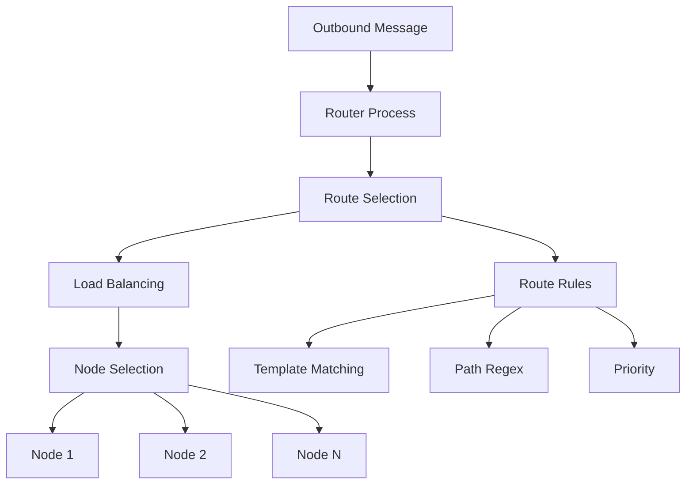
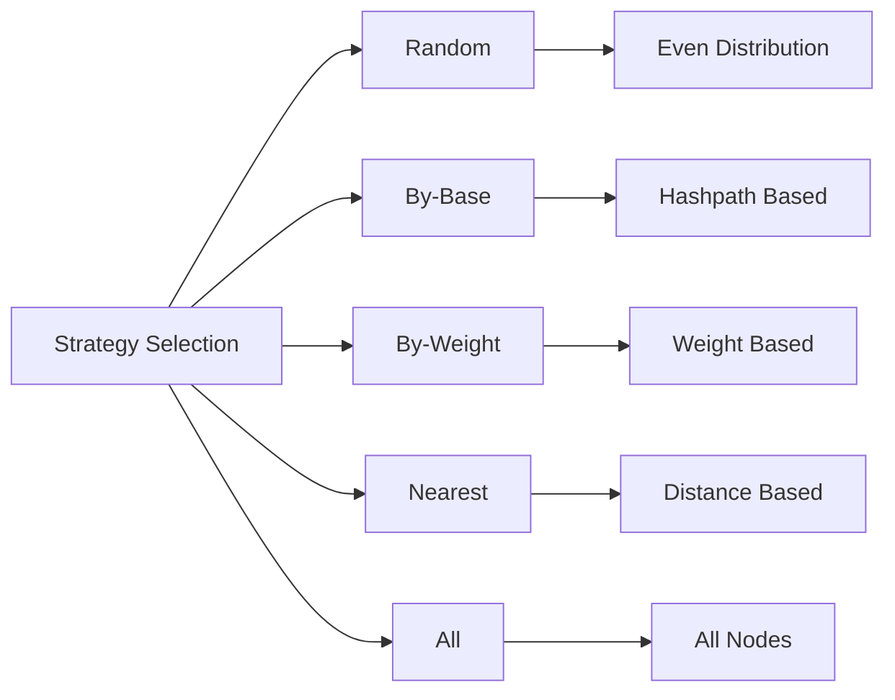

# Module: dev_router

## Basic Information
- **Source File:** dev_router.erl
- **Module Type:** Network Routing Device
- **Purpose:** Routes outbound messages to appropriate network recipients via HTTP, implementing sophisticated load balancing and routing strategies.

## Core Functionality

### 1. Routing Architecture


### 2. Load Distribution Strategies


## Implementation Details

### 1. Route Configuration

#### Route Structure
```erlang
#{
    "Node?" => "Single node URI",
    "Nodes?" => ["List of node URIs"],
    "Strategy?" => "Load distribution strategy",
    "Choose?" => "Number of nodes to select",
    "Template?" => "Message template or path regex"
}
```

#### Route Loading
```erlang
load_routes(Opts) ->
    case hb_opts:get(route_provider, not_found, Opts) of
        not_found -> 
            hb_opts:get(routes, [], Opts);
        RoutesProvider ->
            ProviderMsgs = hb_singleton:from(RoutesProvider),
            {ok, Routes} = hb_ao:resolve_many(ProviderMsgs, Opts)
    end
```

### 2. Load Balancing Strategies

#### Strategy Implementation
1. **Random Distribution**
   - Even load distribution
   - Non-deterministic selection
   - Simple implementation
   - Good for general use

2. **By-Base Distribution**
   - Hashpath-based routing
   - Deterministic selection
   - Minimizes duplication
   - Consistent routing

3. **By-Weight Distribution**
   - Weight-based selection
   - Configurable distribution
   - Resource-aware routing
   - Load optimization

4. **Nearest Distribution**
   - Distance-based routing
   - Wallet address proximity
   - Network optimization
   - Locality awareness

### 3. Route Selection Process

#### Template Matching
```erlang
match_routes(ToMatch, Routes, Opts) ->
    match_routes(
        ToMatch,
        Routes,
        hb_ao:keys(hb_ao:normalize_keys(Routes)),
        Opts
    )
```

#### Node Selection
```erlang
choose(N, Strategy, Base, Nodes, Opts) ->
    case Strategy of
        <<"Random">> -> 
            random_selection(N, Nodes);
        <<"By-Base">> -> 
            hashpath_selection(N, Base, Nodes);
        <<"By-Weight">> ->
            weight_selection(N, Nodes);
        <<"Nearest">> ->
            distance_selection(N, Base, Nodes)
    end
```

## Key Features

### 1. Route Management
- Dynamic route loading
- Priority-based routing
- Template matching
- Path regex support

### 2. Load Balancing
- Multiple strategies
- Configurable selection
- Resource optimization
- Network efficiency

### 3. Node Selection
- Multi-node support
- Strategy-based choice
- Distance calculation
- Weight consideration

### 4. Security Features
- Route authorization
- Signature verification
- Owner validation
- Access control

## Usage Examples

### 1. Basic Routing
```erlang
% Configure routes
Routes = [#{
    <<"template">> => <<"*">>,
    <<"node">> => <<"default_node">>,
    <<"priority">> => 10
}]

% Route message
{ok, Node} = dev_router:route(Message, #{
    routes => Routes
})
```

### 2. Load Balanced Routing
```erlang
% Configure load balanced routes
Routes = [#{
    <<"template">> => <<"/api/*">>,
    <<"nodes">> => [Node1, Node2, Node3],
    <<"strategy">> => <<"By-Weight">>,
    <<"choose">> => 2
}]

% Route message
{ok, SelectedNodes} = dev_router:route(Message, #{
    routes => Routes
})
```

### 3. Dynamic Route Provider
```erlang
% Configure route provider
Config = #{
    route_provider => #{
        <<"path">> => <<"/router/routes">>,
        <<"device">> => <<"provider@1.0">>
    }
}

% Get routes
{ok, Routes} = dev_router:routes(Message1, Message2, Config)
```

## Testing Coverage

### 1. Strategy Tests
```erlang
strategy_suite_test_() ->
    [test_strategy(Strategy) || Strategy <- [
        <<"Random">>,
        <<"By-Base">>,
        <<"Nearest">>
    ]]
```

### 2. Distribution Tests
```erlang
weighted_random_strategy_test() ->
    Nodes = [
        #{<<"weight">> => 1},
        #{<<"weight">> => 99}
    ],
    Distribution = simulate(1000, Nodes)
```

### 3. Route Tests
```erlang
route_template_message_matches_test() ->
    Routes = [
        #{
            <<"template">> => Template,
            <<"node">> => Node
        }
    ],
    test_route_matching(Routes)
```

## Performance Considerations

### 1. Route Selection
- Efficient matching
- Quick template comparison
- Optimized regex
- Fast path extraction

### 2. Load Distribution
- Minimal overhead
- Quick calculations
- Efficient selection
- Resource awareness

### 3. Node Management
- Connection pooling
- Resource caching
- State tracking
- Error handling

## Error Handling

### 1. Route Errors
- Missing routes
- Invalid templates
- Bad configurations
- Authorization failures

### 2. Node Errors
- Connection failures
- Timeout handling
- Resource exhaustion
- State recovery

### 3. Strategy Errors
- Invalid selection
- Resource limits
- Configuration issues
- State inconsistency

## Future Improvements

### 1. Route Enhancement
- More templates
- Better matching
- Enhanced regex
- Improved priority

### 2. Strategy Addition
- New algorithms
- Better selection
- More metrics
- Enhanced efficiency

### 3. Performance Optimization
- Faster matching
- Better distribution
- Resource usage
- Error recovery
