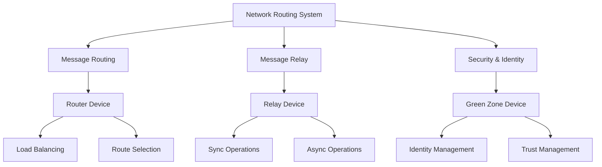
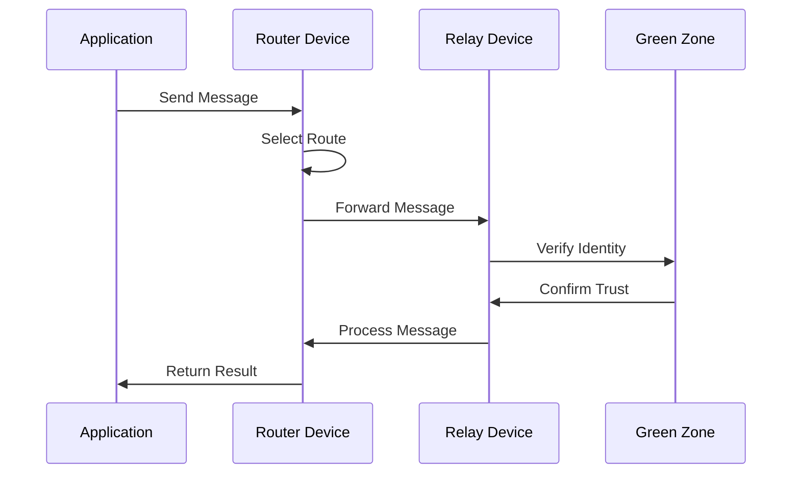

# Network Routing System: In-Depth Analysis & Observations

## Architectural Foundation & Design Philosophy

### 1. Multi-Layer Architecture

The network routing system implements a sophisticated three-layer architecture that handles message routing, relaying, and secure communication:

1. **Message Routing Layer**
   - Implements intelligent route selection
   - Provides load balancing strategies
   - Handles route configuration
   - Manages routing tables
   - Optimizes message flow

2. **Message Relay Layer**
   - Supports synchronous operations
   - Enables asynchronous processing
   - Handles message forwarding
   - Manages relay endpoints
   - Ensures delivery reliability

3. **Security & Identity Layer**
   - Manages node identities
   - Establishes trust relationships
   - Handles cryptographic operations
   - Controls access permissions
   - Ensures secure communication

### 2. Component Integration

The system demonstrates sophisticated component integration:

1. **Router-Relay Integration**
   - Coordinated message handling
   - Shared route information
   - Consistent load balancing
   - Error propagation
   - Performance optimization

2. **Relay-Green Zone Integration**
   - Identity verification
   - Trust establishment
   - Secure communication
   - Access control
   - Key management

3. **System-Wide Integration**
   - Unified message flow
   - Consistent security
   - Shared configuration
   - Error handling
   - Resource management

## Core System Features

### 1. Message Routing Capabilities

#### Route Management
- Dynamic route configuration
- Priority-based routing
- Template matching
- Path regex support
- Route validation

#### Load Distribution
- Random distribution
- Hash-based routing
- Weight-based selection
- Nearest node selection
- Custom strategies

#### Performance Optimization
- Connection pooling
- Request batching
- Response caching
- Resource management
- Error recovery

### 2. Message Relay Features

#### Operation Modes
- Synchronous processing
- Asynchronous handling
- Batch operations
- Priority queuing
- Error recovery

#### Message Transformation
- Format conversion
- Protocol adaptation
- Content modification
- Header management
- Metadata handling

#### Integration Support
- Protocol bridging
- Format translation
- Security integration
- Error propagation
- Performance monitoring

### 3. Security & Identity Features

#### Identity Management
- Key generation
- Identity verification
- Trust establishment
- Access control
- Audit logging

#### Cryptographic Operations
- RSA key handling
- AES encryption
- Message signing
- Key exchange
- Identity protection

#### Trust Management
- Node verification
- Trust relationships
- Configuration validation
- Access permissions
- Security policies

## Implementation Patterns & Best Practices

### 1. Routing Patterns

#### Route Selection
- Template-based matching
- Regular expression support
- Priority handling
- Load balancing
- Error management

#### Configuration Management
- Dynamic updates
- Validation rules
- Default handling
- Error checking
- State management

#### Performance Optimization
- Connection reuse
- Request batching
- Response caching
- Resource pooling
- Error recovery

### 2. Relay Patterns

#### Message Processing
- Format handling
- Protocol adaptation
- Error management
- State tracking
- Resource control

#### Operation Modes
- Sync processing
- Async handling
- Batch operations
- Priority management
- Error recovery

#### Integration Support
- Protocol bridging
- Format conversion
- Security handling
- Error propagation
- Performance monitoring

### 3. Security Patterns

#### Identity Operations
- Key management
- Trust verification
- Access control
- Audit logging
- Error handling

#### Cryptographic Handling
- Key generation
- Encryption operations
- Signature handling
- Trust verification
- Security validation

#### Configuration Management
- Option validation
- State tracking
- Error handling
- Security policies
- Access control

## Performance Considerations

### 1. Message Processing

#### Routing Performance
- Route selection speed
- Load balancing efficiency
- Template matching
- Path resolution
- Error handling

#### Relay Performance
- Message throughput
- Processing latency
- Resource usage
- Error recovery
- State management

#### Security Performance
- Cryptographic operations
- Key management
- Trust verification
- Access control
- Audit logging

### 2. Resource Management

#### Memory Usage
- Connection pooling
- Request caching
- Response buffering
- State tracking
- Resource cleanup

#### CPU Utilization
- Route matching
- Message processing
- Cryptographic operations
- Error handling
- Performance monitoring

#### Network Efficiency
- Connection reuse
- Request batching
- Response caching
- Protocol optimization
- Error recovery

## Future Improvements

### 1. Feature Enhancements

#### Routing Improvements
- More strategies
- Better matching
- Enhanced validation
- Improved monitoring
- Better integration

#### Relay Enhancements
- New protocols
- Better handling
- Enhanced security
- Improved monitoring
- Better performance

#### Security Updates
- Enhanced crypto
- Better trust model
- Improved validation
- Better monitoring
- Enhanced integration

### 2. Performance Optimization

#### Processing Efficiency
- Faster routing
- Better relaying
- Enhanced security
- Improved caching
- Better resource use

#### Resource Management
- Better pooling
- Enhanced caching
- Improved cleanup
- Better monitoring
- Optimized usage

#### Integration Enhancement
- Better protocols
- Enhanced security
- Improved handling
- Better monitoring
- Optimized performance
