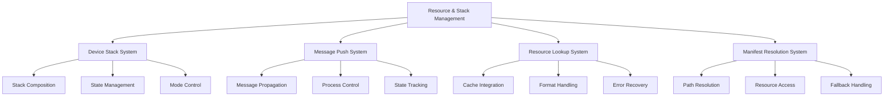
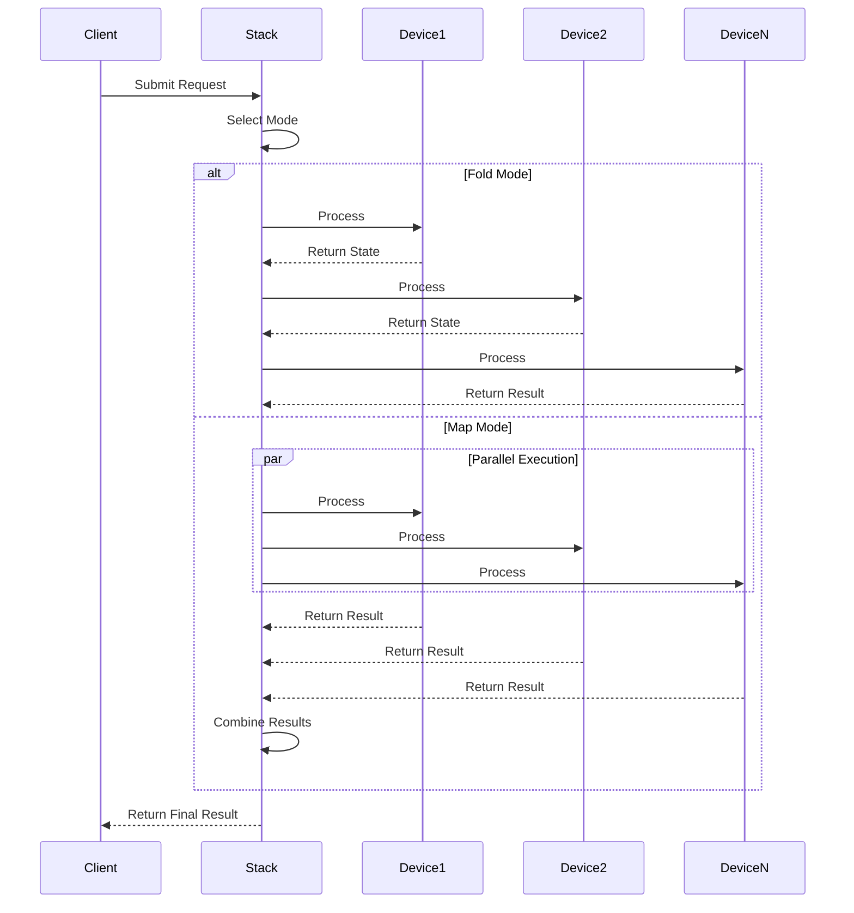
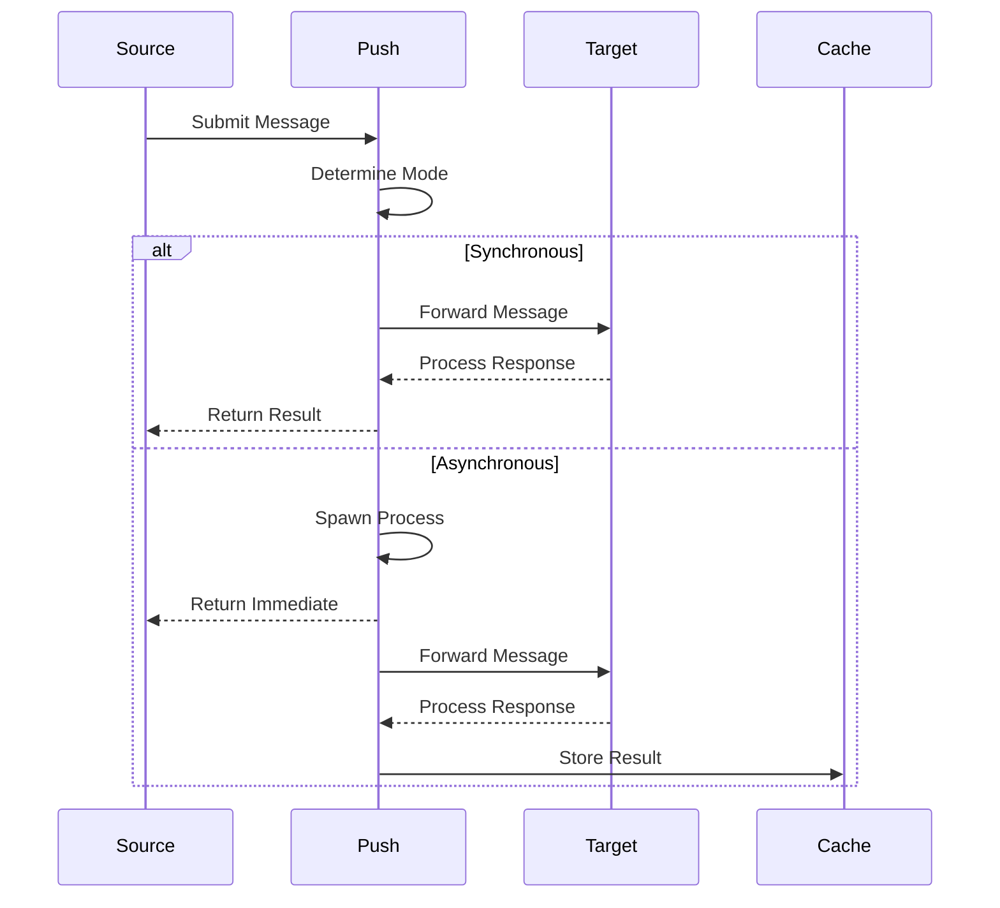
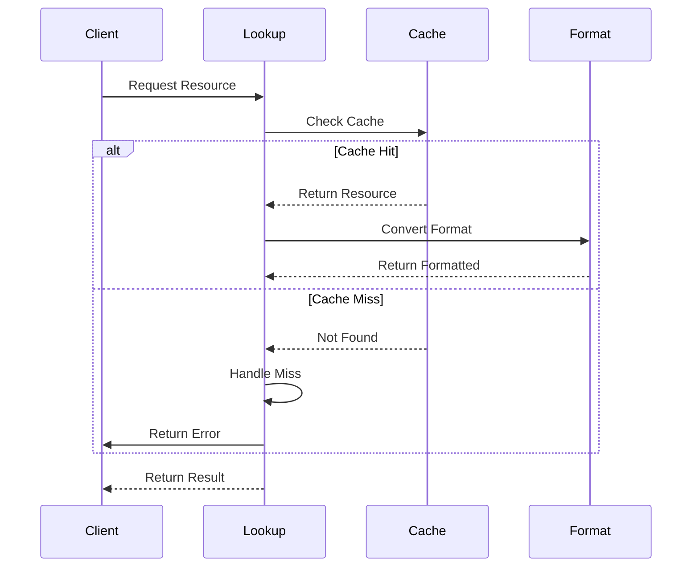
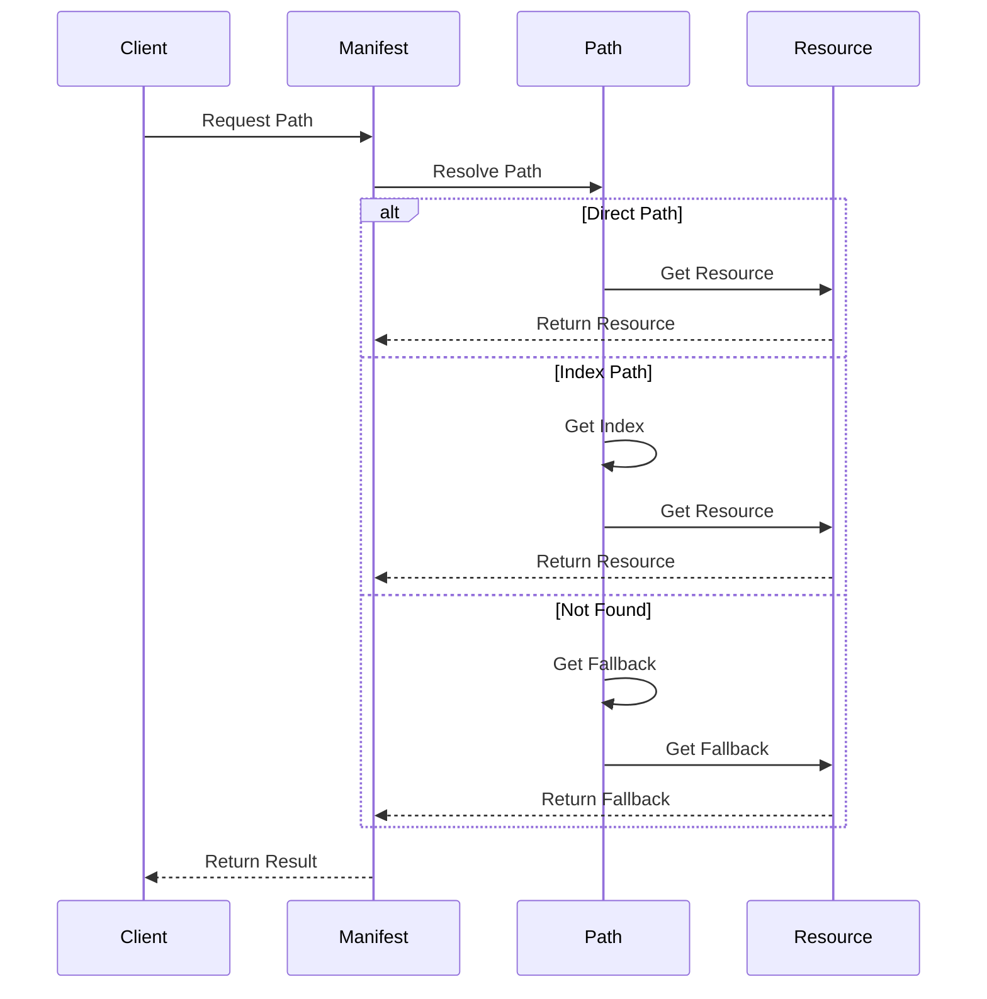

# Resource & Stack Management: System Overview

## Architectural Foundation

### 1. System Architecture

The Resource & Stack Management subsystem represents a sophisticated orchestration layer that manages device composition, message propagation, resource lookup, and manifest resolution. This system demonstrates several key architectural principles:

1. **Layered Architecture**
   - Clear separation of concerns between stacking, pushing, lookup, and manifest handling
   - Well-defined interfaces between components
   - Hierarchical organization of functionality
   - Consistent error handling patterns
   - Robust state management

2. **Component Integration**
   - Seamless interaction between stack and push systems
   - Coordinated resource lookup and manifest resolution
   - Unified error handling and recovery
   - Shared state management
   - Consistent format handling

3. **Resource Management**
   - Efficient cache utilization
   - Optimized lookup patterns
   - Smart fallback mechanisms
   - Format conversion capabilities
   - State preservation strategies

## Core Components

### 1. Device Stack System

The Device Stack System provides sophisticated device composition capabilities:

1. **Stack Management**
   - Dynamic device composition
   - Flexible execution modes
   - State propagation control
   - Error handling strategies
   - Resource optimization

2. **Mode Control**
   - Fold mode for sequential processing
   - Map mode for parallel execution
   - State maintenance mechanisms
   - Error recovery patterns
   - Resource management

3. **State Handling**
   - Consistent state tracking
   - Error state management
   - Resource state control
   - Format state handling
   - Operation validation

### 2. Message Push System

The Message Push System enables sophisticated message propagation:

1. **Push Operations**
   - Synchronous/asynchronous modes
   - Process spawning control
   - State maintenance
   - Error handling
   - Resource management

2. **Process Control**
   - Mode selection
   - State tracking
   - Error recovery
   - Resource optimization
   - Format handling

3. **Integration Points**
   - Stack coordination
   - Cache integration
   - Format handling
   - Error propagation
   - State sharing

### 3. Resource Lookup System

The Resource Lookup System provides efficient resource access:

1. **Cache Integration**
   - Efficient lookup
   - Format handling
   - Error recovery
   - State management
   - Resource optimization

2. **Format Handling**
   - Multiple format support
   - Conversion capabilities
   - Error handling
   - State preservation
   - Resource management

3. **Error Management**
   - Comprehensive recovery
   - State preservation
   - Resource cleanup
   - Format validation
   - Operation verification

### 4. Manifest Resolution System

The Manifest Resolution System enables sophisticated path handling:

1. **Path Resolution**
   - Index path handling
   - Direct path resolution
   - Fallback mechanisms
   - Error recovery
   - State management

2. **Resource Access**
   - Efficient retrieval
   - Format handling
   - Error recovery
   - State preservation
   - Resource optimization

3. **Fallback Handling**
   - Smart fallback selection
   - State preservation
   - Error recovery
   - Format handling
   - Resource management

## Integration Patterns

### 1. Component Coordination
- Stack-Push integration for message propagation
- Push-Lookup integration for resource access
- Lookup-Manifest integration for path resolution
- Manifest-Cache integration for resource retrieval
- Cache-Format integration for data handling

### 2. State Management
- Consistent state tracking across components
- Error state propagation and recovery
- Resource state maintenance
- Format state handling
- Operation state validation

### 3. Error Handling
- Comprehensive error recovery strategies
- State preservation during errors
- Resource cleanup on failures
- Format validation mechanisms
- Operation verification patterns

## Future Directions

### 1. Enhancement Opportunities
- Extended execution modes
- Enhanced state tracking
- Improved error handling
- Better resource management
- Advanced format handling

### 2. Performance Optimization
- Faster execution paths
- Better resource utilization
- Enhanced state management
- Improved error recovery
- Optimized format handling

### 3. Integration Improvements
- Better component coordination
- Enhanced state sharing
- Improved error handling
- Optimized resource usage
- Advanced format handling
