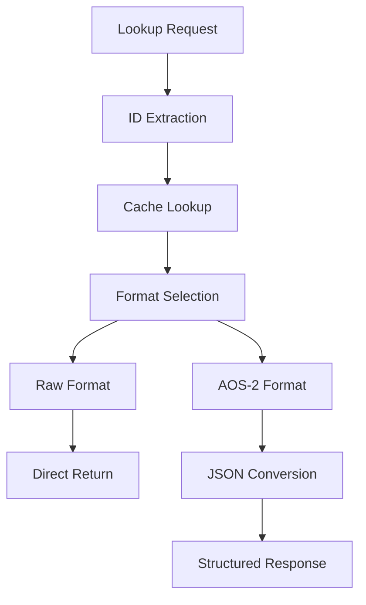
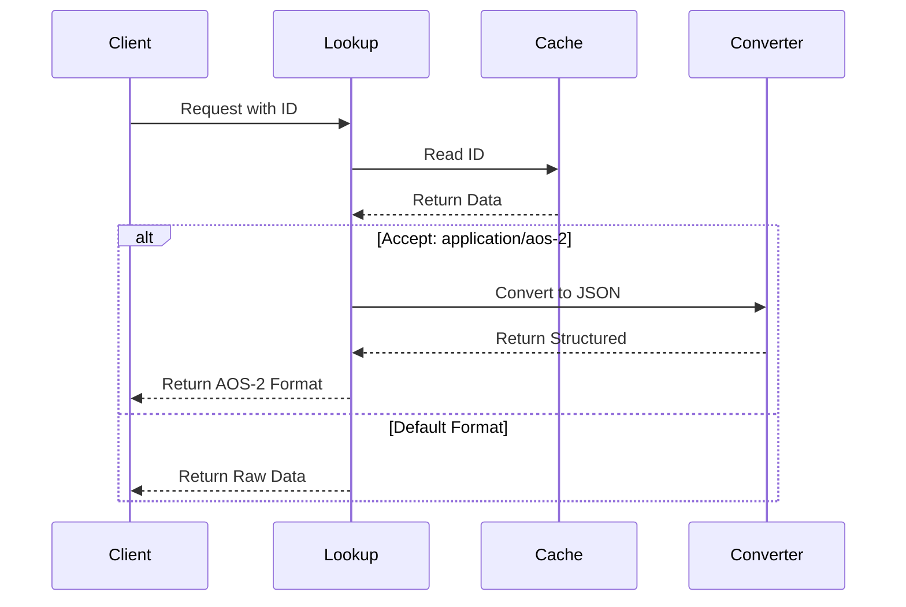

# Module: dev_lookup

## Basic Information
- **Source File:** dev_lookup.erl
- **Module Type:** Lookup Device
- **Purpose:** Retrieves data from local storage by ID and handles format conversion based on accept headers.

## Core Functionality

### 1. Lookup Architecture


### 2. Request Flow


## Implementation Details

### 1. Core Operation
```erlang
read(_M1, M2, Opts) ->
    % Extract target ID
    ID = hb_ao:get(<<"target">>, M2, Opts),
    
    % Attempt cache lookup
    case hb_cache:read(ID, Opts) of
        {ok, Res} ->
            % Handle format conversion
            case hb_ao:get(<<"accept">>, M2, Opts) of
                <<"application/aos-2">> ->
                    convert_to_aos2(Res);
                _ ->
                    {ok, Res}
            end;
        not_found ->
            {error, not_found}
    end
```

### 2. Format Conversion
```erlang
convert_to_aos2(Data) ->
    % Convert to JSON structure
    Struct = dev_json_iface:message_to_json_struct(Data),
    
    % Return formatted response
    {ok, #{
        <<"body">> => hb_json:encode(Struct),
        <<"content-type">> => <<"application/aos-2">>
    }}
```

## Key Features

### 1. ID Resolution
- Target extraction
- Cache lookup
- Error handling
- Result validation
- Format detection

### 2. Format Handling
- Raw data support
- AOS-2 conversion
- JSON structuring
- Content-type management
- Response formatting

### 3. Cache Integration
- Local storage access
- Data retrieval
- Error handling
- Format preservation
- Response management

## Usage Examples

### 1. Basic Lookup
```erlang
% Look up raw data
{ok, Result} = dev_lookup:read(
    #{},
    #{
        <<"target">> => DataID
    },
    #{}
)
```

### 2. AOS-2 Format
```erlang
% Look up with AOS-2 format
{ok, Result} = dev_lookup:read(
    #{},
    #{
        <<"target">> => DataID,
        <<"accept">> => <<"application/aos-2">>
    },
    #{}
)
```

### 3. HTTP Integration
```erlang
% HTTP-based lookup
Node = hb_http_server:start_node(Opts),
Req = hb_message:commit(#{
    <<"path">> => <<"/~lookup@1.0/read?target=", ID/binary>>,
    <<"device">> => <<"lookup@1.0">>,
    <<"accept">> => <<"application/aos-2">>
}, Wallet)
```

## Error Handling

### 1. Lookup Errors
- Missing IDs
- Invalid targets
- Cache failures
- Format errors
- Response validation

### 2. Format Errors
- Invalid formats
- Conversion failures
- Structure errors
- Encoding issues
- Type mismatches

### 3. Cache Errors
- Access failures
- Missing data
- Storage errors
- Format issues
- System failures

## Performance Considerations

### 1. Cache Efficiency
- Quick lookups
- Format caching
- Response time
- Memory usage
- Storage optimization

### 2. Format Conversion
- Conversion speed
- Memory impact
- Response size
- Structure efficiency
- Cache utilization

### 3. Response Time
- Lookup speed
- Format selection
- Conversion time
- Response building
- Error handling

## Future Improvements

### 1. Feature Extensions
- More formats
- Better caching
- Enhanced validation
- Format detection
- Error recovery

### 2. Performance Optimization
- Faster lookups
- Better conversion
- Improved caching
- Enhanced validation
- Error handling

### 3. Integration Enhancement
- More formats
- Better protocols
- Enhanced security
- Improved validation
- Better integration
