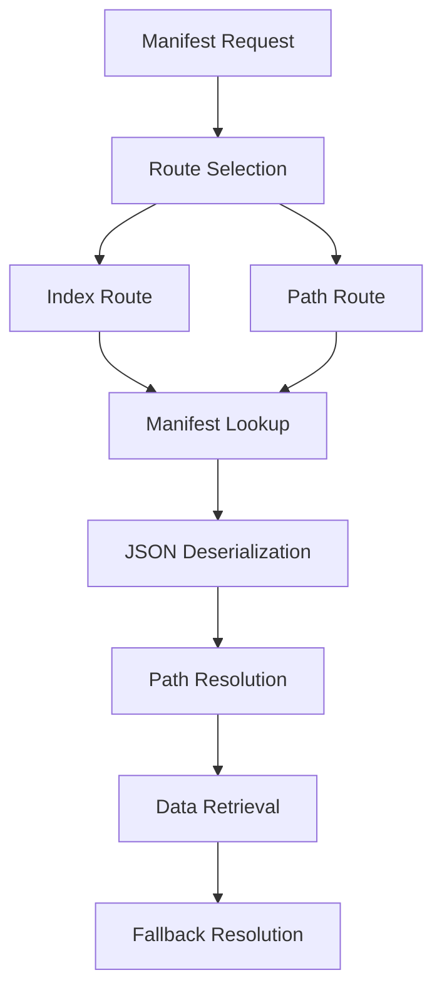
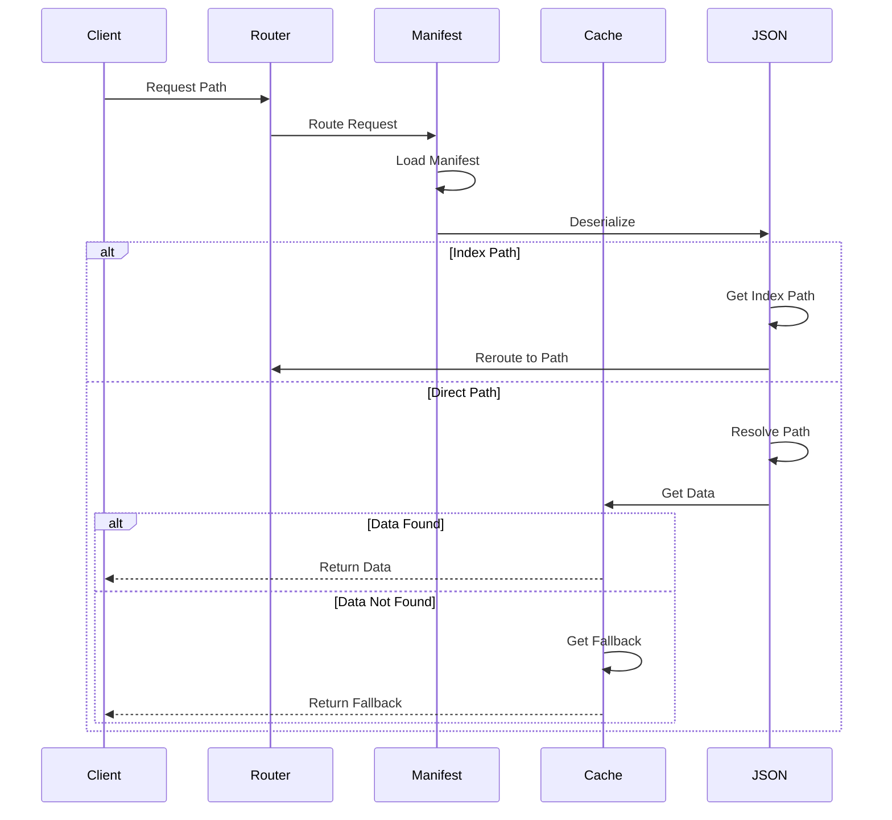

# Module: dev_manifest

## Basic Information
- **Source File:** dev_manifest.erl
- **Module Type:** Manifest Resolution Device
- **Purpose:** Resolves Arweave path manifests according to the v1 schema specification (https://specs.ar.io/?tx=lXLd0OPwo-dJLB_Amz5jgIeDhiOkjXuM3-r0H_aiNj0)

## Core Functionality

### 1. Manifest Architecture


### 2. Resolution Flow


## Implementation Details

### 1. Route Handler
```erlang
route(<<"index">>, M1, M2, Opts) ->
    % Get manifest
    case manifest(M1, M2, Opts) of
        {ok, JSONStruct} ->
            % Resolve index path
            case hb_ao:resolve(JSONStruct, [<<"index">>, <<"path">>], Opts) of
                {ok, Path} ->
                    % Route to resolved path
                    route(Path, M1, M2, Opts);
                _ -> {error, not_found}
            end;
        {error, not_found} ->
            {error, not_found}
    end
```

### 2. Path Resolution
```erlang
route(Key, M1, M2, Opts) ->
    % Get manifest
    {ok, JSONStruct} = manifest(M1, M2, Opts),
    
    % Resolve path entry
    case hb_ao:resolve(JSONStruct, [<<"paths">>, Key], Opts) of
        {ok, Entry} ->
            ID = maps:get(<<"id">>, Entry),
            
            % Try to get data
            case hb_cache:read(ID, Opts) of
                {ok, Data} ->
                    {ok, Data};
                {error, not_found} ->
                    % Try fallback
                    Fallback = hb_ao:get(JSONStruct, <<"fallback">>, Opts),
                    FallbackID = maps:get(<<"id">>, Fallback),
                    hb_cache:read(FallbackID, Opts)
            end;
        _ -> {error, not_found}
    end
```

## Key Features

### 1. Manifest Handling
- JSON deserialization
- Path resolution
- Index handling
- Fallback support
- Error management

### 2. Path Resolution
- Index paths
- Direct paths
- Path validation
- Entry lookup
- Data retrieval

### 3. Data Management
- Cache integration
- Fallback handling
- ID resolution
- Format handling
- Error recovery

## Usage Examples

### 1. Index Resolution
```erlang
% Resolve index path
{ok, Result} = dev_manifest:route(
    <<"index">>,
    ManifestBase,
    #{},
    #{}
)
```

### 2. Path Resolution
```erlang
% Resolve specific path
{ok, Result} = dev_manifest:route(
    <<"path/to/resource">>,
    ManifestBase,
    #{},
    #{}
)
```

### 3. Manifest Structure
```erlang
% Example manifest structure
{
    "index": {
        "path": "index.html"
    },
    "paths": {
        "index.html": {
            "id": "primary-id"
        }
    },
    "fallback": {
        "id": "fallback-id"
    }
}
```

## Error Handling

### 1. Resolution Errors
- Invalid paths
- Missing entries
- JSON errors
- Cache failures
- Manifest errors

### 2. Data Errors
- Missing data
- Invalid IDs
- Cache errors
- Format issues
- System failures

### 3. Fallback Errors
- Missing fallbacks
- Invalid fallbacks
- Cache errors
- Format issues
- System failures

## Performance Considerations

### 1. Resolution Speed
- Path lookup
- JSON parsing
- Cache access
- Fallback handling
- Error recovery

### 2. Cache Efficiency
- Data retrieval
- Fallback access
- ID resolution
- Format handling
- Error management

### 3. Resource Usage
- Memory allocation
- Cache utilization
- JSON processing
- Path resolution
- Error handling

## Future Improvements

### 1. Feature Extensions
- More formats
- Better caching
- Enhanced validation
- Path optimization
- Error recovery

### 2. Performance Optimization
- Faster resolution
- Better caching
- Improved validation
- Enhanced fallbacks
- Error handling

### 3. Integration Enhancement
- More formats
- Better protocols
- Enhanced security
- Improved validation
- Better integration
