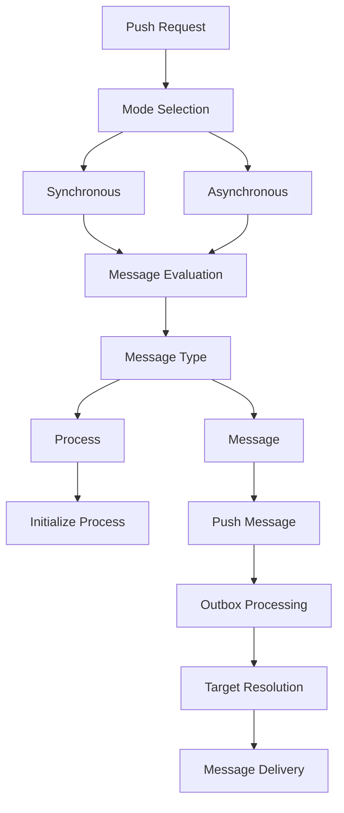
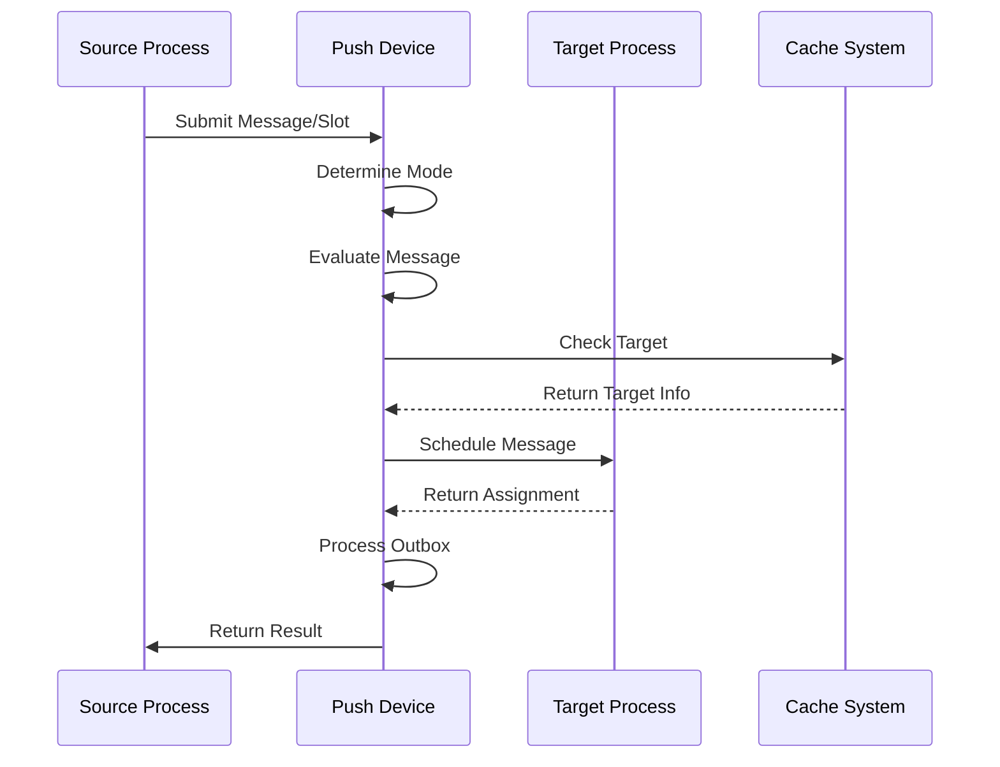

# Module: dev_push

## Basic Information
- **Source File:** dev_push.erl
- **Module Type:** Message Push Device
- **Purpose:** Handles recursive message pushing between processes, evaluating messages and propagating them through the system until no messages remain to be pushed.

## Core Functionality

### 1. Push Architecture


### 2. Message Flow


## Implementation Details

### 1. Push Operation
```erlang
push(Base, Req, Opts) ->
    % Convert base to process
    ModBase = dev_process:as_process(Base, Opts),
    
    % Check for slot number
    case get_slot(Req) of
        no_slot ->
            % Schedule initial message
            schedule_and_push(ModBase, Req, Opts);
        _ ->
            % Push with selected mode
            push_with_mode(ModBase, Req, Opts)
    end
```

### 2. Mode Selection
```erlang
push_with_mode(Base, Req, Opts) ->
    Mode = is_async(Base, Req, Opts),
    case Mode of
        <<"sync">> ->
            do_push(Base, Req, Opts);
        <<"async">> ->
            spawn(fun() -> do_push(Base, Req, Opts) end)
    end
```

### 3. Message Processing
```erlang
do_push(Base, Assignment, Opts) ->
    % Get slot and process ID
    Slot = get_slot(Assignment),
    ID = get_process_id(Base),
    
    % Compute results
    {Status, Result} = compute_results(Base, Slot, Opts),
    
    % Process outbox
    case get_outbox(Result) of
        empty -> 
            return_success(Slot, ID);
        Outbox ->
            process_outbox(Outbox, Base, Slot, Opts)
    end
```

## Key Features

### 1. Push Modes

#### Synchronous
- Direct execution
- Result waiting
- Error handling
- State tracking
- Resource management

#### Asynchronous
- Background processing
- Non-blocking
- Parallel execution
- Resource efficiency
- Error isolation

### 2. Message Handling
- Type detection
- Slot management
- Target resolution
- State tracking
- Error handling

### 3. Process Management
- Process conversion
- Identity tracking
- Resource control
- State management
- Error recovery

## Usage Examples

### 1. Basic Push
```erlang
% Push a message synchronously
{ok, Result} = dev_push:push(
    BaseProcess,
    #{
        <<"slot">> => SlotNumber,
        <<"push-mode">> => <<"sync">>
    },
    #{}
)
```

### 2. Async Push
```erlang
% Push a message asynchronously
{ok, Result} = dev_push:push(
    BaseProcess,
    #{
        <<"slot">> => SlotNumber,
        <<"push-mode">> => <<"async">>
    },
    #{}
)
```

### 3. Process Push
```erlang
% Push a process initialization
{ok, Result} = dev_push:push(
    BaseProcess,
    #{
        <<"type">> => <<"Process">>,
        <<"body">> => ProcessDefinition
    },
    #{}
)
```

## Error Handling

### 1. Push Errors
- Invalid slots
- Missing targets
- Process failures
- Network issues
- Resource exhaustion

### 2. Target Errors
- Invalid targets
- Access denied
- Resource limits
- State conflicts
- Network failures

### 3. Process Errors
- Initialization failures
- State corruption
- Resource limits
- Access control
- Network issues

## Performance Considerations

### 1. Resource Usage
- Memory allocation
- Process spawning
- Network bandwidth
- Cache utilization
- State management

### 2. Execution Efficiency
- Mode selection
- Target resolution
- Message routing
- State tracking
- Error handling

### 3. Network Impact
- Message size
- Target location
- Protocol selection
- Connection management
- Error recovery

## Future Improvements

### 1. Feature Extensions
- More push modes
- Better error handling
- Enhanced monitoring
- Resource optimization
- Performance tracking

### 2. Performance Optimization
- Faster processing
- Better resource use
- Improved error handling
- Enhanced monitoring
- State management

### 3. Integration Enhancement
- More protocols
- Better coordination
- Enhanced security
- Improved monitoring
- Better integration
