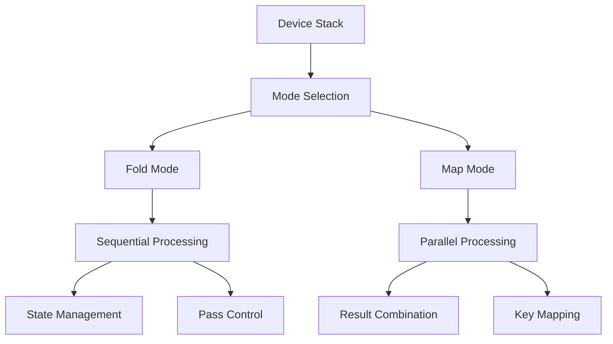
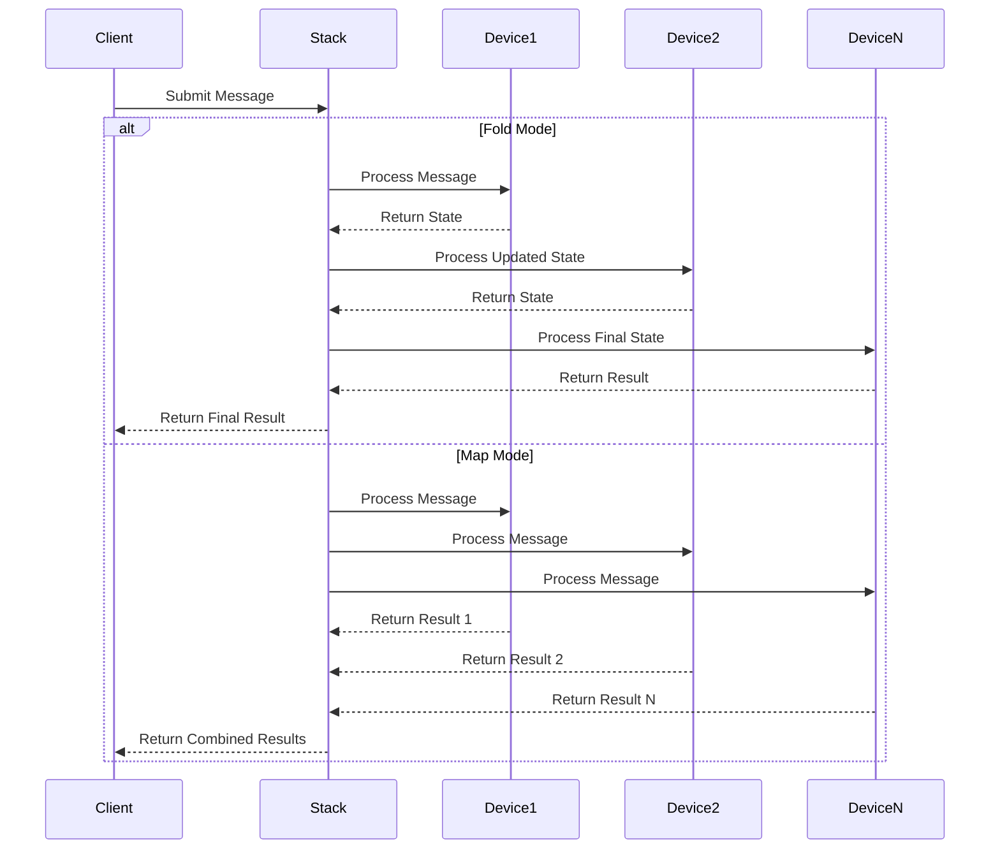

# Module: dev_stack

## Basic Information
- **Source File:** dev_stack.erl
- **Module Type:** Device Stack Manager
- **Purpose:** Manages execution of device stacks, supporting both fold and map modes for processing messages through multiple devices sequentially or in parallel.

## Core Functionality

### 1. Stack Architecture


### 2. Execution Flow


## Implementation Details

### 1. Stack Configuration
```erlang
% Stack device structure
#{
    "device" => "Stack@1.0",
    "device-stack" => #{
        "1" => Device1,
        "2" => Device2,
        "N" => DeviceN
    },
    "mode" => "Fold" | "Map"
}
```

### 2. Mode Operations

#### Fold Mode Processing
```erlang
resolve_fold(Message1, Message2, DevNum, Opts) ->
    % Transform message for current device
    {ok, Message3} = transform(Message1, DevNum, Opts),
    
    % Process through current device
    case process_device(Message3, Message2, Opts) of
        {ok, Message4} -> 
            % Continue to next device
            resolve_fold(Message4, Message2, DevNum + 1, Opts);
        {skip, Message4} ->
            % Skip remaining devices
            {ok, Message4};
        {pass, Message4} ->
            % Restart from first device
            resolve_fold(Message4, Message2, 1, Opts)
    end
```

#### Map Mode Processing
```erlang
resolve_map(Message1, Message2, Opts) ->
    % Get device stack
    DeviceStack = get_device_stack(Message1),
    
    % Process each device independently
    Results = maps:map(
        fun(Key, Device) ->
            process_device(Device, Message2, Opts)
        end,
        DeviceStack
    ),
    
    % Combine results
    {ok, Results}
```

## Key Features

### 1. Execution Modes

#### Fold Mode
- Sequential processing
- State maintenance
- Pass control
- Skip capability
- Error handling

#### Map Mode
- Parallel processing
- Independent execution
- Result combination
- Key preservation
- Error isolation

### 2. State Management
- Pass tracking
- Prefix handling
- Device tracking
- Error strategies
- Resource control

### 3. Message Transformation
- Device selection
- State preservation
- Prefix management
- Path tracking
- Identity maintenance

## Usage Examples

### 1. Fold Mode Stack
```erlang
% Create a fold mode stack
Stack = #{
    <<"device">> => <<"Stack@1.0">>,
    <<"device-stack">> => #{
        <<"1">> => DeviceOne,
        <<"2">> => DeviceTwo
    },
    <<"mode">> => <<"Fold">>
}

% Execute stack
{ok, Result} = hb_ao:resolve(Stack, Message, #{})
```

### 2. Map Mode Stack
```erlang
% Create a map mode stack
Stack = #{
    <<"device">> => <<"Stack@1.0">>,
    <<"device-stack">> => #{
        <<"processor1">> => Processor1,
        <<"processor2">> => Processor2
    },
    <<"mode">> => <<"Map">>
}

% Execute stack
{ok, Results} = hb_ao:resolve(Stack, Message, #{})
```

### 3. Pass Control Example
```erlang
% Create a stack with pass control
Stack = #{
    <<"device">> => <<"Stack@1.0">>,
    <<"device-stack">> => #{
        <<"1">> => PassingDevice,
        <<"2">> => FinalDevice
    },
    <<"allow-multipass">> => true
}

% Execute with pass control
{ok, Result} = hb_ao:resolve(Stack, Message, #{})
```

## Error Handling

### 1. Device Errors
- Error propagation
- Strategy selection
- State preservation
- Recovery options
- Logging support

### 2. Stack Errors
- Configuration validation
- Mode verification
- Pass control
- Resource cleanup
- State recovery

### 3. Transform Errors
- Device validation
- Path verification
- State preservation
- Identity recovery
- Resource cleanup

## Performance Considerations

### 1. Execution Efficiency
- Mode selection
- State management
- Resource usage
- Memory allocation
- CPU utilization

### 2. Resource Management
- Connection pooling
- Memory usage
- State tracking
- Device lifecycle
- Resource cleanup

### 3. Error Impact
- Recovery speed
- Resource release
- State preservation
- Path correction
- Identity management

## Future Improvements

### 1. Feature Extensions
- More execution modes
- Better error handling
- Enhanced monitoring
- Resource optimization
- Performance tracking

### 2. Performance Optimization
- Faster processing
- Better resource use
- Improved error handling
- Enhanced monitoring
- State management

### 3. Integration Enhancement
- More device types
- Better coordination
- Enhanced security
- Improved monitoring
- Better integration
