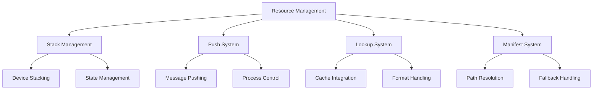
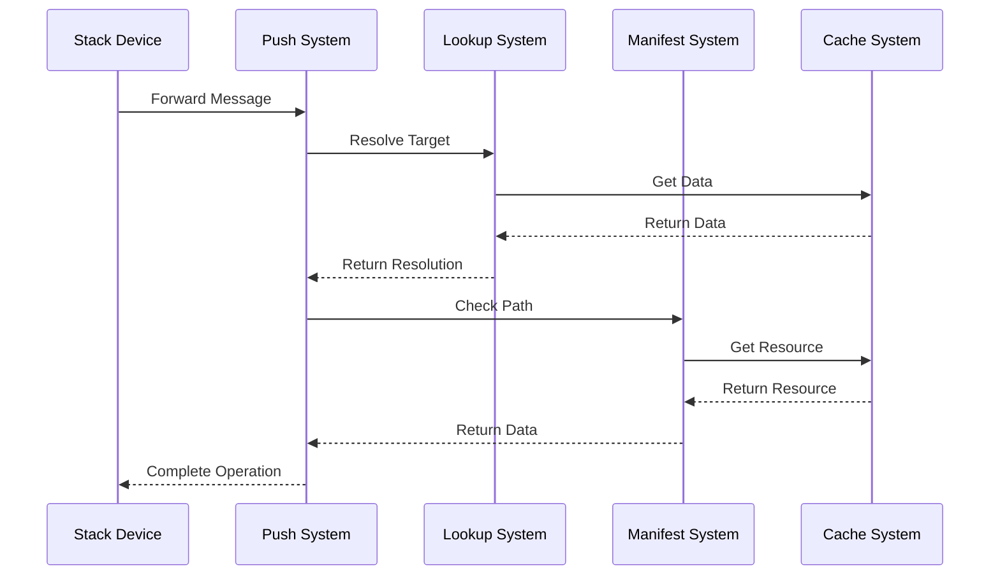

# Resource & Stack Management: System Observations

## Architectural Patterns

### 1. Device Composition

The resource and stack management subsystem demonstrates several key architectural patterns:

1. **Layered Device Management**
   - Stack-based device organization
   - Hierarchical execution flow
   - State propagation
   - Error handling
   - Resource tracking

2. **Message Flow Control**
   - Push-based propagation
   - Synchronous/asynchronous modes
   - State maintenance
   - Error recovery
   - Resource optimization

3. **Resource Resolution**
   - Cache-based lookup
   - Format conversion
   - Path resolution
   - Fallback mechanisms
   - Error management

## Component Integration

### 1. Inter-Device Communication

The components exhibit sophisticated integration patterns:

1. **Stack-Push Integration**
   - Message forwarding
   - State tracking
   - Error propagation
   - Resource management
   - Operation coordination

2. **Push-Lookup Integration**
   - Target resolution
   - Cache coordination
   - Format handling
   - Error recovery
   - Resource optimization

3. **Manifest-Cache Integration**
   - Path resolution
   - Resource retrieval
   - Fallback handling
   - Format conversion
   - Error management

## Key Insights

### 1. Design Patterns

#### Stack Management
- Flexible device composition
- State propagation
- Error handling
- Resource tracking
- Operation modes

#### Push System
- Message propagation
- Process control
- State management
- Error recovery
- Resource optimization

#### Resource Resolution
- Cache integration
- Format handling
- Path resolution
- Fallback mechanisms
- Error management

### 2. System Characteristics

#### Flexibility
- Multiple operation modes
- Format adaptability
- Resource handling
- Error recovery
- State management

#### Reliability
- Error handling
- State tracking
- Resource management
- Operation validation
- Format verification

#### Performance
- Cache utilization
- Resource optimization
- Operation modes
- State management
- Error handling

## Implementation Patterns

### 1. Code Organization

#### Module Structure
- Clear responsibilities
- Focused functionality
- Error handling
- Resource management
- State tracking

#### Integration Points
- Well-defined interfaces
- Clear dependencies
- Error propagation
- Resource sharing
- State coordination

#### Error Handling
- Comprehensive coverage
- Recovery mechanisms
- State preservation
- Resource cleanup
- Operation validation

### 2. Resource Management

#### Cache Utilization
- Efficient lookup
- Format handling
- Path resolution
- Error recovery
- State preservation

#### State Management
- Clear tracking
- Error handling
- Resource cleanup
- Operation validation
- Format verification

#### Operation Control
- Multiple modes
- State tracking
- Error handling
- Resource management
- Format handling

## Future Considerations

### 1. Enhancement Opportunities

#### Stack Management
- More operation modes
- Better state tracking
- Enhanced error handling
- Improved resource management
- Better format handling

#### Push System
- Enhanced propagation
- Better state management
- Improved error recovery
- Resource optimization
- Format handling

#### Resource Resolution
- Better cache integration
- Enhanced format handling
- Improved path resolution
- Better fallback mechanisms
- Enhanced error management

### 2. Integration Improvements

#### Component Coordination
- Better integration
- Enhanced state sharing
- Improved error handling
- Resource optimization
- Format handling

#### Resource Optimization
- Better cache usage
- Enhanced state management
- Improved error recovery
- Format optimization
- Path resolution

#### Error Handling
- Better recovery
- Enhanced state preservation
- Improved resource cleanup
- Format validation
- Operation verification
