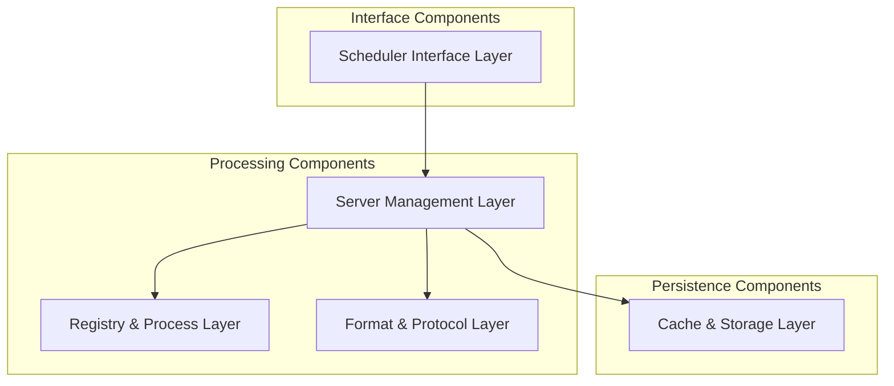
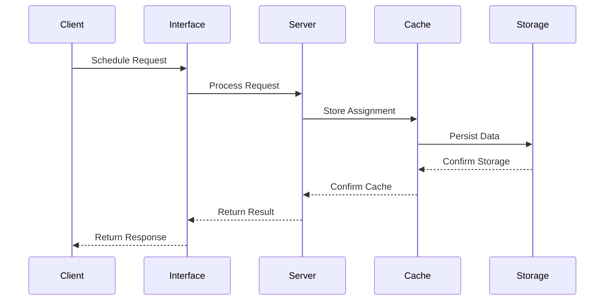
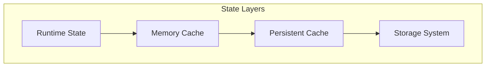
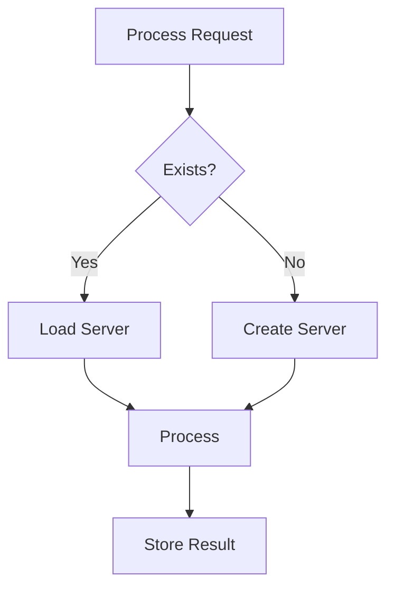
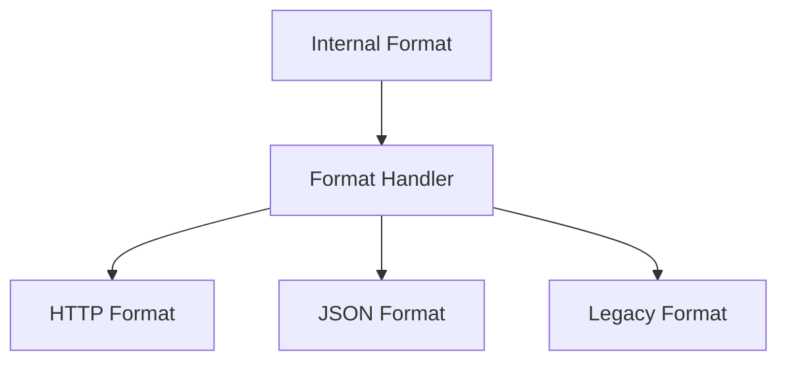

# Scheduling Control System Overview

## System Architecture

The scheduling control system represents a sophisticated orchestration layer within HyperBEAM that manages the execution timing and sequencing of processes. This system is architected as a multi-layered solution that combines several specialized components working in harmony to provide reliable, efficient, and flexible scheduling capabilities.

### Core Components

## Component Interactions

### 1. Primary Control Flow

The scheduling system operates through a carefully orchestrated sequence of interactions:

1. **Initial Request Processing**
   - Client requests arrive at the scheduler interface
   - Requests are validated and normalized
   - Control is passed to appropriate server instance

2. **Server Management**
   - Long-lived servers handle specific process scheduling
   - State is maintained per process
   - Assignments are tracked and managed

3. **Storage Operations**
   - Assignments are persisted to cache
   - State is maintained across restarts
   - Format conversions are applied as needed

### 2. Data Flow Architecture

## Key Subsystems

### 1. Scheduler Core (dev_scheduler)
The scheduler core provides the primary interface for scheduling operations:
- Handles incoming scheduling requests
- Manages scheduling policies
- Coordinates with other components
- Ensures consistent behavior

### 2. Server Management (dev_scheduler_server)
The server management layer maintains process-specific scheduling servers:
- One server per managed process
- State isolation between processes
- Consistent assignment handling
- Resource management

### 3. Cache System (dev_scheduler_cache)
The caching system provides efficient state management:
- Hierarchical cache structure
- Symlink-based organization
- Format normalization
- Quick retrieval

### 4. Registry Service (dev_scheduler_registry)
The registry maintains process tracking and management:
- Process registration
- Server lookup
- Dynamic creation
- Resource cleanup

### 5. Format Handling (dev_scheduler_formats)
The format system manages data representation:
- Multiple format support
- Conversion handling
- Compatibility layers
- Protocol adherence

### 6. Task Management
Task management is handled through specialized components:

#### Cron System (dev_cron)
- Scheduled task execution
- Interval management
- Task persistence
- Execution tracking

#### Multi-pass System (dev_multipass)
- Sequential execution
- Pass management
- State tracking
- Flow control

## Implementation Details

### 1. State Management

The system employs a sophisticated state management approach:

### 2. Process Management

Process handling follows a structured approach:

### 3. Format Handling

Format management is implemented through:

## System Integration

### 1. Core System Integration
The scheduling system integrates with core HyperBEAM components:
- Message system integration
- Storage system usage
- Process management
- Event handling

### 2. External Integration
External system integration is handled through:
- Protocol adaptation
- Format conversion
- State synchronization
- Resource coordination

### 3. Client Integration
Client integration is facilitated by:
- Clean interfaces
- Format support
- Error handling
- State tracking

## Operational Characteristics

### 1. Performance Considerations
The system is optimized for:
- Quick response times
- Efficient state management
- Resource utilization
- Scalability support

### 2. Reliability Features
Reliability is ensured through:
- Error handling
- State preservation
- Resource management
- Recovery mechanisms

### 3. Maintenance Aspects
The system supports maintenance through:
- Clear structure
- Documented interfaces
- Testing support
- Monitoring capabilities

## Future Directions

### 1. Architectural Evolution
Future architectural improvements may include:
- Enhanced distribution
- Improved scalability
- Better resilience
- Extended capabilities

### 2. Feature Enhancement
Planned feature enhancements include:
- New scheduling patterns
- Additional formats
- Enhanced protocols
- Improved monitoring

### 3. Integration Expansion
Integration capabilities may be expanded through:
- New protocols
- Additional formats
- Enhanced compatibility
- Extended features

## Best Practices

### 1. Development Guidelines
Development should follow:
- Clear interfaces
- Consistent patterns
- Error handling
- Resource management

### 2. Operational Guidelines
Operations should maintain:
- State consistency
- Resource efficiency
- Error handling
- Performance monitoring

### 3. Integration Guidelines
Integration should ensure:
- Protocol compliance
- Format compatibility
- Error propagation
- Resource coordination
