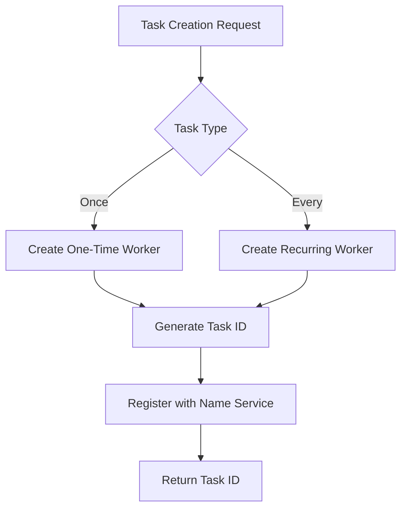
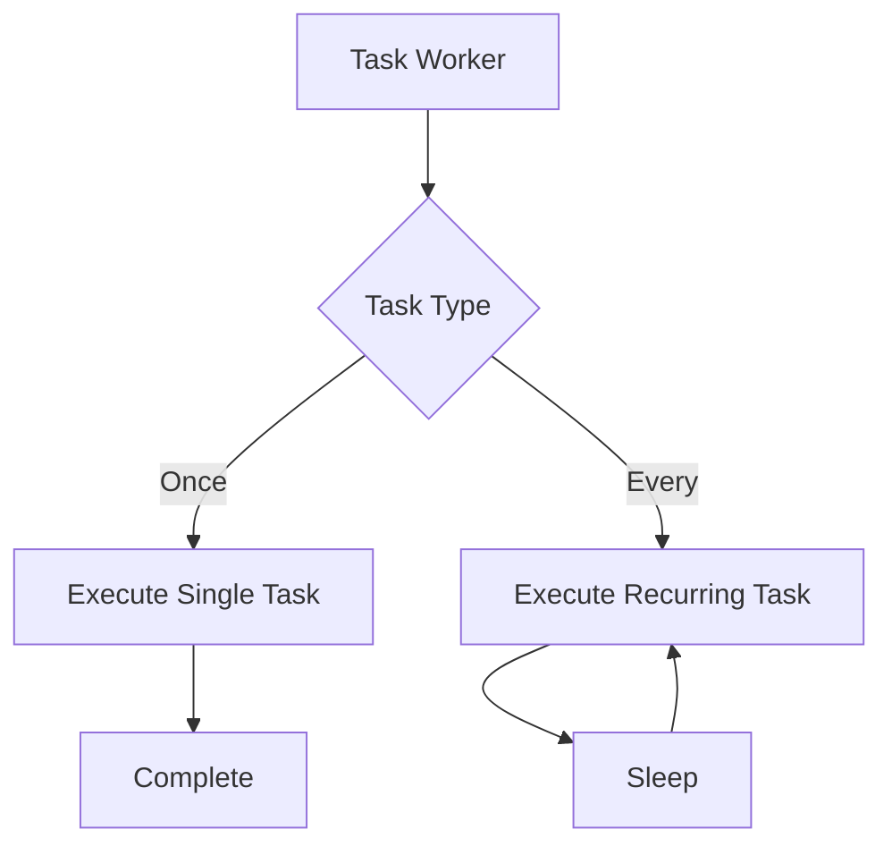

# Module: dev_cron

## Basic Information
- **Source File:** dev_cron.erl
- **Module Type:** Device Scheduling Control
- **Purpose:** Device that enables processes to schedule self-calling messages without user interaction, supporting both one-time and recurring tasks

## Interface

### Public API
```erlang
% Task Management
-export([once/3, every/3, stop/3]).
% Information
-export([info/1, info/3]).
```

## Core Functionality

### 1. Task Types

#### One-Time Tasks
```erlang
once(_Msg1, Msg2, Opts) ->
    case hb_ao:get(<<"cron-path">>, Msg2, Opts) of
        not_found -> {error, <<"No cron path found">>};
        CronPath ->
            ReqMsgID = hb_message:id(Msg2, all),
            ModifiedMsg2 = prepare_message(Msg2, CronPath),
            Name = {<<"cron@1.0">>, ReqMsgID},
            Pid = spawn(fun() -> once_worker(CronPath, ModifiedMsg2, Opts) end),
            hb_name:register(Name, Pid),
            {ok, ReqMsgID}
    end
```

#### Recurring Tasks
```erlang
every(_Msg1, Msg2, Opts) ->
    case {get_path(Msg2), get_interval(Msg2)} of
        {CronPath, IntervalString} ->
            IntervalMillis = parse_time(IntervalString),
            ReqMsgID = hb_message:id(Msg2, all),
            ModifiedMsg2 = prepare_message(Msg2),
            TracePID = hb_tracer:start_trace(),
            Pid = spawn_worker(CronPath, ModifiedMsg2, Opts, IntervalMillis),
            register_task(ReqMsgID, Pid),
            {ok, ReqMsgID}
    end
```

### 2. Task Control

#### Task Stopping
```erlang
stop(_Msg1, Msg2, Opts) ->
    case hb_ao:get(<<"task">>, Msg2, Opts) of
        not_found -> {error, <<"No task ID found">>};
        TaskID ->
            Name = {<<"cron@1.0">>, TaskID},
            case hb_name:lookup(Name) of
                Pid when is_pid(Pid) ->
                    exit(Pid, kill),
                    hb_name:unregister(Name),
                    success_response(TaskID);
                undefined ->
                    {error, <<"Task not found">>}
            end
    end
```

### 3. Worker Implementation

#### One-Time Worker
```erlang
once_worker(Path, Req, Opts) ->
    TracePID = hb_tracer:start_trace(),
    try
        dev_meta:handle(Opts#{ trace => TracePID }, 
                       Req#{ <<"path">> => Path})
    catch
        Class:Reason:Stack ->
            log_error(Path, Class, Reason, Stack),
            throw({error, Class, Reason, Stack})
    end
```

#### Recurring Worker
```erlang
every_worker_loop(Path, Req, Opts, Interval) ->
    execute_task(Path, Req, Opts),
    timer:sleep(Interval),
    every_worker_loop(Path, Req, Opts, Interval)
```

## Implementation Details

### 1. Time Parsing
```erlang
parse_time(BinString) ->
    [AmountStr, UnitStr] = binary:split(BinString, <<"-">>),
    Amount = binary_to_integer(AmountStr),
    case string:lowercase(binary_to_list(UnitStr)) of
        "millisecond" ++ _ -> Amount;
        "second" ++ _ -> Amount * 1000;
        "minute" ++ _ -> Amount * 60 * 1000;
        "hour" ++ _ -> Amount * 60 * 60 * 1000;
        "day" ++ _ -> Amount * 24 * 60 * 60 * 1000;
        _ -> throw({error, invalid_time_unit, UnitStr})
    end
```

### 2. Task Registration Flow


### 3. Task Execution Flow


## Event Logging

### 1. Task Management
```erlang
?event({cron_stopping_task, {task_id, TaskID}, {pid, Pid}})
?event({cron_stop_lookup_error, {task_id, TaskID}, {error, Error}})
```

### 2. Task Execution
```erlang
?event({cron_every_worker_executing, {path, Path}, {req_id, ReqID}})
?event({cron_every_worker_executed, {path, Path}, {result, Result}})
?event({cron_every_worker_error, {path, Path}, {error, Error}})
```

## Testing Coverage

### 1. One-Time Tasks
```erlang
once_executed_test() ->
    % Tests:
    % - Task creation
    % - Worker execution
    % - State verification
    % - Task completion
```

### 2. Recurring Tasks
```erlang
every_worker_loop_test() ->
    % Tests:
    % - Task creation
    % - Periodic execution
    % - State updates
    % - Interval timing
```

### 3. Task Control
```erlang
stop_once_test() ->
    % Tests:
    % - Task stopping
    % - Process termination
    % - Name unregistration
    % - Error handling
```

## Integration Points

### Direct Dependencies
- hb_name: Task registration
- dev_meta: Task execution
- hb_tracer: Execution tracing
- hb_ao: Message handling
- hb_message: Message operations

### Usage Context
- Called by scheduler system
- Integrates with meta device
- Manages task lifecycle
- Handles message routing

## Key Features

### 1. Task Management
- One-time execution
- Recurring execution
- Task identification
- Task termination

### 2. Time Handling
- Interval parsing
- Time unit conversion
- Schedule management
- Execution timing

### 3. Error Handling
- Task validation
- Execution recovery
- Error logging
- State preservation

### 4. Process Control
- Worker spawning
- Task registration
- Process monitoring
- Resource cleanup

## Best Practices

### 1. Task Creation
- Validate parameters
- Generate unique IDs
- Register processes
- Handle errors

### 2. Task Execution
- Monitor workers
- Handle failures
- Maintain state
- Clean up resources

### 3. Integration
- Follow protocols
- Handle timeouts
- Log operations
- Manage resources
