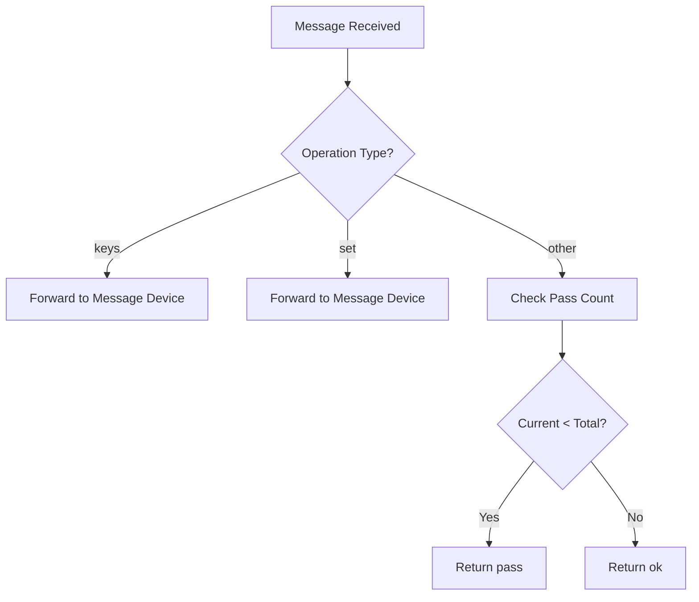
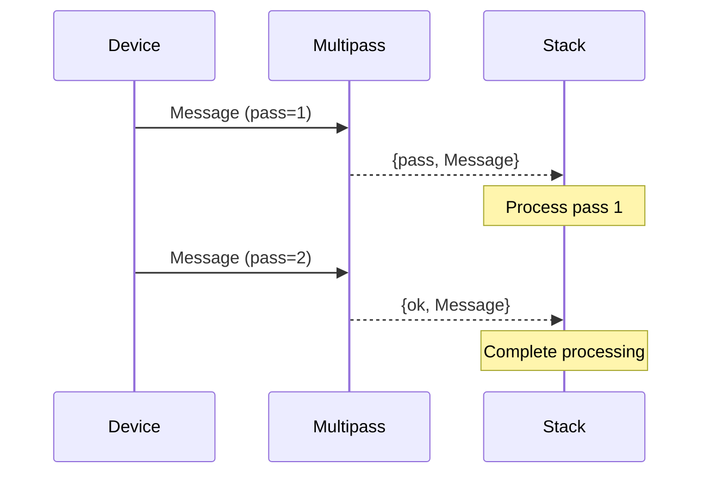

# Module: dev_multipass

## Basic Information
- **Source File:** dev_multipass.erl
- **Module Type:** Device Scheduling Control
- **Purpose:** Device that manages sequential execution passes across devices by triggering repass events until a specified counter is reached

## Interface

### Public API
```erlang
-export([info/1]).
```

## Core Functionality

### 1. Device Information
```erlang
info(_M1) ->
    #{
        handler => fun handle/4
    }
```

### 2. Message Handling

#### Operation Types
```erlang
handle(<<"keys">>, M1, _M2, _Opts) ->
    % Forward key operations to message device
    dev_message:keys(M1);

handle(<<"set">>, M1, M2, Opts) ->
    % Forward set operations to message device
    dev_message:set(M1, M2, Opts);

handle(_Key, M1, _M2, Opts) ->
    % Handle pass control for other operations
    Passes = hb_ao:get(<<"passes">>, {as, dev_message, M1}, 1, Opts),
    Pass = hb_ao:get(<<"pass">>, {as, dev_message, M1}, 1, Opts),
    case Pass < Passes of
        true -> {pass, M1};  % Continue to next pass
        false -> {ok, M1}    % All passes complete
    end
```

## Implementation Details

### 1. Pass Control Flow


### 2. Message Structure
```erlang
#{
    <<"device">> => <<"Multipass@1.0">>,
    <<"passes">> => TotalPasses,    % Total passes required
    <<"pass">> => CurrentPass      % Current pass number
}
```

### 3. Pass Progression


## Testing Coverage

### 1. Basic Operation
```erlang
basic_multipass_test() ->
    % Test message with 2 passes
    Msg1 = #{
        <<"device">> => <<"Multipass@1.0">>,
        <<"passes">> => 2,
        <<"pass">> => 1
    },
    % First pass should continue
    ?assertMatch({pass, _}, hb_ao:resolve(Msg1, <<"Compute">>, #{})),
    
    % Second pass should complete
    Msg2 = Msg1#{ <<"pass">> => 2 },
    ?assertMatch({ok, _}, hb_ao:resolve(Msg2, <<"Compute">>, #{}))
```

## Integration Points

### Direct Dependencies
- dev_message: Message operations
- hb_ao: Message access
- hb_util: Utility functions

### Usage Context
- Used by stack devices
- Integrates with message system
- Controls execution flow
- Manages pass progression

## Key Features

### 1. Pass Management
- Multiple pass support
- Pass counting
- Progress tracking
- Completion detection

### 2. Message Handling
- Operation forwarding
- State maintenance
- Pass control
- Flow management

### 3. Integration
- Device compatibility
- Stack coordination
- Message routing
- State tracking

### 4. Control Flow
- Sequential execution
- Pass progression
- Operation routing
- State management

## Best Practices

### 1. Pass Configuration
- Set appropriate pass count
- Track pass numbers
- Handle completion
- Manage state

### 2. Message Structure
- Include device info
- Set pass parameters
- Track progress
- Maintain state

### 3. Integration
- Forward operations
- Handle responses
- Manage flow
- Track state

## Use Cases

### 1. Sequential Processing
```erlang
% Example: Three-pass processing
Message = #{
    <<"device">> => <<"Multipass@1.0">>,
    <<"passes">> => 3,
    <<"pass">> => 1,
    <<"data">> => Data
}
% Pass 1: Initial processing
% Pass 2: Refinement
% Pass 3: Finalization
```

### 2. Stack Coordination
```erlang
% Example: Multi-device stack
Stack = [
    #{<<"device">> => <<"Multipass@1.0">>, <<"passes">> => 2},
    #{<<"device">> => <<"ProcessorA@1.0">>},
    #{<<"device">> => <<"ProcessorB@1.0">>}
]
% Pass 1: ProcessorA then ProcessorB
% Pass 2: ProcessorA then ProcessorB again
```

### 3. Flow Control
```erlang
% Example: Conditional processing
Message = #{
    <<"device">> => <<"Multipass@1.0">>,
    <<"passes">> => PassCount,
    <<"pass">> => CurrentPass,
    <<"condition">> => Condition
}
% Process until condition met or passes complete
