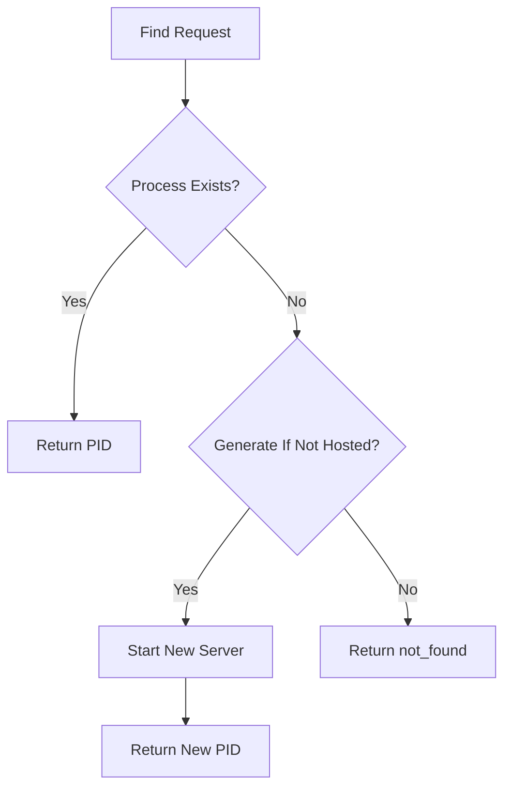
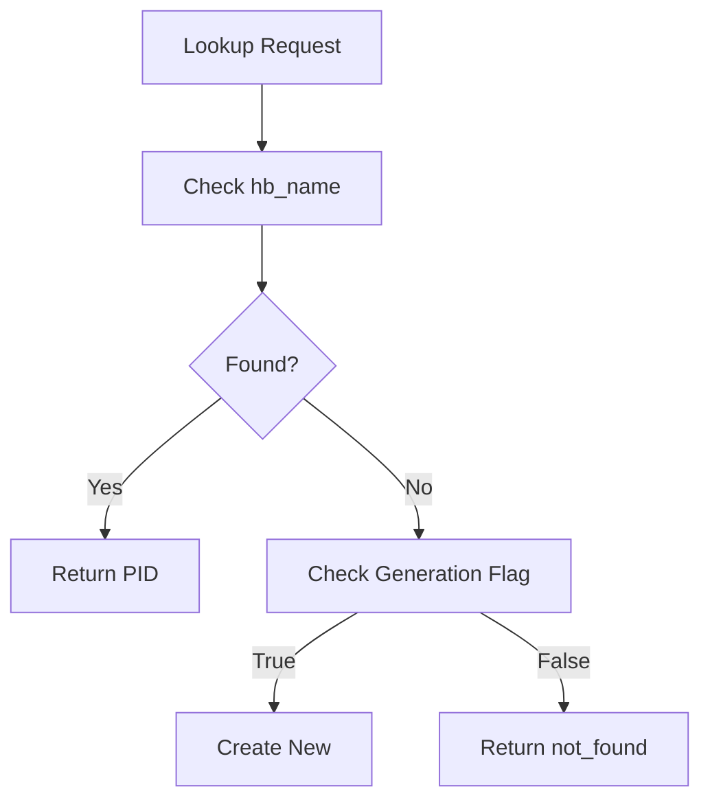

# Module: dev_scheduler_registry

## Basic Information
- **Source File:** dev_scheduler_registry.erl
- **Module Type:** Device Scheduling Control
- **Purpose:** Simple registry for local AO services using process groups, currently focused on scheduler unit (SU) processes

## Interface

### Public API
```erlang
% Core operations
-export([start/0, find/1, find/2, find/3]).
% Information retrieval
-export([get_wallet/0, get_processes/0]).
```

## Core Functionality

### 1. Registry Management

#### Initialization
```erlang
start() ->
    hb_name:start(),
    ok
```

#### Process Lookup
```erlang
find(ProcID) -> find(ProcID, false).
find(ProcID, GenIfNotHosted) ->
    find(ProcID, GenIfNotHosted, #{ priv_wallet => hb:wallet() }).
find(ProcID, GenIfNotHosted, Opts) ->
    case hb_name:lookup({dev_scheduler, ProcID}) of
        undefined -> maybe_new_proc(ProcID, GenIfNotHosted, Opts);
        Pid -> Pid
    end
```

### 2. Process Creation

#### Conditional Creation
```erlang
maybe_new_proc(_ProcID, false, _Opts) -> 
    not_found;
maybe_new_proc(ProcID, _GenIfNotHosted, Opts) -> 
    dev_scheduler_server:start(ProcID, Opts)
```

### 3. Information Retrieval

#### Wallet Access
```erlang
get_wallet() ->
    % TODO: Future support for multiple wallets per SU
    hb:wallet()
```

#### Process Listing
```erlang
get_processes() ->
    [ ProcID || {{dev_scheduler, ProcID}, _} <- hb_name:all() ]
```

## Implementation Details

### 1. Process Registration
- Uses hb_name for process registration
- Stores processes under {dev_scheduler, ProcID} key
- Maintains unique PIDs per process ID

### 2. Process Creation Flow


### 3. Process Lookup Flow


## Event Logging

### 1. Process Management
```erlang
?event({getting_processes, hb_name:all()})
?event({processes, Processes})
```

## Testing Coverage

### 1. Basic Operations
```erlang
find_non_existent_process_test() ->
    % Tests lookup of non-existent process
    % Verifies not_found return

create_and_find_process_test() ->
    % Tests process creation
    % Verifies PID return
    % Confirms consistent lookup
```

### 2. Multiple Processes
```erlang
create_multiple_processes_test() ->
    % Tests multiple process creation
    % Verifies unique PIDs
    % Confirms consistent lookups
```

### 3. Process Listing
```erlang
get_all_processes_test() ->
    % Tests process listing
    % Verifies list contents
    % Confirms process inclusion
```

## Integration Points

### Direct Dependencies
- hb_name: Process registration
- dev_scheduler_server: Server creation
- hb: Wallet management
- pg: Process groups

### Usage Context
- Called by dev_scheduler
- Used by scheduler servers
- Integrates with name service
- Manages process lifecycle

## Key Features

### 1. Process Management
- Unique process IDs
- Conditional creation
- PID lookup
- Process listing

### 2. Registration
- Name-based registration
- Process group integration
- Lookup services
- Creation control

### 3. Configuration
- Wallet management
- Server options
- Creation flags
- Process tracking

### 4. Reliability
- Process verification
- Unique registration
- Lookup consistency
- State management

## Best Practices

### 1. Process Management
- Verify process existence
- Handle creation flags
- Track registrations
- Clean up resources

### 2. Error Handling
- Check registration status
- Validate process IDs
- Handle lookup failures
- Manage creation errors

### 3. Integration
- Coordinate with name service
- Manage server creation
- Track process state
- Monitor registrations

## Future Enhancements

### 1. Planned Improvements
- Multiple wallets per SU
- Enhanced process tracking
- Better state management
- More service types

### 2. Potential Features
- Process monitoring
- State persistence
- Service discovery
- Load balancing
