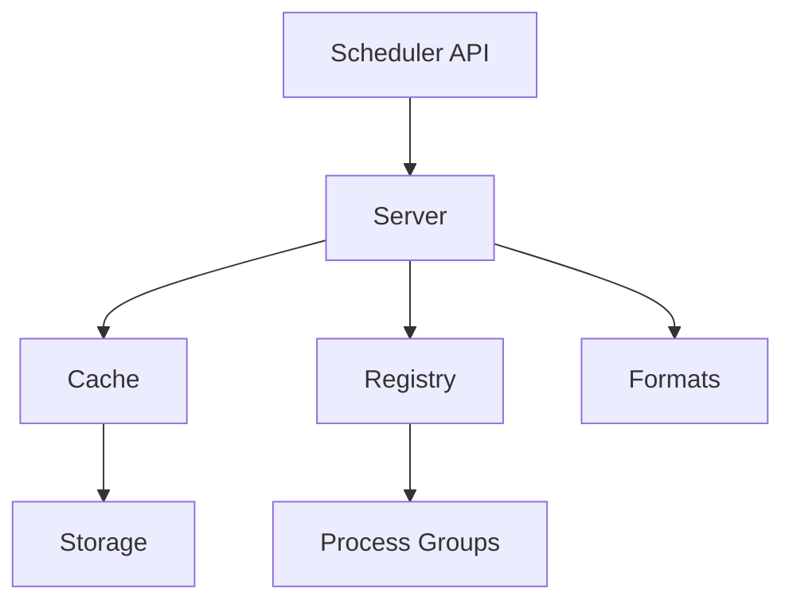
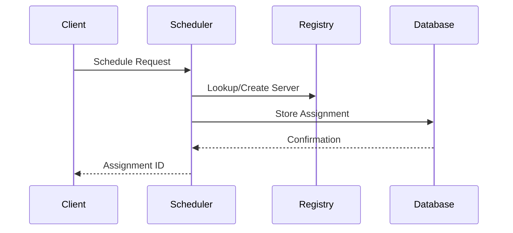
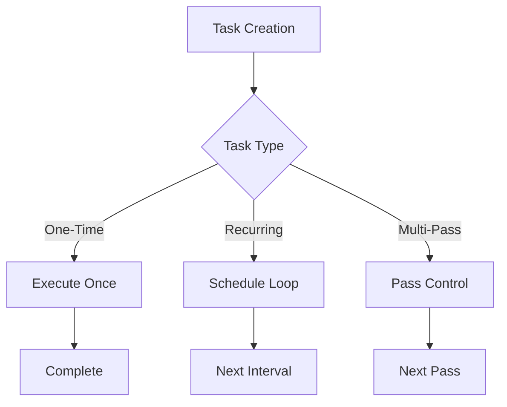
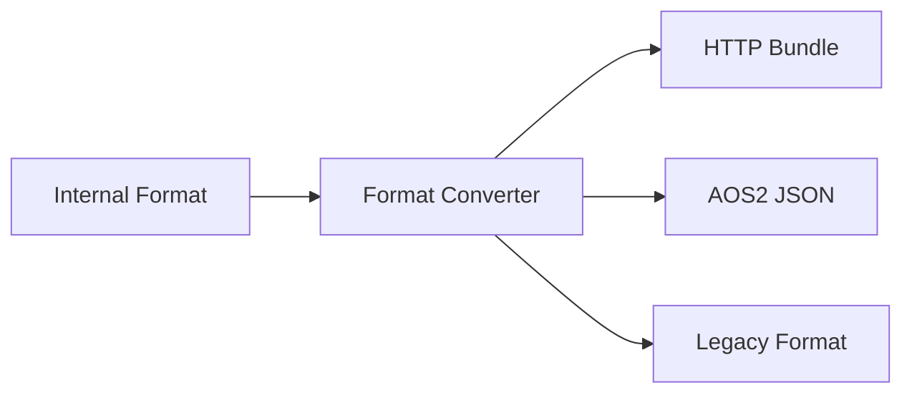
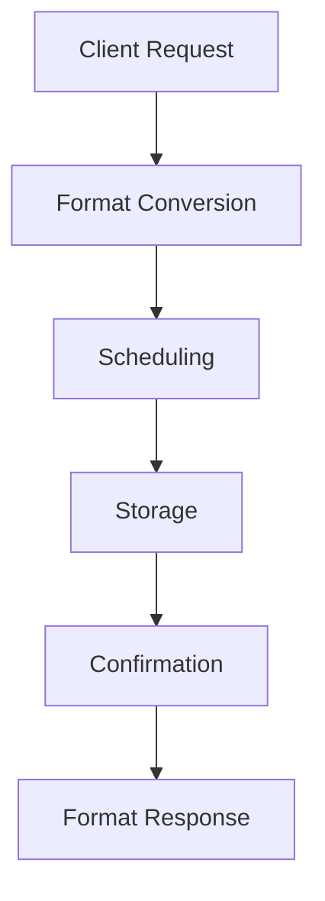
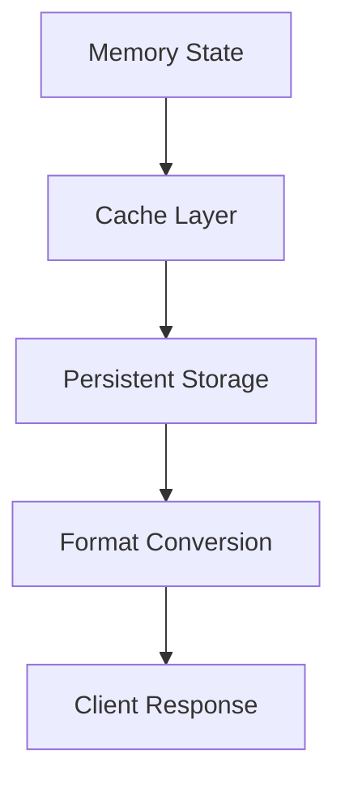
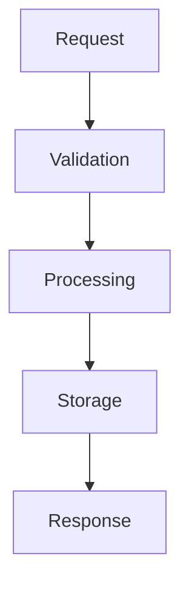

# Scheduling Control System Observations

## Architectural Patterns

### 1. Layered Design
- Clear separation between scheduling interfaces (dev_scheduler) and implementation details
- Hierarchical organization from high-level API to low-level storage
- Modular components with well-defined responsibilities
- Clean integration points between layers

### 2. Service Architecture

### 3. State Management
- Persistent state through caching system
- In-memory state in scheduler servers
- Registry for process tracking
- Format conversion for compatibility

## Design Patterns

### 1. Server Pattern
- Long-lived server processes for scheduling
- Message-based communication
- State encapsulation
- Error handling and recovery

### 2. Registry Pattern
- Central registration point
- Process lookup capabilities
- Dynamic process creation
- Resource cleanup

### 3. Cache Pattern
- Layered caching strategy
- Symlink-based organization
- Format normalization
- Efficient retrieval

## Key Mechanisms

### 1. Scheduling Control

### 2. Task Management

### 3. Format Handling

## Implementation Insights

### 1. Concurrency Management
- Deliberate bottlenecks for consistency
- Process-based isolation
- State synchronization
- Resource coordination

### 2. Error Handling
- Comprehensive error detection
- Recovery mechanisms
- State preservation
- Event logging

### 3. Performance Considerations
- Efficient caching
- Optimized lookups
- Minimal copying
- Resource reuse

## Integration Patterns

### 1. System Integration
- Core system compatibility
- Message protocol adherence
- Storage system integration
- Event system usage

### 2. External Integration
- Format conversion support
- Protocol compatibility
- API consistency
- Client adaptation

### 3. Component Integration
- Clear interfaces
- Defined protocols
- State sharing
- Resource management

## Optimization Opportunities

### 1. Performance
- Cache optimization
- Lookup efficiency
- Process reuse
- Resource pooling

### 2. Reliability
- Enhanced error recovery
- State consistency
- Resource cleanup
- Monitoring improvements

### 3. Scalability
- Distributed scheduling
- Load balancing
- Resource distribution
- State partitioning

## Best Practices

### 1. Code Organization
- Clear module boundaries
- Consistent interfaces
- Error handling patterns
- Resource management

### 2. State Management
- Persistent storage
- Memory efficiency
- State consistency
- Resource tracking

### 3. Integration
- Protocol adherence
- Format compatibility
- Error propagation
- Resource coordination

## Future Considerations

### 1. Extensibility
- New scheduling patterns
- Additional formats
- Enhanced protocols
- Extended capabilities

### 2. Maintenance
- Code clarity
- Documentation
- Testing coverage
- Monitoring capabilities

### 3. Evolution
- Feature additions
- Performance improvements
- Protocol updates
- Integration enhancements

## Critical Patterns

### 1. Message Flow

### 2. State Flow

### 3. Control Flow

## Recommendations

### 1. Short Term
- Optimize cache usage
- Enhance error handling
- Improve monitoring
- Extend testing

### 2. Medium Term
- Add scheduling patterns
- Enhance format support
- Improve scalability
- Extend protocols

### 3. Long Term
- Distributed scheduling
- Enhanced reliability
- Protocol evolution
- System expansion
