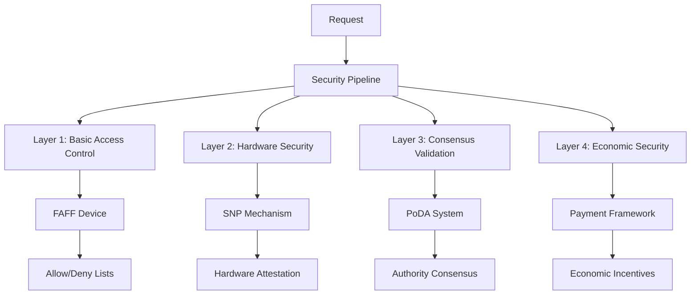
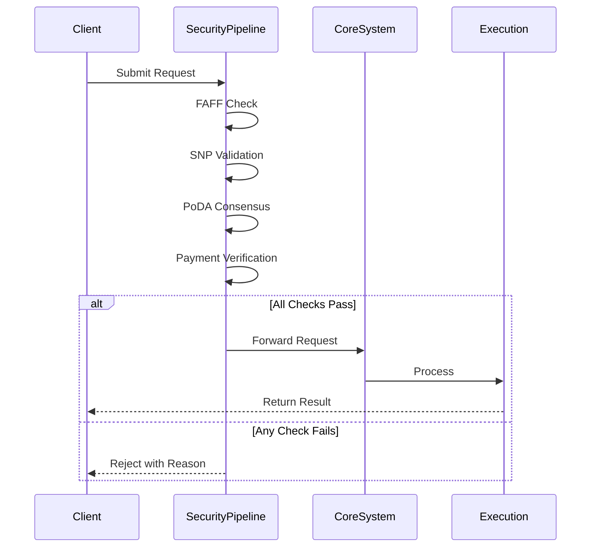
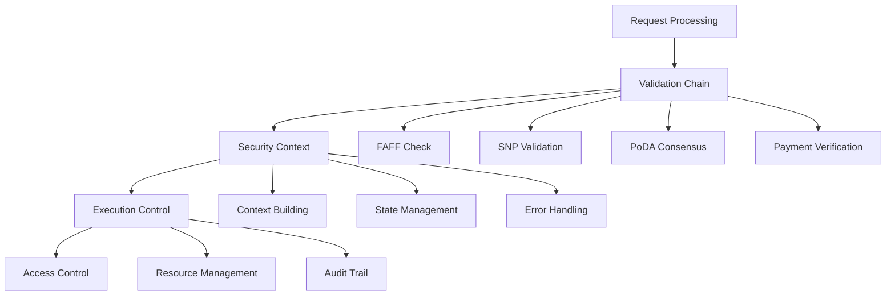
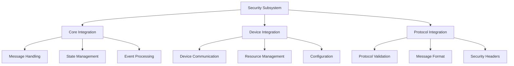
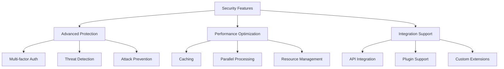

# Security & Access Subsystem Overview

## Architectural Foundation

### 1. Multi-Layer Security Architecture


The security subsystem implements a sophisticated multi-layer approach where each layer provides distinct but complementary security guarantees:

1. **Basic Access Control (FAFF)**
   - Provides fundamental address-based filtering
   - Acts as first-line defense against unauthorized access
   - Maintains simple but effective allow/deny lists
   - Enables quick configuration changes
   - Supports flexible policy updates

2. **Hardware Security (SNP)**
   - Leverages AMD SEV-SNP capabilities
   - Ensures hardware-level trust
   - Validates system integrity
   - Protects sensitive operations
   - Maintains secure enclaves

3. **Consensus Security (PoDA)**
   - Implements distributed trust model
   - Coordinates authority validation
   - Manages commitment collection
   - Enforces quorum requirements
   - Ensures agreement integrity

4. **Economic Security (P4/Simple Pay)**
   - Provides incentive-based access control
   - Manages transaction pricing
   - Handles payment processing
   - Controls resource allocation
   - Prevents abuse through economics

### 2. Integration Architecture


The security pipeline integrates with the core system through:

1. **Message Processing**
   - Pre-execution validation
   - Runtime security checks
   - Post-execution verification
   - Result authentication
   - Error handling

2. **State Management**
   - Security context tracking
   - Permission caching
   - Trust relationship maintenance
   - Configuration management
   - Audit logging

3. **Resource Control**
   - Access limitation
   - Resource allocation
   - Usage tracking
   - Quota enforcement
   - Cost management

## Core Components

### 1. FAFF (Fast Allow/Forbid Filter)
The FAFF device provides fundamental access control through:

1. **Address Management**
   - Efficient address validation
   - Quick lookup operations
   - Flexible list updates
   - Pattern matching support
   - Default policy handling

2. **Policy Enforcement**
   - Rule evaluation
   - Permission checking
   - Access decisions
   - Policy updates
   - Audit logging

### 2. SNP (Secure Nested Paging)
The SNP mechanism ensures hardware-level security through:

1. **Attestation**
   - Hardware validation
   - System measurement
   - State verification
   - Identity confirmation
   - Trust establishment

2. **Protection**
   - Memory isolation
   - Execution security
   - Data protection
   - Key management
   - Secure communication

### 3. PoDA (Proof of Delegated Authority)
The PoDA system implements consensus-based security through:

1. **Authority Management**
   - Validator coordination
   - Trust distribution
   - Quorum enforcement
   - Authority updates
   - Consensus tracking

2. **Commitment Processing**
   - Signature collection
   - Validation aggregation
   - Result verification
   - State synchronization
   - Fault tolerance

### 4. Payment Framework (P4/Simple Pay)
The payment system provides economic security through:

1. **Transaction Management**
   - Cost calculation
   - Payment processing
   - Balance tracking
   - Refund handling
   - Usage accounting

2. **Resource Control**
   - Usage limitation
   - Priority management
   - Quality of service
   - Resource allocation
   - Cost optimization

## Implementation Details

### 1. Security Pipeline


The security pipeline implements:

1. **Request Flow**
   - Message validation
   - Security checks
   - Context building
   - Decision making
   - Result handling

2. **State Management**
   - Context tracking
   - Permission caching
   - Configuration management
   - Status monitoring
   - History maintenance

3. **Error Handling**
   - Validation failures
   - Security violations
   - Resource constraints
   - System errors
   - Recovery procedures

### 2. Integration Points


The security subsystem integrates through:

1. **Core System**
   - Message processing
   - State management
   - Event handling
   - Configuration
   - Logging

2. **Device Layer**
   - Communication
   - Resource control
   - Status tracking
   - Error handling
   - Recovery

3. **Protocol Layer**
   - Message validation
   - Format checking
   - Header processing
   - Content verification
   - Response handling

## Advanced Features

### 1. Security Enhancement


The system provides:

1. **Protection Mechanisms**
   - Multi-layer security
   - Threat detection
   - Attack prevention
   - Recovery procedures
   - Audit capabilities

2. **Performance Features**
   - Efficient processing
   - Resource optimization
   - Caching support
   - Parallel execution
   - Load management

3. **Integration Capabilities**
   - API support
   - Plugin architecture
   - Custom extensions
   - Configuration options
   - Monitoring tools

### 2. Future Directions
The security subsystem evolution focuses on:

1. **Security Enhancement**
   - New protection mechanisms
   - Advanced validation
   - Improved consensus
   - Better attestation
   - Enhanced monitoring

2. **Performance Optimization**
   - Faster processing
   - Better resource use
   - Improved caching
   - Reduced overhead
   - Enhanced efficiency

3. **Integration Improvement**
   - Easier configuration
   - Better monitoring
   - Enhanced debugging
   - Simplified deployment
   - Updated documentation

## Implementation Deep Dive

### 1. FAFF Implementation Details
```erlang
% Core filtering logic from dev_faff.erl
execute(Message, State, Opts) ->
    % Extract address from message
    Address = hb_ao:get(<<"address">>, Message, Opts),
    
    % Check against allow/deny lists
    case {check_allow_list(Address, State),
          check_deny_list(Address, State)} of
        {true, false} -> 
            % Address is allowed and not denied
            {ok, State};
        {false, _} ->
            % Address not in allow list
            {error, <<"Address not allowed">>};
        {_, true} ->
            % Address in deny list
            {error, <<"Address denied">>}
    end.

% Allow list checking with pattern support
check_allow_list(Address, #{allow_list := Patterns}) ->
    lists:any(fun(Pattern) ->
        match_pattern(Address, Pattern)
    end, Patterns).
```

The FAFF device provides:
- Pattern-based address matching
- Configurable allow/deny lists
- Quick lookup operations
- Event logging for auditing
- Runtime list updates

### 2. SNP Validation Chain
```erlang
% Core validation from dev_snp.erl
verify(M1, M2, NodeOpts) ->
    % Step 1: Extract and validate report
    {ok, MsgWithReport} = hb_message:find_target(M1, M2, NodeOpts),
    Report = hb_ao:get(<<"report">>, MsgWithReport, NodeOpts),
    
    % Step 2: Verify nonce matches address and node message ID
    Address = hb_ao:get(<<"address">>, Msg, NodeOpts),
    NodeMsgID = get_node_msg_id(Msg, NodeOpts),
    NonceValid = report_data_matches(Address, NodeMsgID, Nonce),
    
    % Step 3: Verify message signature
    SigValid = hb_message:verify(MsgWithReport),
    
    % Step 4: Verify debug mode disabled
    DebugOff = not is_debug(Report),
    
    % Step 5: Verify trusted software
    SoftwareTrusted = execute_is_trusted(M1, Report, NodeOpts),
    
    % Step 6: Verify measurement and signature
    {ok, MeasurementValid} = verify_measurement(Report),
    {ok, ReportValid} = verify_signature(Report),
    
    % All checks must pass
    {ok, all_valid([NonceValid, SigValid, DebugOff,
                    SoftwareTrusted, MeasurementValid, ReportValid])}.
```

The SNP validation:
- Performs comprehensive report validation
- Verifies hardware measurements
- Checks software trust
- Validates signatures
- Ensures secure state

### 3. PoDA Consensus Flow
```erlang
% Core consensus from dev_poda.erl
validate_stage(2, Commitments, Content, Opts) ->
    % Verify all commitments are valid and from trusted authorities
    case lists:all(
        fun({_, Comm}) -> 
            % Verify commitment signature
            ValidSig = ar_bundles:verify_item(Comm),
            % Check authority is trusted
            ValidAuth = is_trusted_authority(Comm, Opts),
            ValidSig and ValidAuth
        end,
        maps:to_list(Commitments)
    ) of
        true -> validate_stage(3, Content, Commitments, Opts);
        false -> {false, <<"Invalid commitments">>}
    end;

validate_stage(3, Content, Commitments, Opts = #{ <<"quorum">> := Quorum }) ->
    % Count valid authority validations
    Validations = lists:filter(
        fun({_, Comm}) -> validate_commitment(Content, Comm, Opts) end,
        maps:to_list(Commitments)
    ),
    
    % Check if we have enough validations
    case length(Validations) >= Quorum of
        true -> true;
        false -> {false, <<"Not enough validations">>}
    end.

% Parallel commitment collection
collect_commitments(Item, Authorities, Opts) ->
    Parent = self(),
    % Spawn workers for each authority
    Pids = lists:map(
        fun(Auth) -> 
            spawn_monitor(fun() -> 
                Comm = request_commitment(Auth, Item, Opts),
                Parent ! {self(), {Auth, Comm}}
            end)
        end, 
        Authorities
    ),
    % Collect valid commitments
    collect_valid_commitments(Pids, []).
```

The PoDA system implements:
- Multi-stage validation
- Parallel commitment collection
- Authority verification
- Quorum enforcement
- Signature validation

### 4. P4 Payment Processing
```erlang
% Core payment logic from dev_p4.erl
preprocess(State, Raw, NodeMsg) ->
    % Get pricing and ledger devices
    PricingDevice = hb_ao:get(<<"pricing_device">>, State, false, NodeMsg),
    LedgerDevice = hb_ao:get(<<"ledger_device">>, State, false, NodeMsg),
    Messages = hb_ao:get(<<"body">>, Raw, NodeMsg),
    Request = hb_ao:get(<<"request">>, Raw, NodeMsg),
    
    case {is_chargable_req(Request, NodeMsg), 
          (PricingDevice =/= false) and (LedgerDevice =/= false)} of
        {false, _} -> 
            % Non-chargeable route
            {ok, Messages};
        {true, false} -> 
            % No payment devices configured
            {ok, Messages};
        {true, true} ->
            % Get price estimate
            PricingMsg = #{ <<"device">> => PricingDevice },
            PricingReq = #{
                <<"path">> => <<"estimate">>,
                <<"type">> => <<"pre">>,
                <<"request">> => Request,
                <<"body">> => Messages
            },
            case hb_ao:resolve(PricingMsg, PricingReq, NodeMsg) of
                {ok, Price} ->
                    % Check balance
                    LedgerMsg = #{ <<"device">> => LedgerDevice },
                    LedgerReq = #{
                        <<"path">> => <<"debit">>,
                        <<"amount">> => Price,
                        <<"type">> => <<"pre">>,
                        <<"request">> => Request
                    },
                    case hb_ao:resolve(LedgerMsg, LedgerReq, NodeMsg) of
                        {ok, true} -> {ok, Messages};
                        {ok, false} -> {error, <<"Insufficient funds">>};
                        {error, Error} -> {error, Error}
                    end;
                {error, Error} -> {error, Error}
            end
    end.

% Post-processing payment handling
postprocess(State, RawResponse, NodeMsg) ->
    % Similar flow but with actual debit
    % after successful execution
    ...
```

The payment system provides:
- Dynamic pricing through pricing device
- Balance verification via ledger device
- Pre/post execution payment handling
- Route-based charging rules
- Detailed transaction tracking

### 5. Error Handling Patterns
```erlang
% Common error handling pattern
handle_security_error(Error, State) ->
    % 1. Log error details
    ?event({security_error, Error}),
    
    % 2. Update error metrics
    update_error_metrics(Error),
    
    % 3. Format user response
    Response = format_error_response(Error),
    
    % 4. Update state with error
    NewState = mark_error_in_state(State, Error),
    
    {error, Response, NewState}.

% Error response formatting
format_error_response(Error) ->
    case Error of
        {validation, Reason} ->
            #{
                <<"status">> => 400,
                <<"error">> => <<"Validation failed">>,
                <<"reason">> => Reason
            };
        {permission, Reason} ->
            #{
                <<"status">> => 403,
                <<"error">> => <<"Permission denied">>,
                <<"reason">> => Reason
            };
        {resource, Reason} ->
            #{
                <<"status">> => 429,
                <<"error">> => <<"Resource limit">>,
                <<"reason">> => Reason
            };
        _ ->
            #{
                <<"status">> => 500,
                <<"error">> => <<"Internal error">>,
                <<"reason">> => <<"Unknown error">>
            }
    end.
```

Error handling includes:
- Detailed error categorization
- Consistent error formatting
- Metric tracking
- Audit logging
- State preservation

### 6. Performance Optimizations
```erlang
% Parallel processing pattern
pfiltermap(Pred, List) ->
    Parent = self(),
    % Spawn workers
    Pids = lists:map(
        fun(X) -> 
            spawn_monitor(fun() -> 
                Result = {X, Pred(X)},
                Parent ! {self(), Result}
            end)
        end, 
        List
    ),
    % Collect results with timeout
    collect_results(Pids, [], 5000).

% Result collection with timeout
collect_results([], Acc, _) -> 
    lists:reverse(Acc);
collect_results(Pids, Acc, Timeout) ->
    receive
        {Pid, {Item, {true, Result}}} ->
            collect_results(
                lists:keydelete(Pid, 1, Pids),
                [Result | Acc],
                Timeout
            );
        {Pid, _} ->
            collect_results(
                lists:keydelete(Pid, 1, Pids),
                Acc,
                Timeout
            );
        {'DOWN', _, process, Pid, _} ->
            collect_results(
                lists:keydelete(Pid, 1, Pids),
                Acc,
                Timeout
            )
    after Timeout ->
        % Handle timeout by cleaning up and returning partial results
        [exit(Pid, kill) || {Pid, _} <- Pids],
        lists:reverse(Acc)
    end.
```

Performance is optimized through:
- Parallel processing with timeouts
- Resource pooling
- Result caching
- Load distribution
- Efficient algorithms
