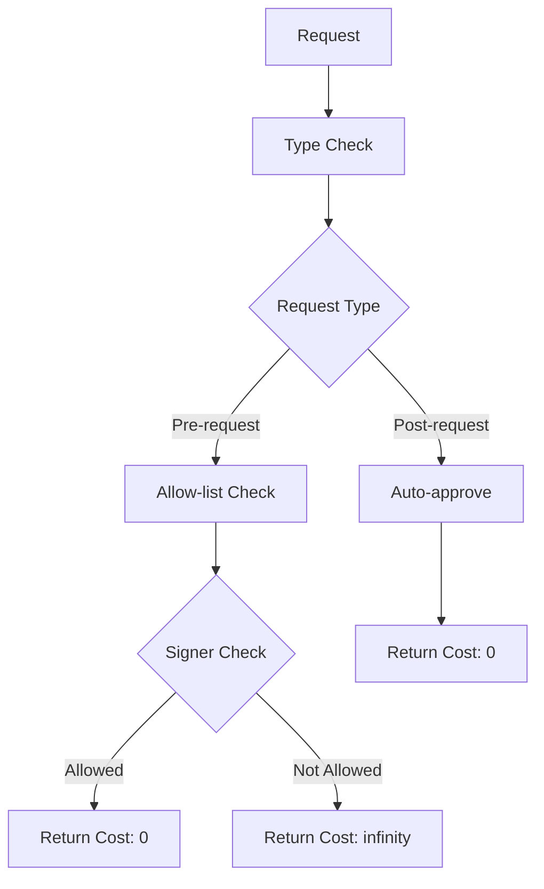
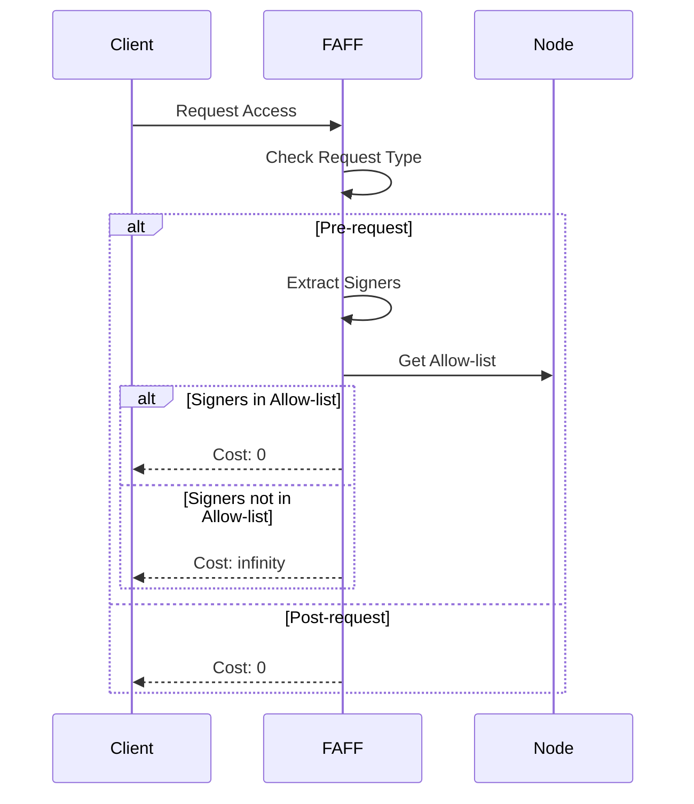

# Module: dev_faff

## Basic Information
- **Source File:** dev_faff.erl
- **Module Type:** Pricing Policy Device
- **Purpose:** Implements a 'friends and family' pricing policy that restricts node access to a predefined allow-list of addresses.

## Core Functionality

### 1. Access Control Architecture


### 2. Request Flow


## Implementation Details

### 1. Pricing API
```erlang
% Estimate cost based on request type and signer status
estimate(_, Msg, NodeMsg) ->
    case hb_ao:get(<<"type">>, Msg, <<"pre">>, NodeMsg) of
        <<"pre">> ->
            case is_admissible(Msg, NodeMsg) of
                true -> {ok, 0};           % Allow-listed: free
                false -> {ok, <<"infinity">>}  % Not allow-listed: blocked
            end;
        <<"post">> -> {ok, 0}  % Post-requests: always free
    end.
```

### 2. Access Control
```erlang
% Verify all signers are in allow-list
is_admissible(Msg, NodeMsg) ->
    % Get configured allow-list
    AllowList = hb_opts:get(faff_allow_list, [], NodeMsg),
    
    % Extract request signers
    Req = hb_ao:get(<<"request">>, Msg, NodeMsg),
    Signers = hb_message:signers(Req),
    
    % Check all signers are allowed
    lists:all(
        fun(Signer) -> lists:member(Signer, CacheWriters) end,
        Signers
    ).
```

### 3. Ledger API
```erlang
% No-op debit implementation
debit(_, Req, _NodeMsg) ->
    ?event(payment, {debit, Req}),
    {ok, true}.  % Always succeed since actual charging is disabled
```

## Key Features

### 1. Access Control
- **Allow-list Based**: Uses a configurable list of permitted addresses
- **Multi-signer Support**: Validates all message signers
- **Request Type Awareness**: Different handling for pre/post requests
- **Zero Cost**: Free access for allowed addresses
- **Complete Blocking**: Infinite cost for non-allowed addresses

### 2. Pricing Model
- **Binary Pricing**: Either free (0) or blocked (infinity)
- **Pre/Post Differentiation**: Only pre-requests are checked
- **No Actual Charging**: Debit operations are no-ops
- **Simple Estimation**: Direct allow/block decisions
- **Event Logging**: Tracks access attempts

### 3. Integration
- **P4 API Compatible**: Implements required pricing interface
- **Ledger API Compatible**: Implements required ledger interface
- **Node Configuration**: Uses node options for allow-list
- **Message Handling**: Integrates with message system
- **Event System**: Uses standard event logging

## Usage Examples

### 1. Node Configuration
```erlang
% Configure node with FAFF policy
NodeOpts = #{
    faff_allow_list => [
        <<"user1-address">>,
        <<"user2-address">>
    ]
},
Node = hb_node:start(NodeOpts).
```

### 2. Request Processing
```erlang
% Process pre-request
PreReq = #{
    <<"type">> => <<"pre">>,
    <<"request">> => SignedRequest
},
{ok, Cost} = dev_faff:estimate(none, PreReq, NodeOpts).

% Process post-request
PostReq = #{
    <<"type">> => <<"post">>,
    <<"request">> => SignedRequest
},
{ok, 0} = dev_faff:estimate(none, PostReq, NodeOpts).
```

### 3. Access Control
```erlang
% Check request admissibility
Msg = #{
    <<"request">> => SignedRequest
},
IsAllowed = dev_faff:is_admissible(Msg, NodeOpts).
```

## Error Handling

### 1. Access Errors
- Invalid signers
- Missing allow-list
- Malformed requests
- Type mismatches
- Configuration issues

### 2. Pricing Errors
- Invalid request types
- Missing parameters
- Format errors
- State issues
- System errors

### 3. Integration Errors
- API mismatches
- Configuration problems
- Message errors
- State corruption
- System failures

## Future Considerations

### 1. Access Control
- Dynamic allow-lists
- Role-based access
- Temporary access
- Group permissions
- Access patterns

### 2. Pricing Model
- Tiered pricing
- Usage tracking
- Cost allocation
- Payment integration
- Billing support

### 3. Integration
- Better monitoring
- Enhanced logging
- Audit support
- Analytics
- Reporting tools
