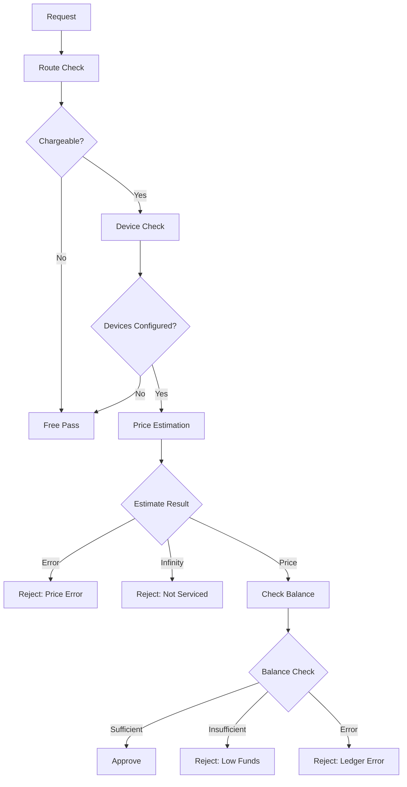
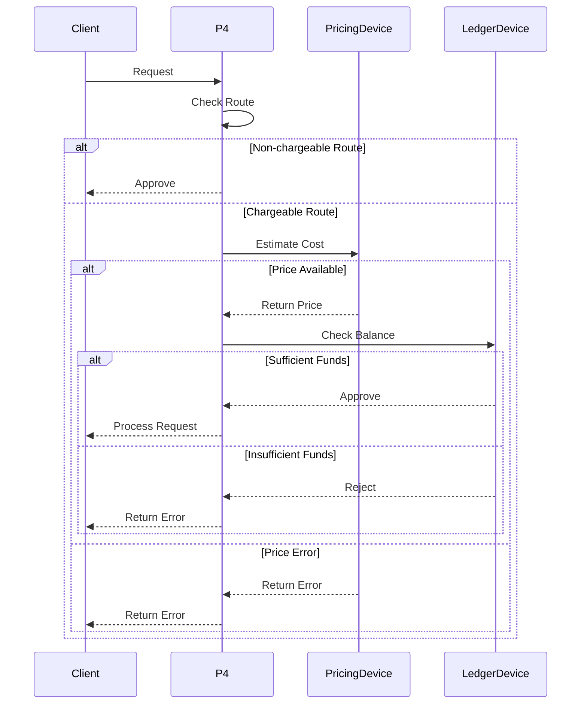

# Module: dev_p4

## Basic Information
- **Source File:** dev_p4.erl
- **Module Type:** Core Payment Ledger
- **Purpose:** Orchestrates payment processing by coordinating pricing and ledger devices for transaction cost estimation and payment handling.

## Core Functionality

### 1. Payment Architecture


### 2. Processing Flow


## Implementation Details

### 1. Request Preprocessing
```erlang
% Preprocess request to check pricing and balance
preprocess(State, Raw, NodeMsg) ->
    PricingDevice = hb_ao:get(<<"pricing_device">>, State, false, NodeMsg),
    LedgerDevice = hb_ao:get(<<"ledger_device">>, State, false, NodeMsg),
    Messages = hb_ao:get(<<"body">>, Raw, NodeMsg),
    Request = hb_ao:get(<<"request">>, Raw, NodeMsg),
    
    case {is_chargable_req(Request, NodeMsg), 
          (PricingDevice =/= false) and (LedgerDevice =/= false)} of
        {false, _} -> {ok, Messages};  % Non-chargeable route
        {true, false} -> {ok, Messages};  % No devices configured
        {true, true} ->
            % Get price estimate and check balance
            estimate_and_validate(PricingDevice, LedgerDevice, 
                                Request, Messages, NodeMsg)
    end.
```

### 2. Response Postprocessing
```erlang
% Postprocess response to apply charges
postprocess(State, RawResponse, NodeMsg) ->
    PricingDevice = hb_ao:get(<<"pricing_device">>, State, false, NodeMsg),
    LedgerDevice = hb_ao:get(<<"ledger_device">>, State, false, NodeMsg),
    Response = hb_ao:get(<<"body">>, RawResponse, NodeMsg),
    Request = hb_ao:get(<<"request">>, RawResponse, NodeMsg),
    
    case (PricingDevice =/= false) and (LedgerDevice =/= false) of
        false -> {ok, Response};
        true ->
            % Calculate final price and debit account
            calculate_and_debit(PricingDevice, LedgerDevice,
                              Request, Response, NodeMsg)
    end.
```

### 3. Route Management
```erlang
% Check if route is chargeable
is_chargable_req(Req, NodeMsg) ->
    NonChargableRoutes = hb_opts:get(
        p4_non_chargable_routes,
        ?DEFAULT_NON_CHARGABLE_ROUTES,
        NodeMsg
    ),
    Matches = dev_router:match_routes(Req, NonChargableRoutes, NodeMsg),
    case Matches of
        no_matches -> true;
        _ -> false
    end.
```

## Key Features

### 1. Payment Processing
- **Device Orchestration**: Coordinates pricing and ledger devices
- **Flexible Pricing**: Supports custom pricing strategies
- **Balance Management**: Integrates with ledger systems
- **Route Control**: Configurable non-chargeable routes
- **Error Handling**: Comprehensive error states

### 2. Device Integration
- **Pricing Device API**: 
  - `/estimate` - Pre-request cost estimation
  - `/price` - Post-request cost calculation
- **Ledger Device API**:
  - `/credit` - Process payments
  - `/debit` - Handle charges
  - `/balance` - Check balances

### 3. Configuration
- **Required Settings**:
  - `p4_pricing_device`: Cost estimation device
  - `p4_ledger_device`: Payment ledger device
- **Optional Settings**:
  - `p4_non_chargable_routes`: Free routes list
  - Custom device configurations

## Usage Examples

### 1. Node Configuration
```erlang
% Configure node with p4 payment system
NodeOpts = #{
    preprocessor => #{
        <<"device">> => <<"p4@1.0">>,
        <<"pricing_device">> => <<"simple-pay@1.0">>,
        <<"ledger_device">> => <<"simple-pay@1.0">>
    },
    p4_non_chargable_routes => [
        #{ <<"template">> => <<"/~p4@1.0/balance">> },
        #{ <<"template">> => <<"/~meta@1.0/*">> }
    ]
}.
```

### 2. Device Integration
```erlang
% Pricing device implementation
estimate(Request, NodeMsg) ->
    Messages = hb_ao:get(<<"body">>, Request, NodeMsg),
    Price = calculate_price(Messages),
    {ok, Price}.

% Ledger device implementation
debit(Request, NodeMsg) ->
    Amount = hb_ao:get(<<"amount">>, Request, NodeMsg),
    update_balance(-Amount, Request, NodeMsg).
```

### 3. Request Processing
```erlang
% Process request with payment
ProcessReq = #{
    <<"path">> => <<"/service">>,
    <<"body">> => ServiceMessages
},
{ok, Response} = hb_http:post(Node, SignedReq, #{}).
```

## Error Handling

### 1. Pricing Errors
- Price calculation failures
- Invalid request formats
- Device communication issues
- Configuration problems
- Service restrictions

### 2. Ledger Errors
- Insufficient funds
- Account access issues
- Balance update failures
- Transaction errors
- State inconsistencies

### 3. Processing Errors
- Device unavailability
- Route matching failures
- Message validation issues
- System errors
- Integration problems

## Future Considerations

### 1. Payment System
- Dynamic pricing models
- Multi-currency support
- Payment aggregation
- Batch processing
- Cost optimization

### 2. Device Integration
- Enhanced protocols
- More device types
- Better coordination
- Failure recovery
- Performance tuning

### 3. Management
- Advanced monitoring
- Usage analytics
- Audit capabilities
- Admin interfaces
- Reporting tools
