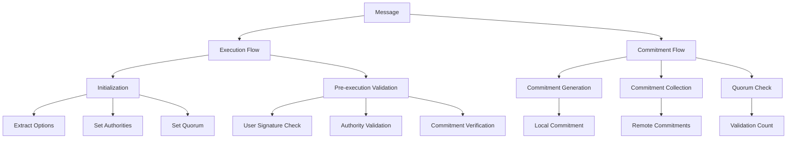
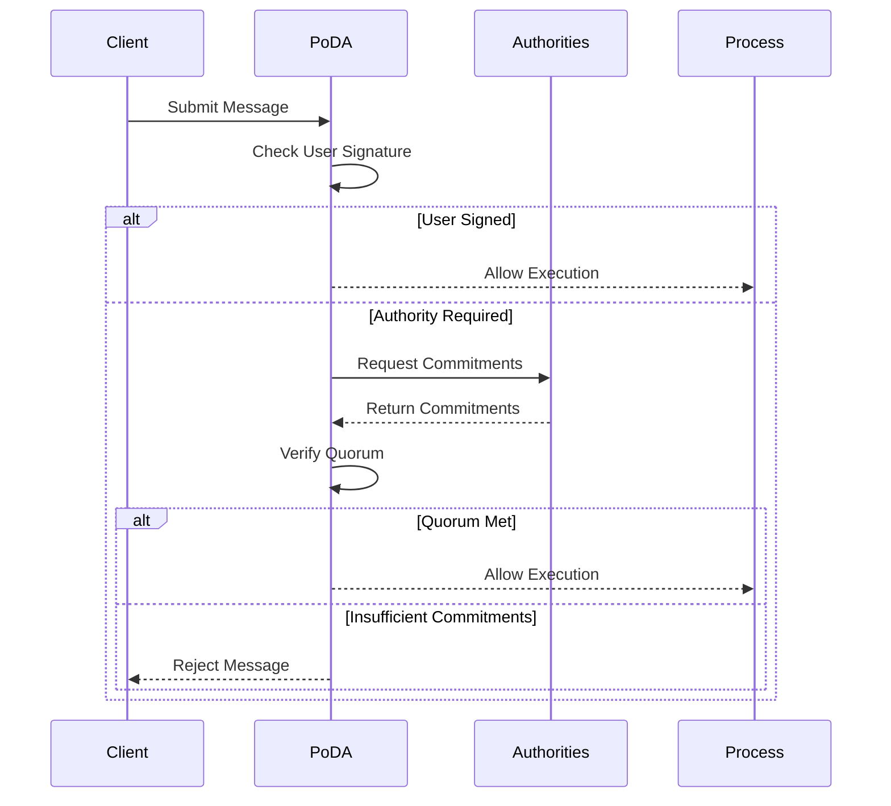

# Module: dev_poda

## Basic Information
- **Source File:** dev_poda.erl
- **Module Type:** Consensus Device
- **Purpose:** Implements a decentralized Proof of Authority (PoDA) consensus algorithm for validating and committing AO process messages.

## Core Functionality

### 1. Consensus Architecture


### 2. Message Flow


## Implementation Details

### 1. Initialization
```erlang
% Initialize PoDA device
init(State, Params) ->
    % Extract authority addresses and quorum requirement
    Authorities = extract_authorities(Params),
    Quorum = extract_quorum(Params),
    
    % Configure device state
    {ok, State, #{
        authorities => Authorities,
        quorum => Quorum
    }}.
```

### 2. Message Validation
```erlang
% Validate incoming message
execute(Msg, State, Opts) ->
    case is_user_signed(Msg) of
        true -> {ok, State};  % User-signed messages pass through
        false ->
            % Validate authority commitments
            case validate_commitments(Msg, Opts) of
                true -> {ok, update_state(State, Msg)};
                {false, Reason} -> {error, Reason}
            end
    end.
```

### 3. Commitment Management
```erlang
% Add commitments to results
push(Item, State = #{results := Results}) ->
    % Generate local commitment
    LocalComm = generate_commitment(Item, State),
    
    % Collect remote commitments
    RemoteComms = collect_commitments(Item, State),
    
    % Bundle all commitments
    AllComms = [LocalComm | RemoteComms],
    
    % Update results with commitments
    {ok, State#{results => add_commitments(Results, AllComms)}}.
```

## Key Features

### 1. Authority Management
- **Authority List**: Configurable list of trusted nodes
- **Quorum Setting**: Required number of validations
- **Dynamic Updates**: Modifiable authority set
- **Role Validation**: Authority verification
- **Permission Control**: Access management

### 2. Message Processing
- **User Messages**: Direct pass-through
- **Authority Messages**: Validation required
- **Commitment Collection**: Distributed gathering
- **Validation Rules**: Configurable checks
- **Error Handling**: Detailed responses

### 3. Consensus Features
- **Distributed Validation**: Multi-node verification
- **Quorum Enforcement**: Minimum approval count
- **Parallel Processing**: Concurrent commitment collection
- **State Management**: Consistent tracking
- **Result Bundling**: Organized outputs

## Usage Examples

### 1. Device Configuration
```erlang
% Configure PoDA device
Config = #{
    <<"authority">> => <<"addr1">>,
    <<"authority">> => <<"addr2">>,
    <<"authority">> => <<"addr3">>,
    <<"quorum">> => <<"2">>
},
{ok, State} = dev_poda:init(#{}, Config).
```

### 2. Message Validation
```erlang
% Process message with commitments
Message = #{
    <<"body">> => Content,
    <<"commitments">> => #{
        <<"1">> => Commitment1,
        <<"2">> => Commitment2
    }
},
{ok, NewState} = dev_poda:execute(Message, State, Opts).
```

### 3. Commitment Addition
```erlang
% Add commitments to results
Item = #{
    <<"target">> => ProcessId,
    <<"data">> => Content
},
{ok, UpdatedState} = dev_poda:push(Item, State).
```

## Error Handling

### 1. Validation Errors
- Missing commitments
- Invalid signatures
- Insufficient quorum
- Authority mismatch
- Format issues

### 2. Processing Errors
- Message format invalid
- Commitment collection failed
- Authority unreachable
- State inconsistency
- Timeout issues

### 3. System Errors
- Configuration problems
- Network failures
- Resource exhaustion
- State corruption
- Protocol violations

## Future Considerations

### 1. Consensus
- Dynamic quorum adjustment
- Authority rotation
- Weight-based voting
- Timeout management
- Fork resolution

### 2. Performance
- Commitment caching
- Parallel validation
- Network optimization
- State compression
- Resource management

### 3. Security
- Authority verification
- Message integrity
- Replay protection
- Access control
- Audit support
