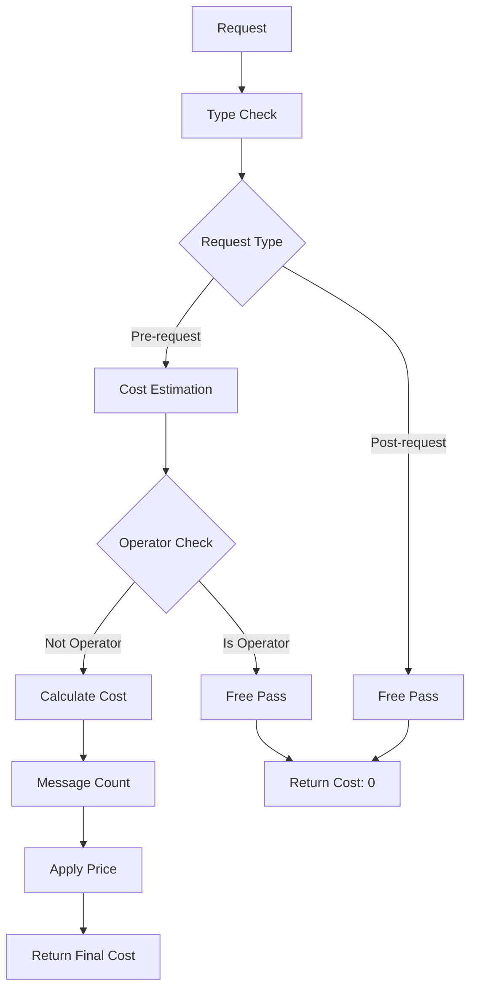
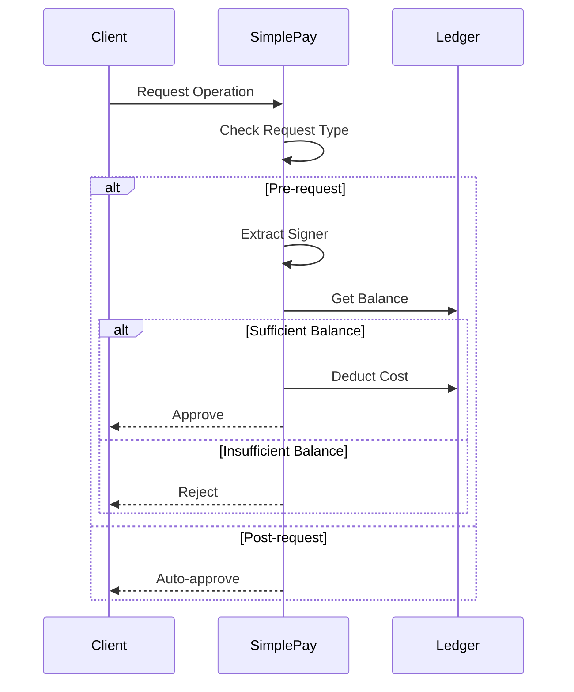

# Module: dev_simple_pay

## Basic Information
- **Source File:** dev_simple_pay.erl
- **Module Type:** Pricing & Ledger Device
- **Purpose:** Implements a simple per-message payment system with built-in ledger functionality.

## Core Functionality

### 1. Payment Architecture


### 2. Ledger Flow


## Implementation Details

### 1. Pricing API
```erlang
% Cost estimation based on message count and type
estimate(_, EstimateReq, NodeMsg) ->
    Req = hb_ao:get(<<"request">>, EstimateReq, NodeMsg),
    ReqType = hb_ao:get(<<"type">>, EstimateReq, undefined, NodeMsg),
    
    case {is_operator(Req, NodeMsg), ReqType} of
        {true, _} -> {ok, 0};  % Operator requests are free
        {_, <<"post">>} -> {ok, 0};  % Post-processing is free
        {_, <<"pre">>} ->
            % Calculate cost based on message count
            Messages = hb_ao:get(<<"body">>, EstimateReq, NodeMsg),
            Price = hb_opts:get(simple_pay_price, 1, NodeMsg),
            {ok, length(Messages) * Price}
    end.
```

### 2. Ledger API
```erlang
% Balance deduction during preprocessing
debit(_, RawReq, NodeMsg) ->
    case hb_ao:get(<<"type">>, RawReq, undefined, NodeMsg) of
        <<"post">> -> 
            {ok, true};  % Post-processing always succeeds
        <<"pre">> ->
            Req = hb_ao:get(<<"request">>, RawReq, NodeMsg),
            case hb_message:signers(Req) of
                [] -> 
                    {ok, false};  % Unsigned requests fail
                [Signer] ->
                    % Check and update balance
                    UserBalance = get_balance(Signer, NodeMsg),
                    Price = hb_ao:get(<<"amount">>, RawReq, 0, NodeMsg),
                    case UserBalance >= Price of
                        true ->
                            set_balance(Signer, UserBalance - Price, NodeMsg),
                            {ok, true};
                        false ->
                            {ok, false}
                    end
            end
    end.
```

### 3. Balance Management
```erlang
% Balance retrieval with normalization
get_balance(Signer, NodeMsg) ->
    NormSigner = hb_util:human_id(Signer),
    Ledger = hb_opts:get(simple_pay_ledger, #{}, NodeMsg),
    hb_ao:get(NormSigner, Ledger, 0, NodeMsg).

% Balance update with event logging
set_balance(Signer, Amount, NodeMsg) ->
    NormSigner = hb_util:human_id(Signer),
    Ledger = hb_opts:get(simple_pay_ledger, #{}, NodeMsg),
    
    % Update ledger with new balance
    NewMsg = NodeMsg#{
        simple_pay_ledger =>
            hb_ao:set(Ledger, NormSigner, Amount, NodeMsg)
    },
    hb_http_server:set_opts(NewMsg),
    {ok, NewMsg}.
```

## Key Features

### 1. Payment System
- **Per-message Pricing**: Cost based on message count
- **Configurable Rate**: Adjustable per-message price
- **Operator Exemption**: Free access for node operator
- **Pre/Post Handling**: Charges only during pre-processing
- **Balance Validation**: Ensures sufficient funds before processing

### 2. Ledger Management
- **Built-in Ledger**: Integrated balance tracking
- **Address Normalization**: Consistent wallet ID handling
- **Default Balances**: Zero balance for new users
- **Atomic Updates**: Safe balance modifications
- **Event Logging**: Comprehensive transaction tracking

### 3. Integration
- **P4 Compatible**: Implements pricing and ledger APIs
- **HTTP Integration**: Works with HTTP server infrastructure
- **Message System**: Integrates with message handling
- **Node Configuration**: Uses node options for settings
- **Event System**: Uses standard event logging

## Usage Examples

### 1. Node Configuration
```erlang
% Configure node with simple-pay
NodeOpts = #{
    simple_pay_price => 10,  % Cost per message
    simple_pay_ledger => #{  % Initial balances
        <<"user1">> => 1000,
        <<"user2">> => 500
    },
    operator => OperatorAddress
}.
```

### 2. Balance Operations
```erlang
% Check balance
BalanceReq = #{
    <<"path">> => <<"/~simple-pay@1.0/balance">>
},
{ok, Balance} = hb_http:get(Node, SignedBalanceReq, #{}).

% Top up balance
TopupReq = #{
    <<"path">> => <<"/~simple-pay@1.0/topup">>,
    <<"amount">> => 100,
    <<"recipient">> => UserAddress
},
{ok, NewBalance} = hb_http:post(Node, SignedTopupReq, #{}).
```

### 3. Request Processing
```erlang
% Process request with payment
ProcessReq = #{
    <<"type">> => <<"pre">>,
    <<"body">> => Messages,
    <<"amount">> => Cost
},
{ok, Result} = hb_http:post(Node, SignedProcessReq, #{}).
```

## Error Handling

### 1. Payment Errors
- Insufficient balance
- Invalid request type
- Missing signatures
- Price calculation issues
- Configuration problems

### 2. Ledger Errors
- Balance update failures
- Ledger corruption
- State inconsistencies
- Normalization issues
- Storage problems

### 3. Integration Errors
- API mismatches
- Configuration issues
- Message errors
- State corruption
- System failures

## Future Considerations

### 1. Payment System
- Variable pricing
- Bulk discounts
- Subscription model
- Payment plans
- Cost optimization

### 2. Ledger System
- Persistent storage
- Transaction history
- Balance limits
- Account types
- Audit support

### 3. Integration
- Better monitoring
- Enhanced logging
- Analytics support
- Reporting tools
- Admin interface
