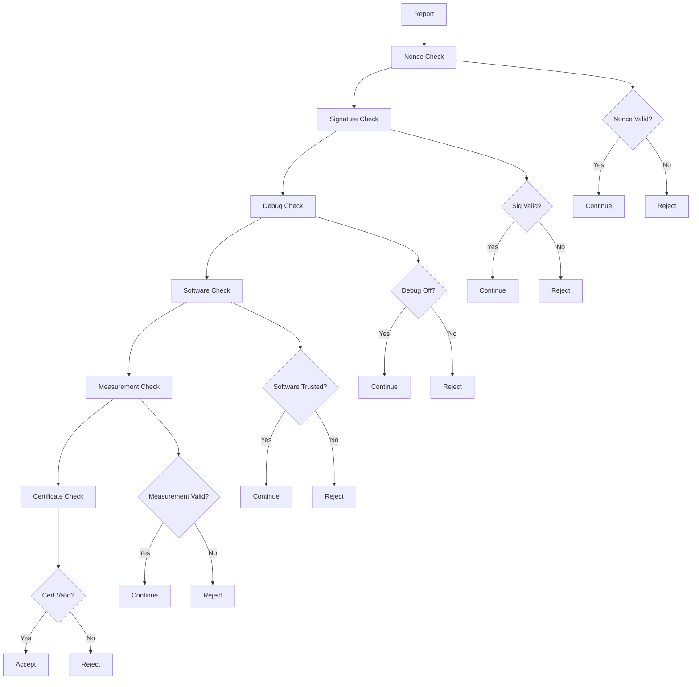
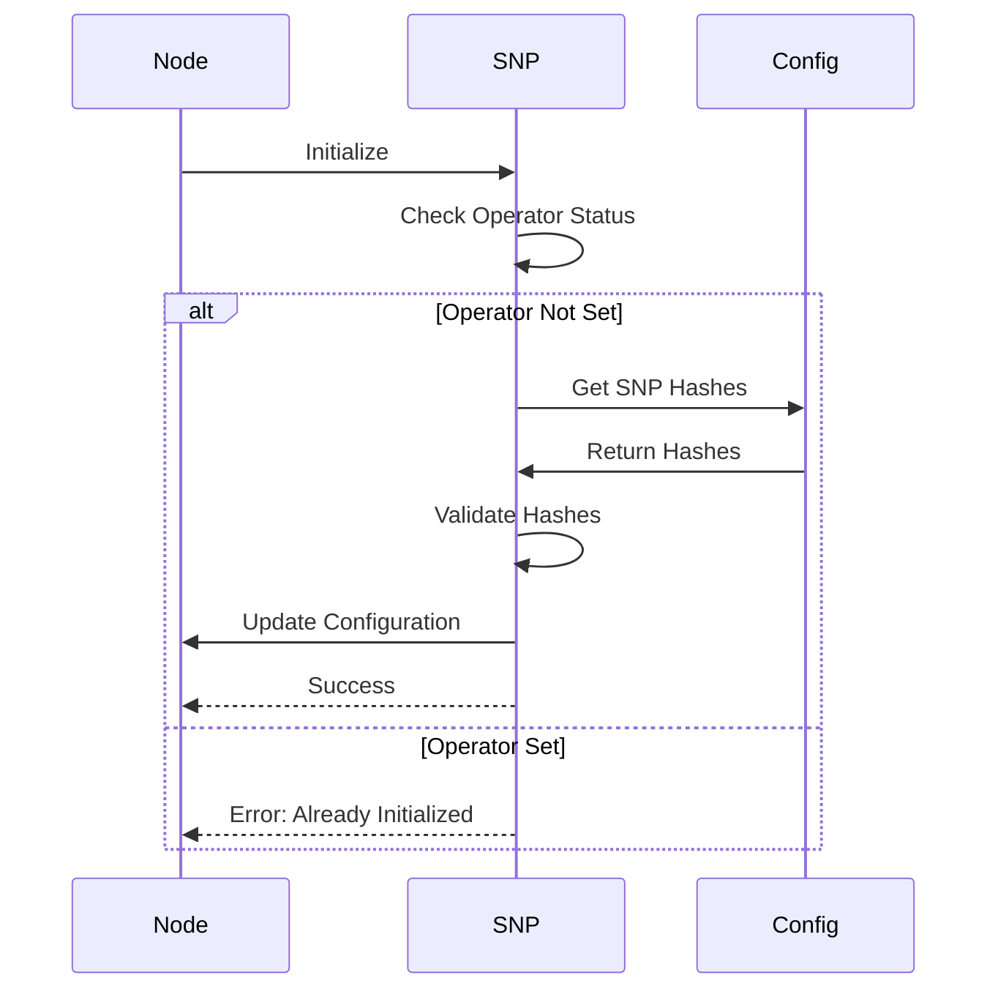

# Module: dev_snp

## Basic Information
- **Source File:** dev_snp.erl
- **Module Type:** Security Validation Device
- **Purpose:** Implements AMD SEV-SNP commitment validation and generation for secure node attestation.

## Core Functionality

### 1. Validation Architecture


### 2. Initialization Flow


## Implementation Details

### 1. Report Validation
```erlang
% Verify SNP commitment report
verify(M1, M2, NodeOpts) ->
    % Extract report and normalize
    {ok, MsgWithReport} = hb_message:find_target(M1, M2, NodeOpts),
    Report = hb_json:decode(ReportJSON),
    
    % Perform validation steps
    NonceValid = report_data_matches(Address, NodeMsgID, Nonce),
    SigValid = hb_message:verify(MsgWithReport),
    DebugOff = not is_debug(Report),
    SoftwareTrusted = execute_is_trusted(M1, Report, NodeOpts),
    MeasurementValid = verify_measurement(Report),
    CertValid = verify_signature(Report),
    
    % Return final validation result
    {ok, all_valid([NonceValid, SigValid, DebugOff,
                    SoftwareTrusted, MeasurementValid, CertValid])}.
```

### 2. Report Generation
```erlang
% Generate SNP commitment report
generate(_M1, _M2, Opts) ->
    % Get node identity
    Wallet = hb_opts:get(priv_wallet, no_viable_wallet, Opts),
    Address = hb_util:human_id(ar_wallet:to_address(Wallet)),
    
    % Generate node message ID
    {ok, NodeMsgID} = dev_message:id(NodeMsg, #{}, Opts),
    
    % Create report data and generate attestation
    ReportData = generate_nonce(Address, NodeMsgID),
    {ok, ReportJSON} = dev_snp_nif:generate_attestation_report(ReportData),
    
    % Build and sign report message
    ReportMsg = hb_message:commit(
        build_report_message(ReportData, ReportJSON, Address, NodeMsg),
        Wallet
    ),
    {ok, ReportMsg}.
```

### 3. Trust Validation
```erlang
% Validate software components against trusted list
execute_is_trusted(M1, Msg, NodeOpts) ->
    % Get validation device
    Device = get_validation_device(M1),
    
    % Check each parameter
    Result = lists:all(
        fun(Param) ->
            Value = hb_ao:get(Param, Msg, NodeOpts),
            {ok, true} = validate_parameter(Device, Param, Value, NodeOpts)
        end,
        ?COMMITTED_PARAMETERS
    ),
    {ok, Result}.
```

## Key Features

### 1. Security Validation
- **Nonce Verification**: Ensures report freshness
- **Signature Validation**: Verifies message authenticity
- **Debug Protection**: Prevents debug mode exploitation
- **Software Trust**: Validates component integrity
- **Measurement Checks**: Verifies system state
- **Certificate Chain**: Validates hardware root of trust

### 2. Report Generation
- **Identity Integration**: Uses node wallet
- **Nonce Creation**: Combines address and message ID
- **Attestation Support**: Interfaces with SEV-SNP
- **Message Signing**: Ensures report authenticity
- **Configuration Binding**: Links to node settings

### 3. Trust Management
- **Parameter Tracking**: Monitors critical components
- **Hash Verification**: Validates software integrity
- **Flexible Validation**: Supports custom verifiers
- **Trust Storage**: Manages trusted values
- **Component Isolation**: Separates validation logic

## Usage Examples

### 1. Node Initialization
```erlang
% Initialize SNP support
NodeOpts = #{
    trusted => #{
        snp_hashes => #{
            firmware => "b8c5d4082d5738db...",
            kernel => "69d0cd7d13858e4f...",
            initrd => "853ebf56bc6ba5f0...",
            append => "6cb8a0082b483849..."
        }
    }
},
{ok, _} = hb_http:post(Node, "/~snp@1.0/init", NodeOpts).
```

### 2. Report Generation
```erlang
% Generate attestation report
{ok, Report} = hb_http:get(
    Node,
    "/~snp@1.0/generate",
    #{ <<"is-trusted-device">> => <<"snp@1.0">> }
).
```

### 3. Report Validation
```erlang
% Validate remote node's report
{ok, Valid} = hb_http:post(
    Node,
    "/~snp@1.0/verify",
    #{ <<"report">> => RemoteReport }
).
```

## Error Handling

### 1. Validation Errors
- Invalid nonce format
- Signature mismatch
- Debug mode enabled
- Untrusted software
- Invalid measurements
- Certificate issues

### 2. Generation Errors
- Missing wallet
- Node ID issues
- Attestation failures
- Message errors
- Configuration problems

### 3. Trust Errors
- Missing parameters
- Hash mismatches
- Validation failures
- Device errors
- Configuration issues

## Future Considerations

### 1. Security
- Enhanced validation
- Additional checks
- Policy management
- Trust revocation
- Audit support

### 2. Integration
- More platforms
- Better monitoring
- Performance tuning
- Error recovery
- Status tracking

### 3. Management
- Trust updates
- Configuration UI
- Reporting tools
- Analytics
- Automation
