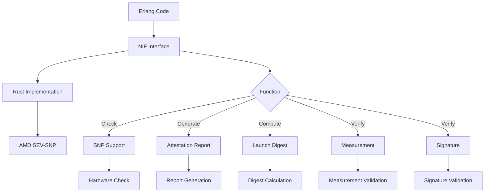
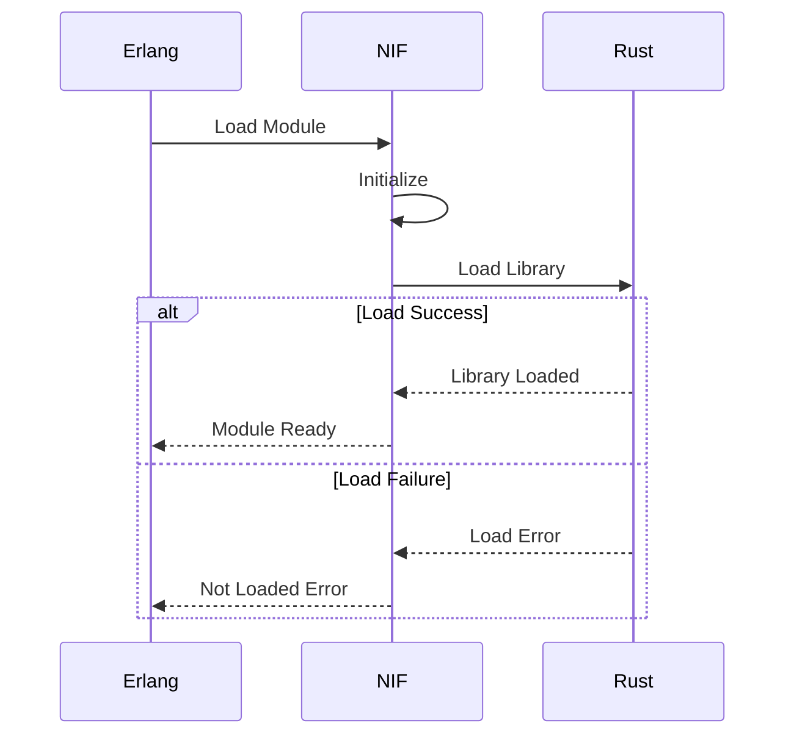

# Module: dev_snp_nif

## Basic Information
- **Source File:** dev_snp_nif.erl
- **Module Type:** Native Interface Module
- **Purpose:** Provides native implementation bindings for AMD SEV-SNP operations through Rust NIFs.

## Core Functionality

### 1. NIF Architecture


### 2. Loading Flow


## Implementation Details

### 1. NIF Functions
```erlang
% Check if SEV-SNP is supported
check_snp_support() ->
    ?NOT_LOADED.

% Generate attestation report
generate_attestation_report(_UniqueData, _VMPL) ->
    ?NOT_LOADED.

% Compute launch digest
compute_launch_digest(_Args) ->
    ?NOT_LOADED.

% Verify measurement
verify_measurement(_Report, _Expected) ->
    ?NOT_LOADED.

% Verify signature
verify_signature(_Report) ->
    ?NOT_LOADED.
```

### 2. Module Loading
```erlang
% Initialize NIF module
init() ->
    ?load_nif_from_crate(dev_snp_nif, 0).

% Handle not loaded error
not_loaded(Line) ->
    erlang:nif_error({not_loaded, [{module, ?MODULE}, {line, Line}]}).
```

### 3. Test Implementation
```erlang
% Test attestation report generation
generate_attestation_report_test() ->
    case dev_snp_nif:check_snp_support() of
        {ok, true} ->
            UniqueData = crypto:strong_rand_bytes(64),
            VMPL = 1,
            {ok, Report} = generate_attestation_report(UniqueData, VMPL),
            verify_report(Report);
        {ok, false} ->
            skip_test("SNP not supported")
    end.
```

## Key Features

### 1. Hardware Integration
- **SNP Support Check**: Validates hardware capabilities
- **Native Bindings**: Direct hardware access
- **Secure Operations**: Protected execution
- **Performance**: Native speed
- **Resource Management**: Direct memory handling

### 2. Report Operations
- **Report Generation**: Creates attestation reports
- **Digest Computation**: Calculates launch digests
- **Measurement Verification**: Validates measurements
- **Signature Verification**: Checks report signatures
- **Data Validation**: Ensures report integrity

### 3. Safety Features
- **Load Checking**: Validates NIF availability
- **Error Handling**: Proper error propagation
- **Resource Cleanup**: Automatic cleanup
- **Type Safety**: Strong type checking
- **Memory Safety**: Protected memory access

## Usage Examples

### 1. Hardware Check
```erlang
% Check for SNP support
case dev_snp_nif:check_snp_support() of
    {ok, true} ->
        % SNP operations available
        proceed_with_snp();
    {ok, false} ->
        % Fallback to non-SNP mode
        use_fallback()
end.
```

### 2. Report Generation
```erlang
% Generate attestation report
UniqueData = crypto:strong_rand_bytes(64),
{ok, Report} = dev_snp_nif:generate_attestation_report(
    UniqueData,
    1  % VMPL level
).
```

### 3. Verification
```erlang
% Verify measurement and signature
{ok, true} = dev_snp_nif:verify_measurement(Report, Expected),
{ok, true} = dev_snp_nif:verify_signature(Report).
```

## Error Handling

### 1. Loading Errors
- Module not found
- Library load failure
- Version mismatch
- Permission issues
- Resource allocation failures

### 2. Operation Errors
- Hardware support missing
- Invalid parameters
- Memory allocation failures
- Operation timeouts
- System errors

### 3. Validation Errors
- Invalid reports
- Measurement mismatches
- Signature failures
- Format errors
- Data corruption

## Future Considerations

### 1. Hardware Support
- Additional CPU features
- Platform extensions
- Performance optimizations
- Resource management
- Error recovery

### 2. Integration
- More verification types
- Extended report formats
- Better error reporting
- Performance monitoring
- Debug support

### 3. Testing
- Automated validation
- Performance testing
- Error simulation
- Coverage improvement
- Integration tests
