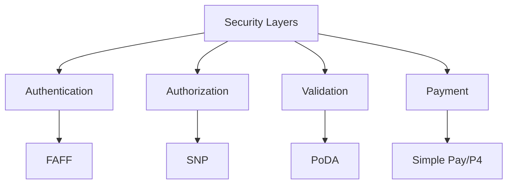
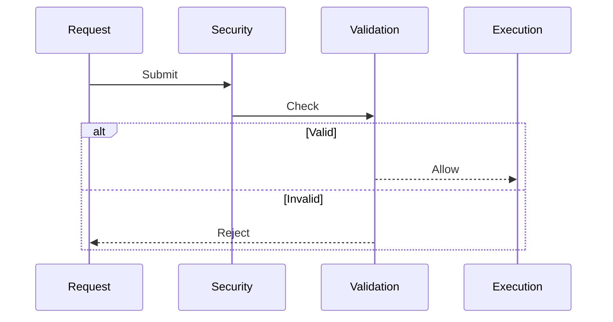
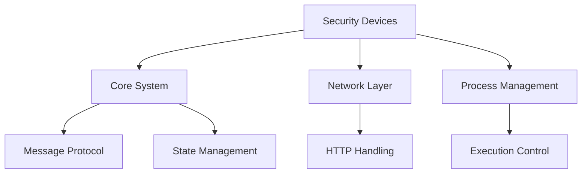

# Security & Access Observations

## Architectural Patterns

### 1. Multi-Layer Security

### 2. Trust Models
- **FAFF**: Simple allow/deny based on address lists
- **SNP**: Hardware-based trust through AMD SEV-SNP
- **PoDA**: Distributed trust through authority consensus
- **P4/Simple Pay**: Economic trust through payment mechanisms

## Key Insights

### 1. Security Integration
- Security devices operate as preprocessors/postprocessors
- Modular design allows mixing security mechanisms
- Consistent message handling across security layers
- Flexible configuration through device parameters
- Chainable security validations

### 2. Access Control Patterns
- Address-based filtering (FAFF)
- Hardware attestation (SNP)
- Consensus-based approval (PoDA)
- Payment-based access (P4/Simple Pay)

### 3. Implementation Approaches
- **Simplicity**: FAFF provides basic filtering
- **Hardware Security**: SNP leverages CPU features
- **Distributed Trust**: PoDA implements consensus
- **Economic Security**: P4 manages payments

## Common Patterns

### 1. Message Processing

### 2. Configuration Management
- Consistent parameter handling
- Runtime configuration updates
- Default fallback behaviors
- Error state management
- Logging and monitoring

### 3. Integration Points
- Message preprocessing
- Execution validation
- Result postprocessing
- State management
- Event handling

## Design Principles

### 1. Security First
- Default deny approach
- Explicit authorization required
- Multiple validation layers
- Comprehensive error handling
- Audit trail generation

### 2. Flexibility
- Configurable parameters
- Pluggable mechanisms
- Extensible interfaces
- Optional features
- Fallback behaviors

### 3. Performance
- Efficient validation
- Parallel processing
- Caching support
- Resource management
- Optimized paths

## Challenges & Solutions

### 1. Trust Management
- **Challenge**: Establishing trust across nodes
- **Solution**: Multiple trust mechanisms (hardware, consensus, economic)

### 2. Performance Impact
- **Challenge**: Security overhead
- **Solution**: Optimized validation paths, caching

### 3. Configuration Complexity
- **Challenge**: Managing security parameters
- **Solution**: Consistent configuration interfaces

### 4. Integration Overhead
- **Challenge**: Combining security mechanisms
- **Solution**: Modular design, clear interfaces

## Future Considerations

### 1. Security Enhancements
- Additional validation mechanisms
- Enhanced attestation support
- Improved consensus algorithms
- Better payment integration
- Advanced monitoring

### 2. Performance Optimization
- Validation caching
- Parallel processing
- Resource management
- State optimization
- Network efficiency

### 3. Integration Improvements
- Simplified configuration
- Better error handling
- Enhanced monitoring
- Automated testing
- Documentation tools

## Best Practices

### 1. Implementation
- Use layered security approach
- Implement defense in depth
- Follow least privilege principle
- Enable comprehensive logging
- Support audit capabilities

### 2. Configuration
- Document all parameters
- Provide sensible defaults
- Validate all inputs
- Handle edge cases
- Support updates

### 3. Integration
- Define clear interfaces
- Support modularity
- Enable composition
- Maintain consistency
- Allow extension

## Module Relationships

### 1. Direct Dependencies

### 2. Interaction Patterns
- Sequential validation
- Parallel processing
- State sharing
- Event propagation
- Result aggregation

### 3. Integration Points
- Message handling
- State management
- Configuration
- Monitoring
- Testing

## Recommendations

### 1. Development
- Maintain modular design
- Enhance test coverage
- Improve documentation
- Add monitoring
- Support debugging

### 2. Deployment
- Document configurations
- Monitor performance
- Track metrics
- Enable logging
- Support updates

### 3. Maintenance
- Regular security reviews
- Performance monitoring
- Configuration audits
- Update management
- Documentation updates
