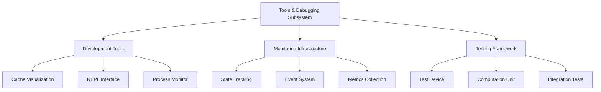
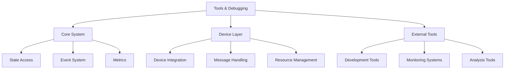
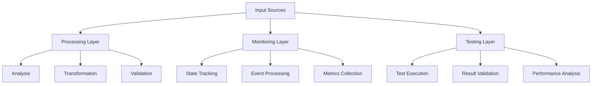

# Tools & Debugging Subsystem Overview

## Architectural Foundation

The Tools & Debugging subsystem represents a sophisticated collection of development, monitoring, and debugging capabilities that form an integral part of the HyperBEAM ecosystem. This subsystem is meticulously designed to provide comprehensive visibility into system operations while maintaining a strict non-interference policy with production code.

### 1. Foundational Architecture


The architecture is built upon three fundamental pillars:

1. **Development Tools Layer**
   - Provides real-time visualization of system internals
   - Enables interactive system exploration and debugging
   - Facilitates deep inspection of runtime state
   - Supports dynamic configuration and monitoring
   - Integrates with external development tools

2. **Monitoring Infrastructure**
   - Implements non-intrusive state observation
   - Maintains comprehensive event tracking
   - Provides detailed performance metrics
   - Supports system health monitoring
   - Enables real-time diagnostics

3. **Testing Framework**
   - Facilitates comprehensive system testing
   - Supports various testing methodologies
   - Enables controlled error simulation
   - Provides integration test capabilities
   - Maintains test result tracking

## Core Components

### 1. Cache Visualization (dev_cacheviz)
The Cache Visualization component transforms complex internal cache structures into comprehensible visual representations:

```erlang
% Core visualization pipeline
visualization_flow() ->
    #{
        input => "Cache Structure",
        processing => [
            "Structure Analysis",
            "Graph Generation",
            "Layout Optimization",
            "Format Conversion"
        ],
        output => [
            "DOT Format",
            "SVG Rendering"
        ]
    }.
```

This component excels in:
- Converting abstract cache structures into visual graphs
- Providing interactive exploration capabilities
- Supporting multiple output formats
- Enabling deep cache analysis
- Facilitating debugging and optimization

### 2. REPL Interface (dev_hyperbuddy)
The REPL Interface serves as a sophisticated bridge between developers and the system:

```erlang
% Core REPL architecture
repl_system() ->
    #{
        interface => "Web-Based Console",
        features => [
            "Command Processing",
            "State Inspection",
            "Metrics Visualization",
            "System Interaction"
        ],
        integration => [
            "HTTP Server",
            "Metrics System",
            "Event Handling"
        ]
    }.
```

Key capabilities include:
- Interactive system exploration
- Real-time command execution
- Dynamic state inspection
- Metrics visualization
- Comprehensive debugging

### 3. Process Monitor (dev_monitor)
The Process Monitor provides sophisticated process observation capabilities:

```erlang
% Core monitoring system
monitoring_system() ->
    #{
        capabilities => [
            "State Observation",
            "Event Tracking",
            "Signal Handling",
            "Resource Monitoring"
        ],
        features => [
            "Non-intrusive Monitoring",
            "Real-time Updates",
            "Performance Analysis",
            "Resource Tracking"
        ]
    }.
```

This component ensures:
- Comprehensive process visibility
- Efficient state tracking
- Detailed event logging
- Resource utilization monitoring
- Performance analysis

### 4. Test Device (dev_test)
The Test Device provides a robust framework for system testing:

```erlang
% Core testing framework
testing_framework() ->
    #{
        components => [
            "Handler Resolution",
            "State Management",
            "Error Simulation",
            "Result Validation"
        ],
        capabilities => [
            "Integration Testing",
            "Unit Testing",
            "Performance Testing",
            "Error Handling"
        ]
    }.
```

Key features include:
- Comprehensive test coverage
- Flexible test configuration
- Error simulation capabilities
- Result validation
- Performance benchmarking

### 5. Computation Unit (dev_cu)
The Computation Unit manages complex computational tasks:

```erlang
% Core computation architecture
computation_system() ->
    #{
        processing => [
            "Assignment Management",
            "Result Handling",
            "Bundle Processing",
            "State Tracking"
        ],
        features => [
            "Efficient Computation",
            "Result Validation",
            "Error Recovery",
            "Performance Optimization"
        ]
    }.
```

This component provides:
- Sophisticated computation management
- Efficient resource utilization
- Robust error handling
- Performance optimization
- State preservation

## Integration Patterns

### 1. System Integration


The integration strategy emphasizes:
- Seamless core system integration
- Efficient device layer interaction
- Comprehensive external tool support
- Robust message handling
- Effective resource management

### 2. Data Flow Architecture


The data flow architecture ensures:
- Efficient data processing
- Comprehensive monitoring
- Effective testing
- Robust validation
- Performance optimization

## Implementation Considerations

### 1. Performance Impact
The subsystem implements sophisticated strategies to minimize performance overhead:

- **Resource Management**
  - Efficient memory utilization
  - Optimized processing paths
  - Controlled resource allocation
  - Smart caching strategies
  - Load distribution

- **Processing Optimization**
  - Parallel execution
  - Batch processing
  - Resource pooling
  - Load balancing
  - Cache utilization

### 2. Security Implications
Security considerations are deeply embedded in the design:

- **Access Control**
  - Strict permission management
  - Secure state access
  - Protected resources
  - Monitored operations
  - Audit logging

- **Data Protection**
  - Secure data handling
  - State isolation
  - Protected communication
  - Encrypted storage
  - Access validation

### 3. Reliability Measures
The subsystem implements comprehensive reliability features:

- **Error Handling**
  - Sophisticated error detection
  - Robust recovery mechanisms
  - State preservation
  - Operation validation
  - System protection

- **State Management**
  - Consistent state tracking
  - Safe state transitions
  - Recovery procedures
  - Validation checks
  - History maintenance

## Future Directions

### 1. Enhanced Capabilities
Planned enhancements focus on expanding system capabilities:

- **Advanced Visualization**
  - Real-time updates
  - Interactive exploration
  - Custom visualizations
  - Advanced analytics
  - Performance profiling

- **Improved Integration**
  - External tool support
  - Cloud integration
  - Advanced monitoring
  - Enhanced debugging
  - Extended analytics

### 2. Performance Optimization
Future optimizations will focus on:

- **Processing Efficiency**
  - Enhanced algorithms
  - Improved caching
  - Better resource use
  - Reduced overhead
  - Faster processing

- **Resource Management**
  - Smart allocation
  - Efficient utilization
  - Better distribution
  - Improved tracking
  - Optimized storage

### 3. Development Support
Enhanced development support will include:

- **Tool Integration**
  - Advanced debugging
  - Better profiling
  - Enhanced testing
  - Improved monitoring
  - Extended analytics

- **Documentation**
  - Comprehensive guides
  - Interactive examples
  - Best practices
  - Use cases
  - Integration patterns
