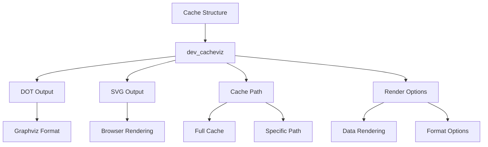
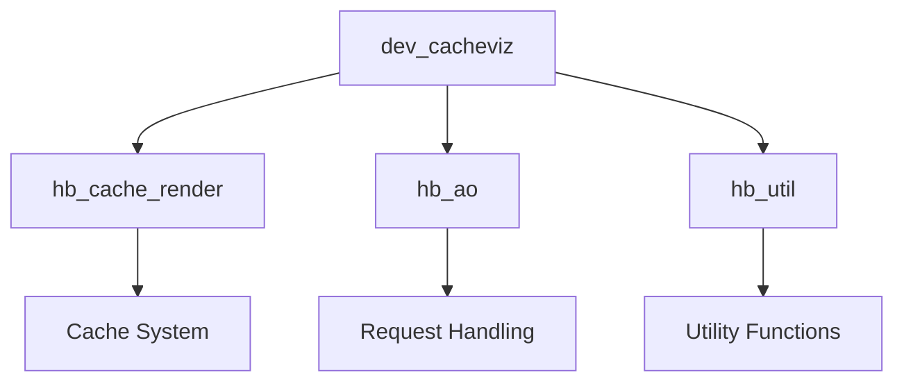

# Module: dev_cacheviz

## Basic Information
- **Source File:** dev_cacheviz.erl
- **Module Type:** Visualization Device
- **Purpose:** Generates visual representations of node cache structures in both DOT and SVG formats.

## Core Functionality

### 1. Visualization Architecture


### 2. Implementation Details
```erlang
% Core DOT generation function
dot(_, Req, Opts) ->
    % Extract target path (defaults to 'all')
    Target = hb_ao:get(<<"target">>, Req, all, Opts),
    
    % Generate DOT representation with options
    Dot = hb_cache_render:cache_path_to_dot(
        Target,
        #{
            render_data =>
                hb_util:atom(
                    hb_ao:get(<<"render-data">>, Req, false, Opts)
                )
        },
        Opts
    ),
    
    % Return formatted response
    {ok, #{
        <<"content-type">> => <<"text/vnd.graphviz">>,
        <<"body">> => Dot
    }}.

% SVG conversion function
svg(Base, Req, Opts) ->
    % First generate DOT representation
    {ok, #{ <<"body">> := Dot }} = dot(Base, Req, Opts),
    
    % Log the DOT output for debugging
    ?event(cacheviz, {dot, Dot}),
    
    % Convert DOT to SVG
    Svg = hb_cache_render:dot_to_svg(Dot),
    
    % Return formatted response
    {ok, #{
        <<"content-type">> => <<"image/svg+xml">>,
        <<"body">> => Svg
    }}.
```

## Key Features

### 1. Cache Visualization
- **Full Cache View**: Renders complete cache structure
- **Path-Specific View**: Visualizes specific cache paths
- **Data Rendering**: Optional inclusion of cached data
- **Format Options**: Multiple output formats (DOT/SVG)
- **Browser Integration**: SVG output for web viewing

### 2. Rendering Options
```erlang
% Example rendering options
Options = #{
    render_data => false,  % Don't show cached data
    target => "/some/path",  % Specific cache path
    format => dot  % Output format
}
```

### 3. Integration Points
- **Cache System**: Direct cache structure access
- **Graphviz**: DOT format generation
- **SVG Conversion**: DOT to SVG transformation
- **HTTP Response**: Content type handling
- **Event Logging**: Debug information

## Usage Examples

### 1. Full Cache Visualization
```erlang
% Request full cache visualization
Request = #{
    <<"render-data">> => false
},
{ok, Response} = dev_cacheviz:dot(none, Request, #{}).
```

### 2. Path-Specific View
```erlang
% Request specific cache path
Request = #{
    <<"target">> => <<"/specific/path">>,
    <<"render-data">> => true
},
{ok, Response} = dev_cacheviz:svg(none, Request, #{}).
```

### 3. Integration Example
```erlang
% Example HTTP handler integration
handle_request(#{method := get, path := "/cache/viz"} = Req, State) ->
    % Generate SVG visualization
    {ok, Response} = dev_cacheviz:svg(
        none,
        #{
            <<"target">> => get_path(Req),
            <<"render-data">> => get_render_option(Req)
        },
        State
    ),
    % Return visualization
    {ok, Response}.
```

## Error Handling

### 1. Input Validation
- Invalid paths
- Malformed requests
- Missing parameters
- Format errors
- Option validation

### 2. Rendering Errors
- DOT generation failures
- SVG conversion issues
- Cache access errors
- Memory constraints
- Timeout handling

### 3. Response Formatting
- Content type mismatches
- Encoding issues
- Size limitations
- Format compatibility
- Browser support

## Performance Considerations

### 1. Cache Access
- Efficient path traversal
- Memory usage optimization
- Concurrent access handling
- Cache size limitations
- Update synchronization

### 2. Rendering Pipeline
- DOT generation efficiency
- SVG conversion speed
- Response streaming
- Memory management
- Resource cleanup

### 3. Integration Impact
- Request handling load
- Response size management
- Caching strategies
- Resource utilization
- System performance

## Future Enhancements

### 1. Visualization Features
- Interactive elements
- Real-time updates
- Custom styling
- Layout options
- Filter capabilities

### 2. Performance Improvements
- Incremental rendering
- Partial updates
- Response compression
- Cache optimization
- Resource pooling

### 3. Integration Options
- WebSocket support
- Export formats
- Custom renderers
- Plugin system
- API extensions

## Related Modules

### 1. Direct Dependencies


### 2. Integration Points
- hb_cache_render: Core rendering functionality
- hb_ao: Request parameter handling
- hb_util: Utility functions
- Event system: Debug logging
- HTTP system: Response handling

### 3. Usage Context
- Debugging tools
- Development aids
- System monitoring
- Cache analysis
- Performance tuning
