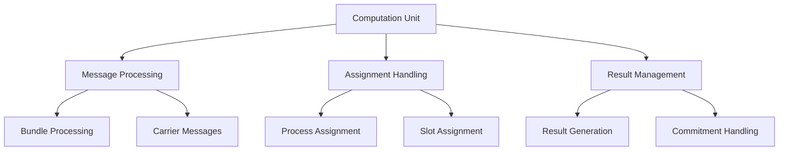
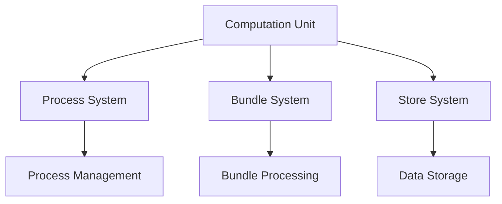

# Module: dev_cu

## Basic Information
- **Source File:** dev_cu.erl
- **Module Type:** Computation Unit Device
- **Purpose:** Manages computation assignments and results handling, particularly for bundled transactions and process execution.

## Core Functionality

### 1. Computation Architecture


### 2. Message Push Implementation
```erlang
% Push message for computation
push(Msg, S = #{ assignment := Assignment, logger := _Logger }) ->
    % Log push event
    ?event(
        {pushing_message,
            {assignment, hb_util:id(Assignment, unsigned)},
            {message, hb_util:id(Msg, unsigned)}
        }
    ),
    
    % Compute results
    case hb_client:compute(Assignment, Msg) of
        {ok, Results} ->
            ?event(computed_results),
            {ok, S#{ results => Results }};
        Error ->
            throw({cu_error, Error})
    end.
```

### 3. Execution Flow
```erlang
% Execute carrier message
execute(CarrierMsg, S) ->
    % Extract bundle and setup
    MaybeBundle = ar_bundles:hd(CarrierMsg),
    Store = hb_opts:get(store),
    Wallet = hb:wallet(),
    
    % Process bundle or carrier message
    {ok, Results} = process_message(MaybeBundle, CarrierMsg, Store, Wallet),
    
    % Handle commit-to requests
    handle_commit_request(CarrierMsg, Results, S).
```

## Key Features

### 1. Bundle Processing
```erlang
% Bundle handling logic
process_bundle(Bundle, Store, Wallet) ->
    case Bundle of
        #tx{data = #{ <<"body">> := _Msg, <<"assignment">> := Assignment }} ->
            {_, ProcID} = lists:keyfind(<<"process">>, 1, Assignment#tx.tags),
            ?event({dev_cu_computing_from_full_assignment, 
                {process, ProcID}, 
                {slot, hb_util:id(Assignment, signed)}
            }),
            hb_process:result(ProcID, hb_util:id(Assignment, signed), Store, Wallet);
        _ ->
            process_carrier(CarrierMsg, Store, Wallet)
    end.
```

### 2. Commitment Management
```erlang
% Commitment handling
handle_commit(CommitTo, Results, S) ->
    case ar_bundles:find(CommitTo, Results) of
        not_found ->
            {ok, S#{ results => create_error_response(404) }};
        _ ->
            {ok, S#{ results => create_commitment_response(CommitTo) }}
    end.

% Create commitment response
create_commitment_response(CommitTo) ->
    ar_bundles:sign_item(
        #tx {
            tags = [
                {<<"status">>, 200},
                {<<"commitment-for">>, CommitTo}
            ],
            data = <<>>
        },
        hb:wallet()
    ).
```

### 3. Error Handling
```erlang
% Error response creation
create_error_response(Status) ->
    #tx {
        tags = [{<<"status">>, Status}],
        data = <<"Requested message to commit to not in results bundle.">>
    }.

% Computation error handling
handle_computation_error(Error) ->
    ?event({computation_failed, Error}),
    throw({cu_error, Error}).
```

## Usage Examples

### 1. Basic Computation
```erlang
% Example computation request
compute_example() ->
    Assignment = create_assignment(),
    Message = prepare_message(),
    State = #{ 
        assignment => Assignment,
        logger => default_logger
    },
    {ok, Results} = dev_cu:push(Message, State).
```

### 2. Bundle Processing
```erlang
% Example bundle processing
process_bundle_example() ->
    CarrierMsg = create_carrier_message(),
    State = initial_state(),
    {ok, Results} = dev_cu:execute(CarrierMsg, State).
```

### 3. Commitment Handling
```erlang
% Example commitment processing
handle_commitment_example() ->
    CommitTo = <<"message-id">>,
    Results = compute_results(),
    State = #{ results => Results },
    {ok, Response} = handle_commit(CommitTo, Results, State).
```

## Integration Points

### 1. System Integration


### 2. Dependencies
- hb_client: Computation client
- ar_bundles: Bundle management
- hb_process: Process handling
- hb_util: Utility functions
- hb_opts: Configuration options

### 3. Event System
- Push events
- Computation events
- Bundle events
- Commitment events
- Error events

## Error Handling

### 1. Computation Errors
- Invalid assignments
- Processing failures
- Resource errors
- State errors
- Client errors

### 2. Bundle Errors
- Invalid bundles
- Missing data
- Format errors
- Processing errors
- Validation errors

### 3. System Errors
- Store errors
- Process errors
- Wallet errors
- Message errors
- State errors

## Performance Considerations

### 1. Resource Management
- Memory usage
- Computation load
- Bundle size
- Result caching
- State tracking

### 2. Processing Efficiency
- Bundle handling
- Message processing
- Result generation
- Commitment handling
- Error handling

### 3. Optimization
- Caching strategy
- Bundle processing
- Result handling
- Error recovery
- State management

## Future Enhancements

### 1. Processing Features
- Advanced bundling
- Parallel processing
- Result streaming
- State persistence
- Error recovery

### 2. Integration
- Extended protocols
- System monitoring
- Performance metrics
- Debug support
- Testing tools

### 3. Development
- API enhancements
- Documentation
- Testing support
- Debug features
- Monitoring tools
