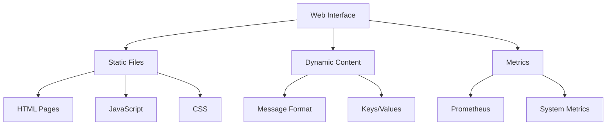
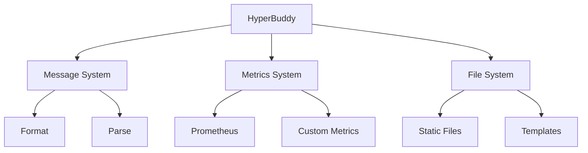

# Module: dev_hyperbuddy

## Basic Information
- **Source File:** dev_hyperbuddy.erl
- **Module Type:** Web Interface Device
- **Purpose:** Provides a REPL-like web interface for interacting with AO-Core, including metrics visualization and message formatting.

## Core Functionality

### 1. Web Interface Architecture


### 2. Route Configuration
```erlang
% Core route configuration
info() ->
    #{
        default => fun serve/4,
        routes => #{
            <<"index">> => <<"index.html">>,
            <<"console">> => <<"console.html">>,
            <<"styles.css">> => <<"styles.css">>,
            <<"metrics.js">> => <<"metrics.js">>,
            <<"devices.js">> => <<"devices.js">>,
            <<"utils.js">> => <<"utils.js">>,
            <<"main.js">> => <<"main.js">>
        }
    }.
```

### 3. File Serving Implementation
```erlang
% Static file serving logic
serve(Key, _, _, _) ->
    ?event({hyperbuddy_serving, Key}),
    case maps:get(Key, maps:get(routes, info(), no_routes), undefined) of
        undefined -> {error, not_found};
        Filename -> return_file(Filename)
    end.

% File response handling
return_file(Name) ->
    Base = hb_util:bin(code:priv_dir(hb)),
    Filename = <<Base/binary, "/html/hyperbuddy@1.0/", Name/binary >>,
    ?event({hyperbuddy_serving, Filename}),
    {ok, Body} = file:read_file(Filename),
    {ok, #{
        <<"body">> => Body,
        <<"content-type">> => determine_content_type(Filename)
    }}.
```

## Key Features

### 1. Web Interface Components
- **Console Interface**: REPL-like interaction
- **Metrics Dashboard**: System monitoring
- **Message Formatting**: Pretty printing
- **Static Assets**: UI resources
- **Route Management**: URL handling

### 2. Metrics Integration
```erlang
% Prometheus metrics handling
metrics(_, Req, Opts) ->
    case hb_opts:get(prometheus, not hb_features:test(), Opts) of
        true ->
            {_, HeaderList, Body} =
                prometheus_http_impl:reply(#{
                    path => true,
                    headers => fun(Name, Default) ->
                        hb_ao:get(Name, Req, Default, Opts)
                    end,
                    registry => prometheus_registry:exists(<<"default">>),
                    standalone => false
                }),
            Headers = format_headers(HeaderList),
            {ok, Headers#{<<"body">> => Body}};
        false ->
            {ok, #{<<"body">> => <<"Prometheus metrics disabled.">>}}
    end.
```

### 3. Message Formatting
```erlang
% Message formatting interface
format(Base, _, _) ->
    {ok, #{
        <<"body">> => hb_util:bin(hb_message:format(Base))
    }}.
```

## Usage Examples

### 1. Web Console Access
```erlang
% Example HTTP request handling
handle_console_request() ->
    {ok, #{
        <<"body">> => serve(<<"console">>, none, none, #{}),
        <<"content-type">> => <<"text/html">>
    }}.
```

### 2. Metrics Retrieval
```erlang
% Example metrics access
get_system_metrics(Req) ->
    Opts = #{prometheus => true},
    {ok, Response} = dev_hyperbuddy:metrics(none, Req, Opts),
    format_metrics_response(Response).
```

### 3. Message Formatting
```erlang
% Example message formatting
format_message(Msg) ->
    {ok, Response} = dev_hyperbuddy:format(Msg, none, none),
    handle_formatted_output(Response).
```

## File Structure

### 1. Static Files
```text
/priv/html/hyperbuddy@1.0/
├── index.html      # Main entry page
├── console.html    # REPL interface
├── styles.css      # UI styling
├── metrics.js      # Metrics visualization
├── devices.js      # Device management
├── utils.js        # Utility functions
└── main.js         # Core functionality
```

### 2. Content Types
```erlang
% Content type mapping
content_types() -> #{
    <<".html">> => <<"text/html">>,
    <<".js">> => <<"text/javascript">>,
    <<".css">> => <<"text/css">>,
    <<".png">> => <<"image/png">>,
    <<".ico">> => <<"image/x-icon">>
}.
```

## Integration Points

### 1. Core System Integration


### 2. External Dependencies
- Prometheus for metrics
- HTTP server for web interface
- File system for static content
- Message formatter for output

### 3. System Hooks
- Message formatting
- Metrics collection
- File serving
- Route handling

## Error Handling

### 1. File Access
- Missing files
- Permission issues
- Invalid paths
- Content type errors
- Read failures

### 2. Metrics
- Disabled metrics
- Registry errors
- Collection failures
- Format issues
- Timeout handling

### 3. Message Processing
- Format errors
- Invalid messages
- System errors
- Resource limits
- Response handling

## Performance Considerations

### 1. Resource Management
- File caching
- Metrics buffering
- Message queuing
- Memory usage
- CPU utilization

### 2. Response Time
- Static file serving
- Metrics collection
- Message formatting
- Route resolution
- Error handling

### 3. Scalability
- Concurrent requests
- Resource pooling
- Cache management
- Load distribution
- Connection handling

## Future Enhancements

### 1. Interface Features
- Real-time updates
- Interactive graphs
- Custom themes
- Search functionality
- Advanced filtering

### 2. Metrics Enhancement
- Custom dashboards
- Alert integration
- Historical data
- Trend analysis
- Export options

### 3. Development Tools
- Debug integration
- Profile support
- Test automation
- Documentation
- Plugin system
