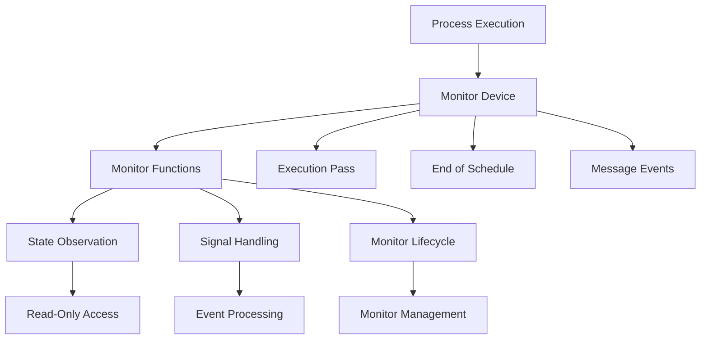
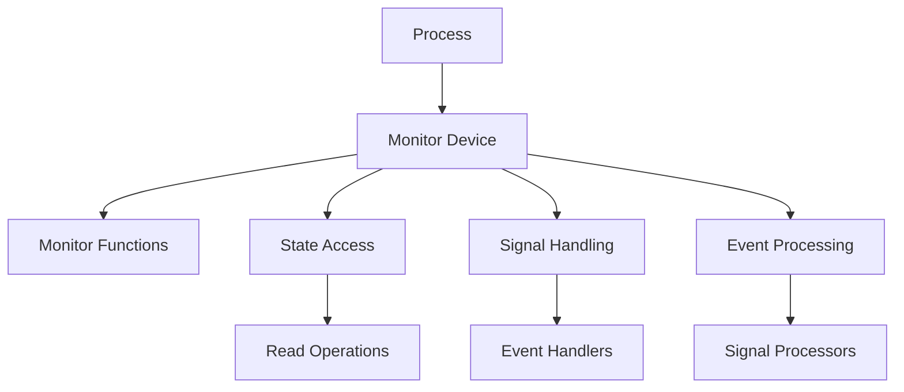

# Module: dev_monitor

## Basic Information
- **Source File:** dev_monitor.erl
- **Module Type:** Monitoring Device
- **Purpose:** Provides flexible monitoring capabilities for process execution, allowing non-mutating monitor functions to observe process state during execution passes.

## Core Functionality

### 1. Monitor Architecture


### 2. Implementation Details
```erlang
% Core initialization
init(State, _, InitState) ->
    {ok, State#{
        <<"monitors">> => InitState  % List of monitor functions
    }}.

% Monitor function execution
signal(State = #{ <<"monitors">> := StartingMonitors }, Signal) ->
    % Filter out completed monitors
    RemainingMonitors =
        lists:filter(
            fun(Mon) ->
                case Mon(State, Signal) of
                    done -> false;  % Remove monitor
                    _ -> true      % Keep monitor
                end
            end,
            StartingMonitors
        ),
    ?event({remaining_monitors, length(RemainingMonitors)}),
    {ok, State#{ <<"monitors">> := RemainingMonitors }}.
```

### 3. Monitor Management
```erlang
% Add new monitor function
add_monitor(Mon, State = #{ <<"monitors">> := Monitors }) ->
    {ok, State#{
        <<"monitors">> => [Mon | Monitors]
    }}.

% Execute monitors at end of schedule
end_of_schedule(State) -> 
    signal(State, end_of_schedule).
```

## Key Features

### 1. Monitor Functions
- **Non-mutating**: Read-only access to state
- **Signal-based**: Event-driven monitoring
- **Lifecycle Control**: Self-termination capability
- **State Access**: Full process state visibility
- **Event Handling**: Multiple signal types

### 2. Signal Types
```erlang
% Example signal handling
handle_signal(State, Signal) ->
    case Signal of
        {message, Msg} ->
            % Handle message event
            process_message(State, Msg);
        end_of_schedule ->
            % Handle schedule completion
            process_schedule_end(State);
        _ ->
            % Handle other signals
            process_other(State, Signal)
    end.
```

### 3. Monitor Lifecycle
```erlang
% Example monitor function
monitor_function(State, Signal) ->
    case should_continue(State, Signal) of
        true ->
            % Continue monitoring
            process_signal(State, Signal),
            continue;
        false ->
            % Stop monitoring
            cleanup(State),
            done
    end.
```

## Usage Examples

### 1. Basic Monitoring
```erlang
% Create simple state monitor
state_monitor(State, Signal) ->
    case Signal of
        {message, _} ->
            ?event({state_snapshot, State}),
            continue;
        _ ->
            continue
    end.

% Add monitor to process
add_monitor(state_monitor, ProcessState).
```

### 2. Event Tracking
```erlang
% Create event tracking monitor
event_monitor(State, Signal) ->
    case Signal of
        {message, Msg} ->
            track_message(Msg),
            continue;
        end_of_schedule ->
            summarize_events(),
            done
    end.
```

### 3. Conditional Monitoring
```erlang
% Monitor with specific conditions
conditional_monitor(State, Signal) ->
    case should_monitor(State) of
        true ->
            process_signal(Signal),
            continue;
        false ->
            done
    end.
```

## Monitor Types

### 1. State Monitors
- Process state tracking
- Variable observation
- State transitions
- Invariant checking
- History recording

### 2. Event Monitors
- Message tracking
- Signal processing
- Event counting
- Pattern matching
- Timing analysis

### 3. Performance Monitors
- Execution timing
- Resource usage
- Operation counts
- Bottleneck detection
- Optimization hints

## Integration Points

### 1. Process Integration


### 2. System Integration
- Process management
- Event system
- State tracking
- Signal routing
- Resource monitoring

### 3. Debug Integration
- Error tracking
- State inspection
- Event logging
- Performance analysis
- Debug output

## Error Handling

### 1. Monitor Errors
- Function crashes
- Invalid signals
- State access
- Resource limits
- Timing issues

### 2. Process Errors
- Execution failures
- State corruption
- Signal errors
- Resource exhaustion
- Timeout handling

### 3. System Errors
- Integration issues
- Resource constraints
- Communication failures
- State inconsistencies
- System overload

## Performance Considerations

### 1. Resource Usage
- Memory efficiency
- CPU utilization
- Event processing
- State access
- Signal handling

### 2. Monitoring Impact
- Process overhead
- System load
- Network usage
- Storage requirements
- Processing delays

### 3. Optimization
- Efficient filtering
- Resource pooling
- Event batching
- State caching
- Signal aggregation

## Future Enhancements

### 1. Monitor Features
- Advanced filtering
- Pattern matching
- State prediction
- Anomaly detection
- Performance profiling

### 2. Integration
- Remote monitoring
- Distributed tracking
- Cloud integration
- Analytics support
- Visualization tools

### 3. Development
- Monitor templates
- Testing support
- Documentation
- Debug tools
- Analysis utilities
