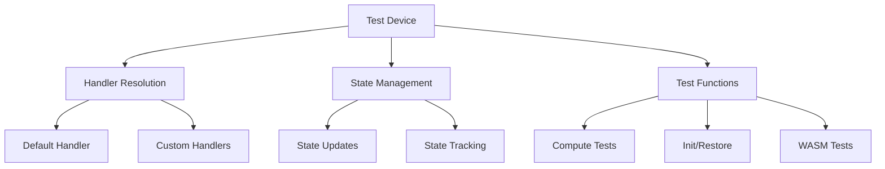
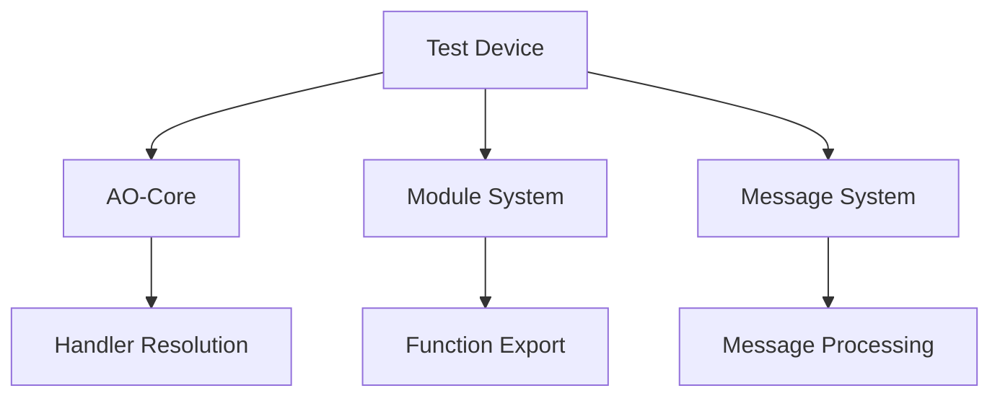

# Module: dev_test

## Basic Information
- **Source File:** dev_test.erl
- **Module Type:** Test Device
- **Purpose:** Provides a test device for AO-Core, specifically designed to test functionality that depends on Erlang's module system.

## Core Functionality

### 1. Test Architecture


### 2. Handler Configuration
```erlang
% Core handler configuration
info(_) ->
    #{
        <<"default">> => dev_message,
        handlers => #{
            <<"info">> => fun info/3,
            <<"update_state">> => fun update_state/3,
            <<"increment_counter">> => fun increment_counter/3
        }
    }.

% Device information
info(_Msg1, _Msg2, _Opts) ->
    InfoBody = #{
        <<"description">> => <<"Test device for testing the AO-Core framework">>,
        <<"version">> => <<"1.0">>,
        <<"paths">> => #{
            <<"info">> => <<"Get device info">>,
            <<"test_func">> => <<"Test function">>,
            <<"compute">> => <<"Compute function">>,
            <<"init">> => <<"Initialize function">>,
            <<"restore">> => <<"Restore function">>,
            <<"mul">> => <<"Multiply function">>,
            <<"snapshot">> => <<"Snapshot function">>,
            <<"postprocess">> => <<"Postprocess function">>,
            <<"update_state">> => <<"Update state function">>
        }
    },
    {ok, #{<<"status">> => 200, <<"body">> => InfoBody}}.
```

### 3. State Management
```erlang
% State initialization
init(Msg, _Msg2, Opts) ->
    ?event({init_called_on_dev_test, Msg}),
    {ok, hb_ao:set(Msg, #{ <<"already-seen">> => [] }, Opts)}.

% State restoration
restore(Msg, _Msg2, Opts) ->
    case hb_ao:get(<<"already-seen">>, Msg, Opts) of
        not_found ->
            {error, <<"No viable state to restore.">>};
        AlreadySeen ->
            {ok,
                hb_private:set(
                    Msg,
                    #{ <<"test-key/started-state">> => AlreadySeen },
                    Opts
                )
            }
    end.
```

## Key Features

### 1. Compute Testing
```erlang
% Compute handler implementation
compute(Msg1, Msg2, Opts) ->
    AssignmentSlot = hb_ao:get(<<"slot">>, Msg2, Opts),
    Seen = hb_ao:get(<<"already-seen">>, Msg1, Opts),
    {ok,
        hb_ao:set(
            Msg1,
            #{
                <<"random-key">> => <<"random-value">>,
                <<"results">> =>
                    #{ <<"assignment-slot">> => AssignmentSlot },
                <<"already-seen">> => [AssignmentSlot | Seen]
            },
            Opts
        )
    }.
```

### 2. WASM Integration
```erlang
% WASM function example
mul(Msg1, Msg2) ->
    State = hb_ao:get(<<"state">>, Msg1, #{ hashpath => ignore }),
    [Arg1, Arg2] = hb_ao:get(<<"args">>, Msg2, #{ hashpath => ignore }),
    {ok, #{ 
        <<"state">> => State, 
        <<"results">> => [Arg1 * Arg2] 
    }}.
```

### 3. Worker Management
```erlang
% Worker state update
update_state(_Msg, Msg2, _Opts) ->
    case hb_ao:get(<<"test-id">>, Msg2) of
        not_found ->
            {error, <<"No test ID found in message.">>};
        ID ->
            case hb_name:lookup({<<"test">>, ID}) of
                undefined ->
                    {error, <<"No test worker found.">>};
                Pid ->
                    Pid ! {update, Msg2},
                    {ok, Pid}
            end
    end.
```

## Testing Capabilities

### 1. State Testing
- Initialization testing
- State restoration
- State tracking
- State updates
- State validation

### 2. Message Testing
- Handler resolution
- Message routing
- Message processing
- Response formatting
- Error handling

### 3. Worker Testing
- Process management
- State updates
- Counter operations
- Message passing
- Error handling

## Usage Examples

### 1. Basic Testing
```erlang
% Test function resolution
test_basic() ->
    Msg = #{ <<"device">> => <<"Test-Device@1.0">> },
    {ok, <<"GOOD_FUNCTION">>} = 
        hb_ao:resolve(Msg, test_func, #{}).
```

### 2. Compute Testing
```erlang
% Test compute functionality
test_compute() ->
    % Initialize state
    Msg0 = #{ <<"device">> => <<"Test-Device@1.0">> },
    {ok, Msg1} = hb_ao:resolve(Msg0, init, #{}),
    
    % Test computation
    Msg2 = #{
        <<"path">> => <<"compute">>,
        <<"slot">> => 1,
        <<"body/number">> => 1337
    },
    {ok, Msg3} = hb_ao:resolve(Msg1, Msg2, #{}).
```

### 3. Worker Testing
```erlang
% Test worker updates
test_worker() ->
    % Register worker
    ID = <<"test-1">>,
    hb_name:register({<<"test">>, ID}, self()),
    
    % Send update
    Msg = #{
        <<"test-id">> => ID,
        <<"data">> => <<"test">>
    },
    {ok, _} = update_state(none, Msg, #{}).
```

## Integration Points

### 1. Core System


### 2. Dependencies
- hb_ao: Message operations
- hb_name: Process registration
- hb_private: Private state
- hb_http_server: HTTP integration
- eunit: Test framework

### 3. Test Integration
- Unit testing
- Integration testing
- System testing
- Performance testing
- Error testing

## Error Handling

### 1. Message Errors
- Missing fields
- Invalid types
- Unknown paths
- Handler errors
- State errors

### 2. Worker Errors
- Missing workers
- Invalid IDs
- Process failures
- Message errors
- State corruption

### 3. System Errors
- Module errors
- Function errors
- State errors
- Integration errors
- Resource errors

## Performance Considerations

### 1. Resource Usage
- Memory management
- Process creation
- Message passing
- State tracking
- Error handling

### 2. Testing Impact
- Test overhead
- Resource usage
- System load
- Response time
- Error recovery

### 3. Optimization
- Efficient testing
- Resource pooling
- State caching
- Message batching
- Error handling

## Future Enhancements

### 1. Testing Features
- Advanced scenarios
- Complex states
- Error simulation
- Load testing
- Performance profiling

### 2. Integration
- More test types
- Better reporting
- Custom handlers
- Extended metrics
- Debug support

### 3. Development
- Test templates
- Helper functions
- Documentation
- Examples
- Utilities
