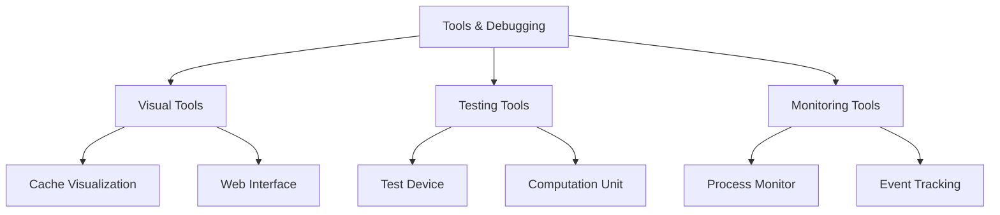
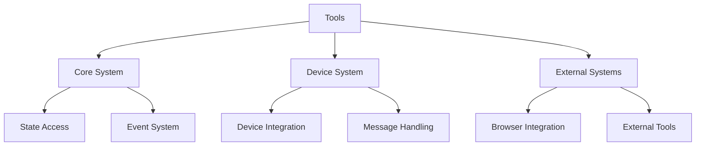

# Tools & Debugging Subsystem Observations

## Architectural Patterns

### 1. Visualization Patterns

### 2. Common Design Elements
- Non-intrusive monitoring
- Read-only state access
- Event-driven architecture
- Flexible configuration
- Modular integration

### 3. Integration Strategy
- Clear separation of concerns
- Standardized interfaces
- Minimal dependencies
- Pluggable components
- Extensible design

## Key Insights

### 1. Visualization Tools
- **CacheViz (dev_cacheviz)**
  - Graph-based cache visualization
  - DOT/SVG output formats
  - Interactive exploration
  - Flexible rendering options
  - Browser integration

- **HyperBuddy (dev_hyperbuddy)**
  - REPL-like interface
  - Web-based interaction
  - Metrics visualization
  - System monitoring
  - Debug capabilities

### 2. Testing Tools
- **Test Device (dev_test)**
  - Module system testing
  - Handler resolution
  - State management
  - Error simulation
  - Integration testing

- **Computation Unit (dev_cu)**
  - Assignment handling
  - Result management
  - Bundle processing
  - Commitment handling
  - Error recovery

### 3. Monitoring Tools
- **Process Monitor (dev_monitor)**
  - State observation
  - Event tracking
  - Signal handling
  - Resource monitoring
  - Performance analysis

## Implementation Patterns

### 1. State Management
- Read-only state access
- Event-based updates
- Atomic operations
- State validation
- Error handling

### 2. Error Handling
- Consistent patterns
- Detailed logging
- Error categorization
- Recovery strategies
- User feedback

### 3. Resource Management
- Efficient processing
- Memory optimization
- Resource pooling
- Load balancing
- Cache utilization

## Common Challenges

### 1. Visualization
- Complex data representation
- Real-time updates
- Performance impact
- Memory usage
- Browser compatibility

### 2. Testing
- State isolation
- Error simulation
- Resource management
- Timing issues
- Integration complexity

### 3. Monitoring
- Performance overhead
- Data collection
- Event correlation
- Resource usage
- Scalability

## Best Practices

### 1. Code Organization
- Clear module boundaries
- Consistent interfaces
- Minimal coupling
- Comprehensive testing
- Detailed documentation

### 2. Error Management
- Detailed error messages
- Consistent formatting
- Recovery procedures
- User guidance
- Debug support

### 3. Resource Handling
- Efficient algorithms
- Memory management
- Resource cleanup
- Load monitoring
- Performance optimization

## Integration Patterns

### 1. System Integration

### 2. Message Flow
- Standardized formats
- Clear routing
- Error handling
- State tracking
- Event logging

### 3. Event Handling
- Event correlation
- Signal processing
- State updates
- Resource tracking
- Performance monitoring

## Future Directions

### 1. Enhancement Areas
- Advanced visualization
- Real-time monitoring
- Performance profiling
- Integration testing
- Debug tooling

### 2. Integration Opportunities
- External tools
- Cloud services
- Analytics platforms
- Monitoring systems
- Development tools

### 3. Development Focus
- User experience
- Performance optimization
- Tool integration
- Documentation
- Testing support

## Critical Considerations

### 1. Performance Impact
- Monitoring overhead
- Resource usage
- System load
- Network traffic
- Memory consumption

### 2. Security Implications
- Access control
- Data protection
- State isolation
- Error handling
- Resource limits

### 3. Maintenance Aspects
- Code organization
- Documentation
- Testing coverage
- Error handling
- Resource management

## Recommendations

### 1. Development
- Standardize interfaces
- Improve documentation
- Enhance testing
- Optimize performance
- Extend tooling

### 2. Integration
- Strengthen integration
- Add external tools
- Improve monitoring
- Enhance debugging
- Expand testing

### 3. Operations
- Monitor performance
- Track resources
- Handle errors
- Manage state
- Optimize usage
